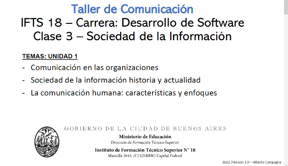
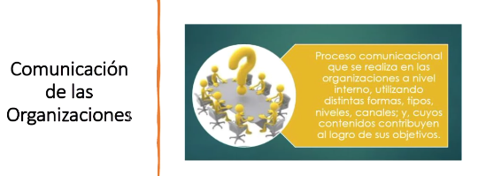
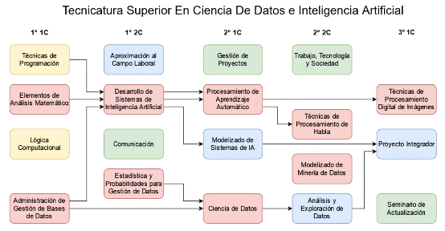
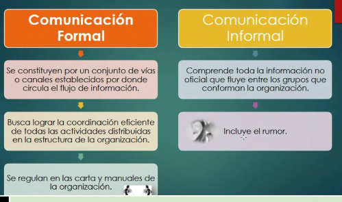
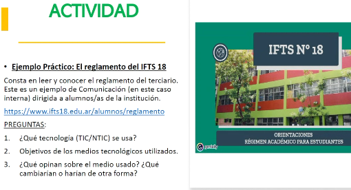
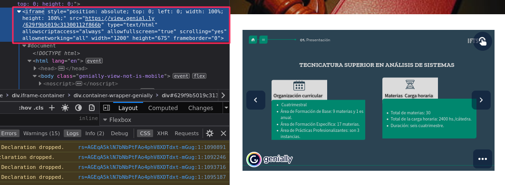

## Clase 02

Taller de comunicaciones

### Comunicación de las organizaciones

Ejemplo de diagrama de organización aplicado a las correlatividades de una carrera.

### Comunicación formal / informal

### Comunicación Organizativa

### Actividad

1. Se utiliza un sistema embebido mediante un iframe, a través de un SaaS llamado Genially (una web app para visualización de presentaciones).

2. El objetivo es que los alumnos conozcan el reglamento. Con esa idea se busca presentar un documento que en principio es aburrido (un documento largo con el reglamento del instituto) y mostrarlo de forma más interactiva y visualmente atractiva.

3. Está bien presentado y carga bastante rápido. En contrapartida o como crítica diría que no es una opción de Software Libre y en ese sentido se pierde control sobre el contenido que se utiliza (por ejemplo Genially podría dejar de brindar una versión gratuita en cualquier momento).