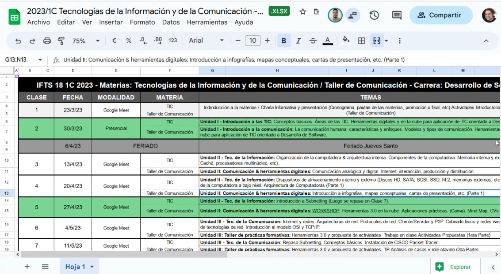

Presentación de la materia.
Prof. Alberto Campagna

Temas generales de la materia:

Comparte un Drive y un classroom:

Ver cronograma completo en drive

Comenta criterios de aprobación (igual que las otras materias)

Link a la web del profe sobre la materia: https://www.analistadesistemas.com.ar/

(Próxima clase presencial)