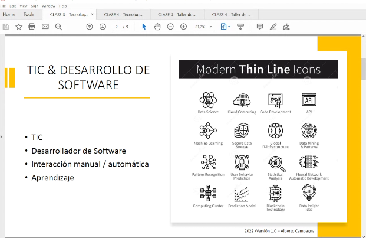
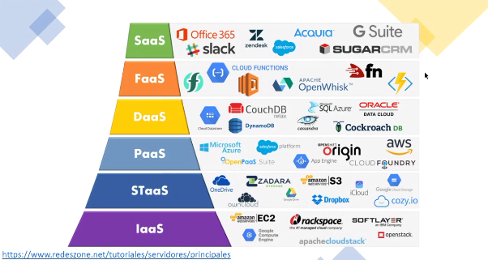
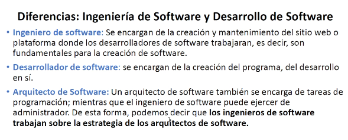
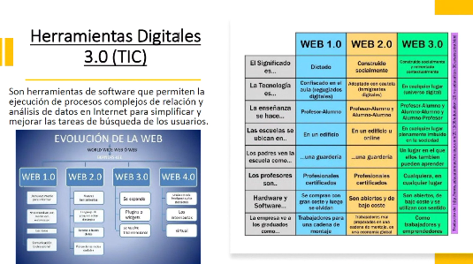
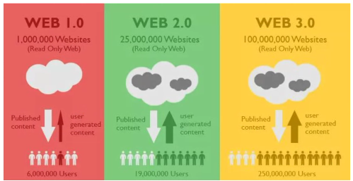

## Clase 03

Repaso general de temas vistos:

Ejemplos de SaaS
Storage (STaaS)
PaaS
IaaS

Mucho metaverso en el medio..un poco de cryptofalopa más adelante 🙄

Menciona conceptos de cloud hosting.

---
Sigue la clase

Ingeniería de Software

### Web 1.0, 2.0, 3.0

