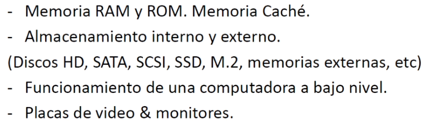
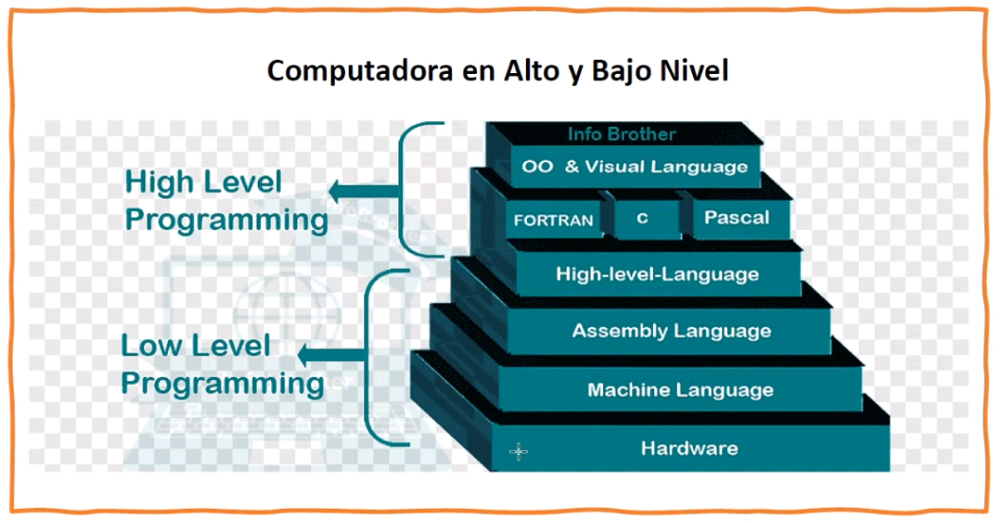
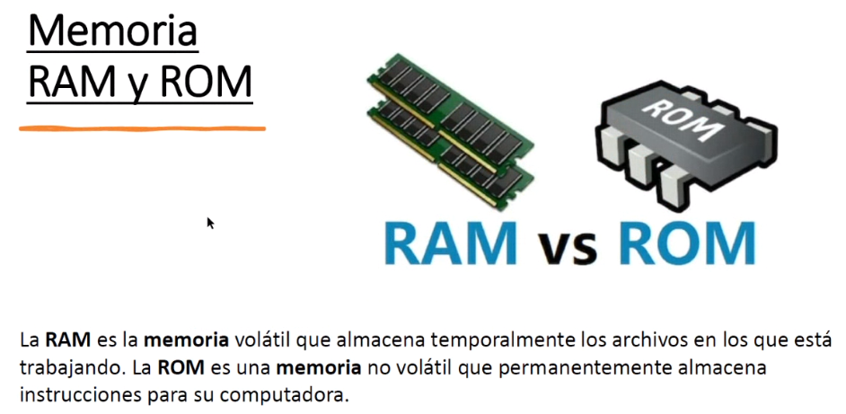
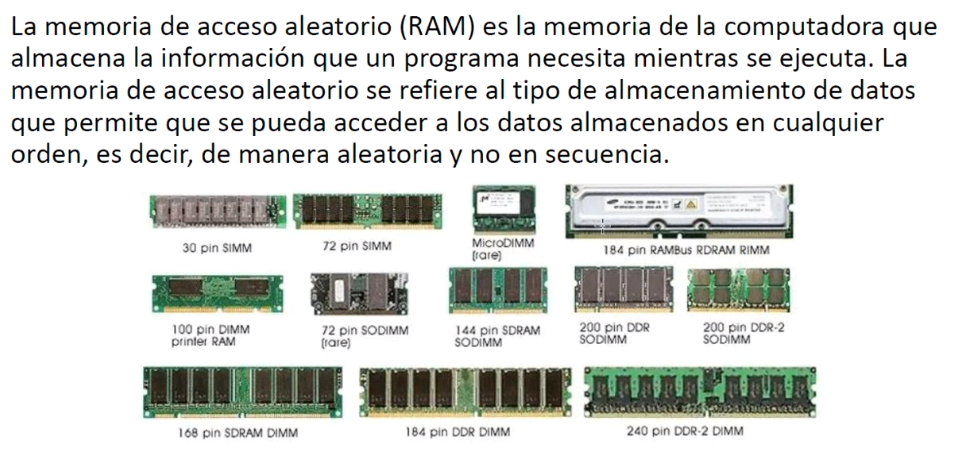
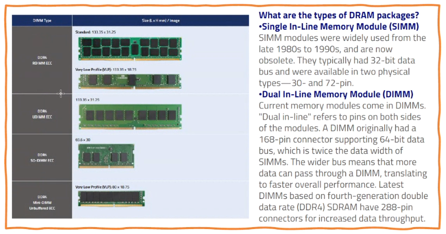
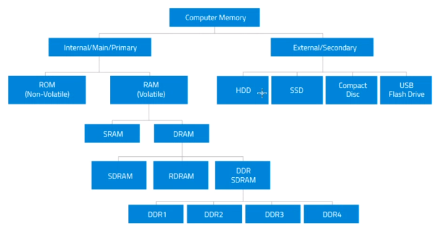
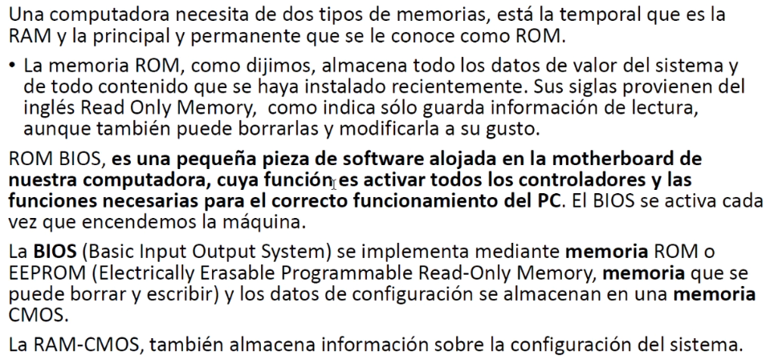
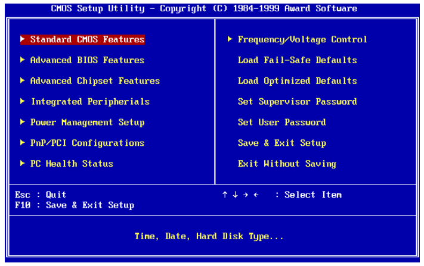
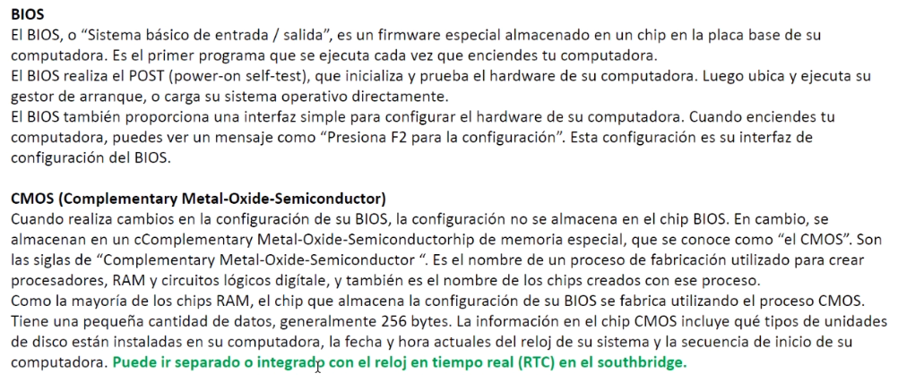
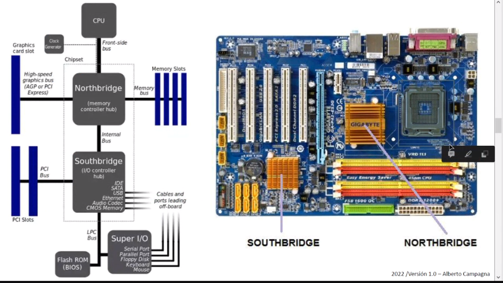

## Clase 06

---
Sobre repaso:

### Organización física de la computador

Slide organización física de la computadora (entra)
Slide 1 procesador (entra)

---
Vuelve a clase 06: RAM y ROM. Caché. Almacenamiento.

### RAM y ROM

### Memoria RAM (Random Access Memory)

### Memoria de la computadora

### Memoria ROM (Read-Only Memory)

### BIOS

Mención especial a la BIOS <3

### Motherboard

