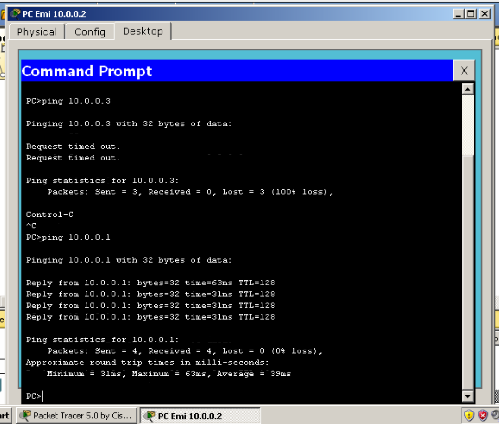
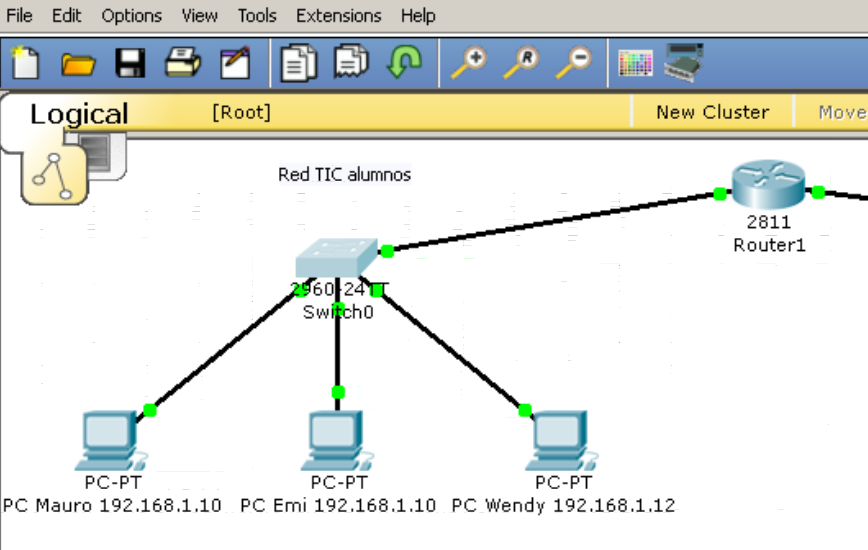

## Clase 07

Empezamos a ver un poco de Cisco Packet tracer. En mi caso no pude usar la versión de Linux por unas dependencias..así que bajé una versión vieja y la corrí en una máquina virtual con win XP 😅


Vemos desde el entorno del profe con su setup. Nos muestra un poco cómo empezar a diagramar una red:


Podemos manejar el cmd de cada PC dentro del diagrama:


ping entre las dos PC que fueron conectadas en red:




Setting completo:

```
0/0 GATEWAY 192.168.1.1

RED TIC ALUMNOS
DEFAULT GATEWAY 192.168.1.1

192.168.1.10
192.168.1.11
192.168.1.12

---

0/1 GATEWAY 135.168.1.1

RED IFTS
DEFAULT GATEWAY 135.168.1.1

135.168.1.10
135.168.1.11
135.168.1.12
```

Setup en mi entorno:

#### Red TIC Alumnos:



#### Red IFTS


Ping de una PC a otra entre redes:

