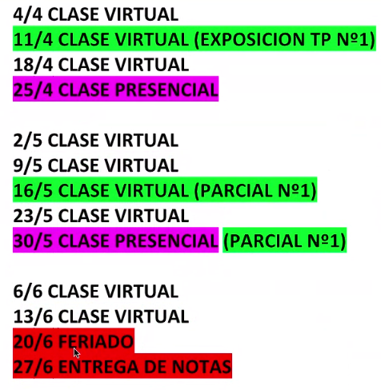
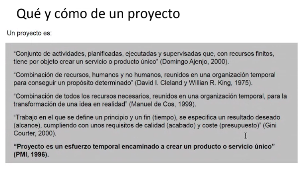
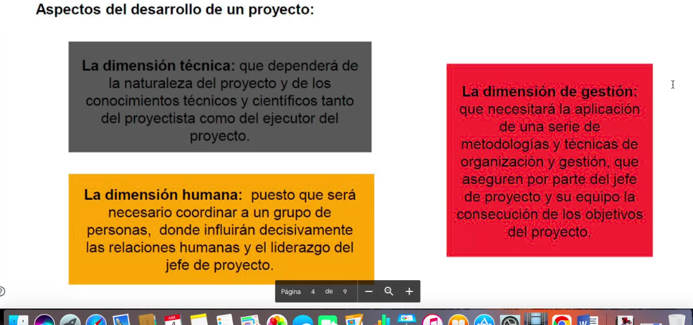
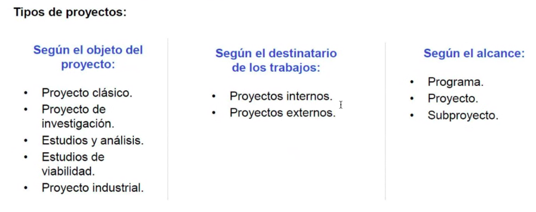
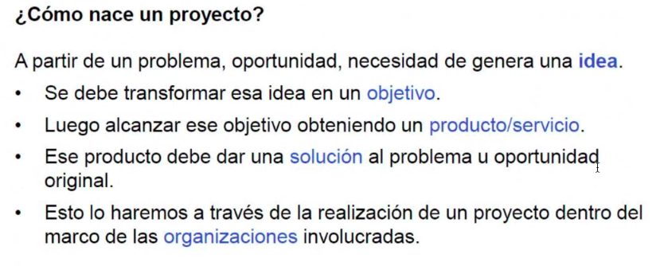
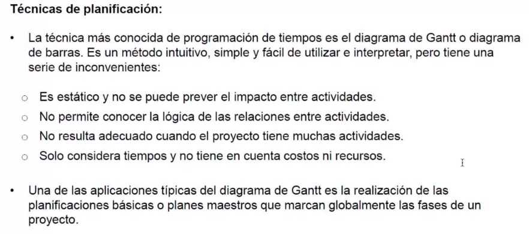

Clase virtual

Empezamos corrigiendo algunos avances de TP.

### Cronograma:

Probablemente algunas clases presenciales se hagan virtual.

Fecha de parcial tentativa: 16/05

---

Tomar tiempo de la presentación para el martes 11/04

Repasa los apuntes subidos a classroom.

- Datos, Información, Conocimiento
- Sistemas / Sistemas informáticos

(se pone a leer un texto)

Repasa el ppt de proyecto:

### Gantt

