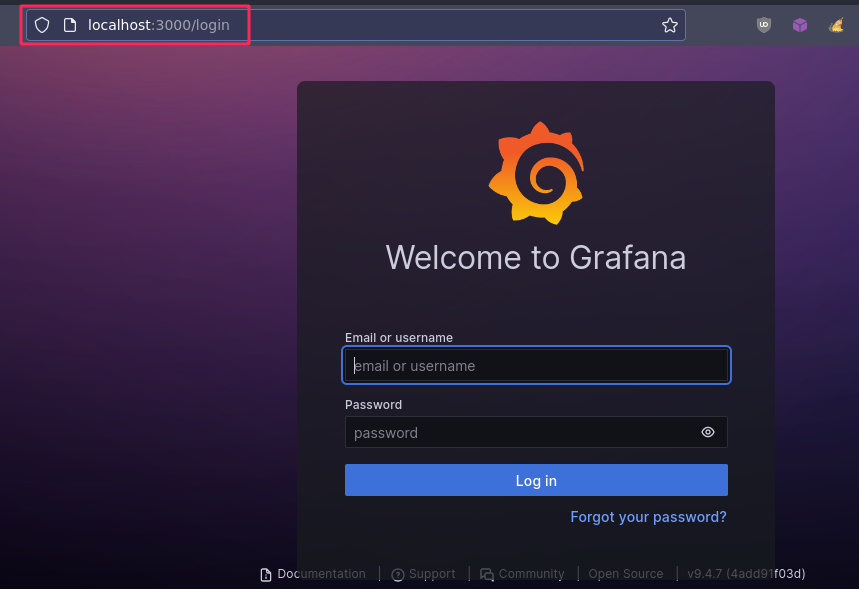
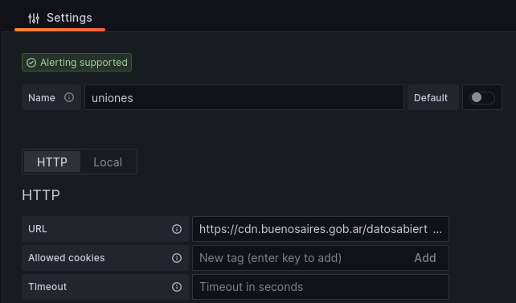
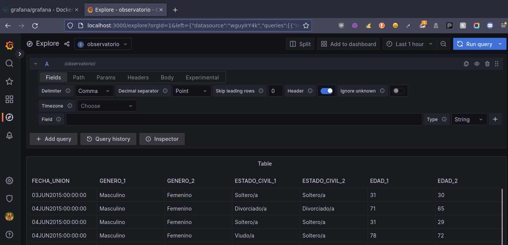

## Clase 04

Vemos las presentaciones de todos los grupos.

- BD SQL y noSQL
- DSS
- Big Data
- Data Warehouse / Data Mining
- CRM

Para la próxima clase leer los trabajos de cada tema.
Nos adelanta que vamos a probar datasets de la ciudad con tableau.

---
### Grafana Sandbox

Buscando una alternativa libre a Power BI y Tableau voy a ir probando Grafana en local o a futuro en alguna vps chica.

Por ahora quedó corriendo en localhost con [docker](https://hub.docker.com/r/grafana/grafana/)

```bash
docker run -d --name=grafana -p 3000:3000 grafana/grafana
```

sale con 🍟 



Para usar archivos CSV como input hay que instalar el siguiente [plugin de Grafana](https://github.com/grafana/grafana-csv-datasource)

Una vez instalado podemos tomar un dataset similar a los que vamos a usar en próximas clases, en este caso por https:

```url
https://cdn.buenosaires.gob.ar/datosabiertos/datasets/ministerio-de-gobierno/uniones-civiles-convivenciales/dataset_uniones_civiles_convivenciales.csv
```



Y podemos ver los datos en el explorador:



(...)