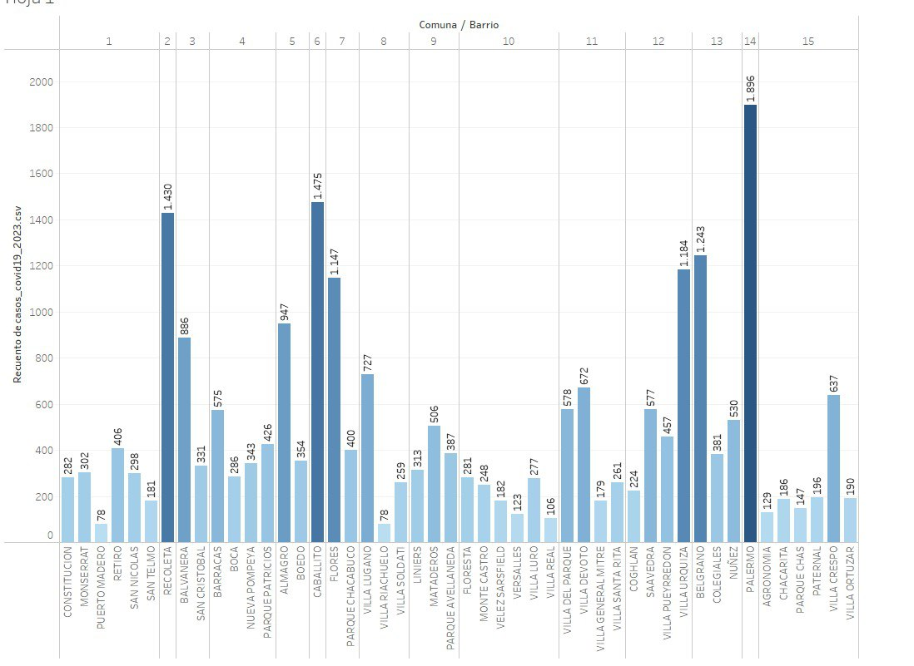
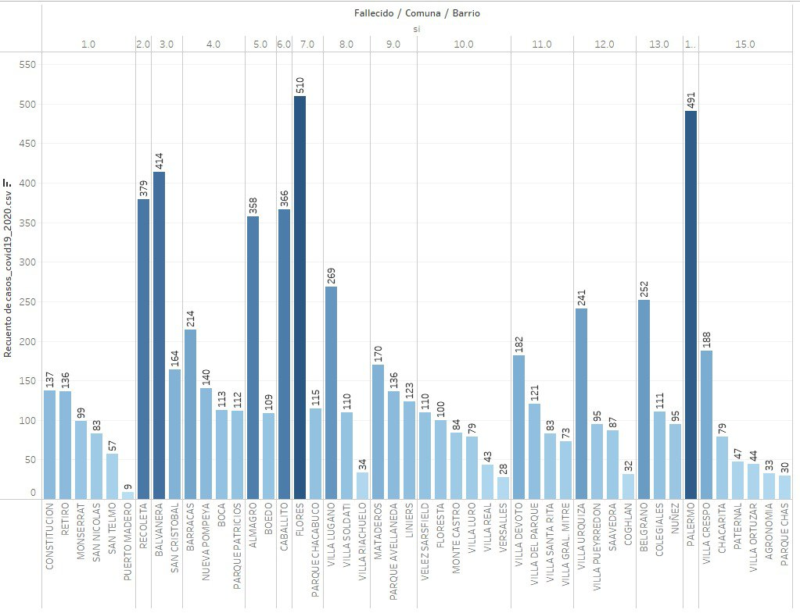
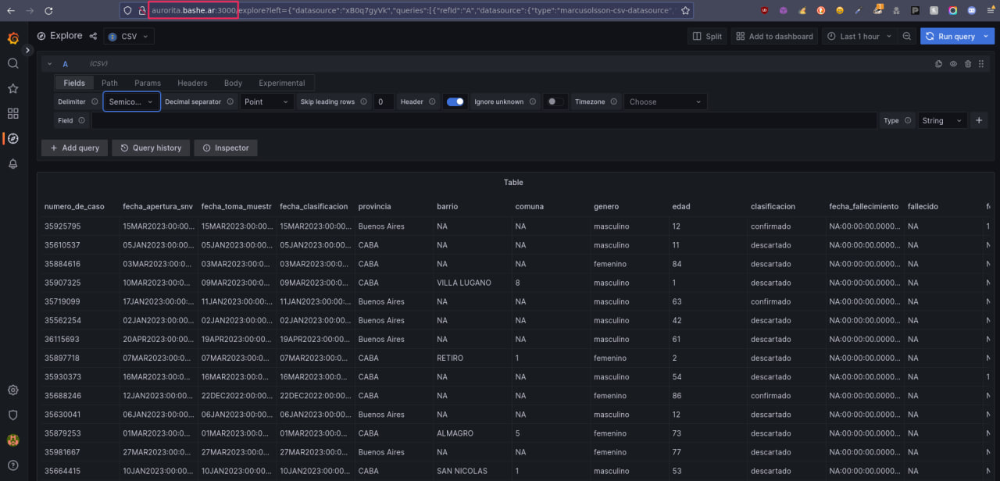

## Clase 06

Clase virtual. Repasamos consigan del TP con todos los grupos.

Empezamos a hacer parte de la actividad grupal en salas. En nuestro grupo dejamos una bajada de la propuesta para el TP en dos partes.

Por un lado el análisis de datos con el dataset de COVID comparando 2020 con 2023.

Empezamos a sacar los primeros gráficos en Tableau que luego van a ir a la presentación:

### Casos por barrio de la ciudad

### Fallecidos por barrio de la ciudad

### Grafana

Seguimos avanzando con la idea de levantar un servicio web de Grafana para mostrar el mismo dataset elegido.

Quedó corriendo con docker en mi instancia de prueba.

Documentación importante para continuar este tema:

- [Grafana Docker hub image](https://hub.docker.com/r/grafana/grafana/)
- [Configurar Grafana Docker](https://grafana.com/docs/grafana/latest/setup-grafana/configure-docker/)
- [Configurar sin login](https://grafana.com/docs/grafana/latest/setup-grafana/configure-security/configure-authentication/#anonymous-authentication)