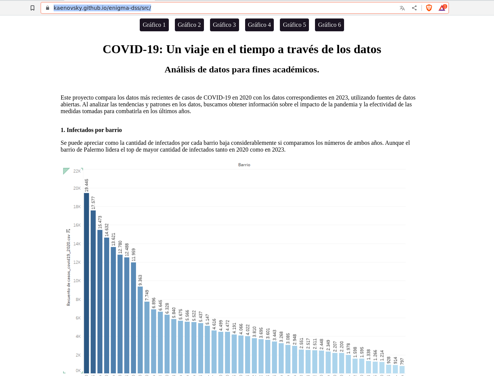

## Clase 08

Hacemos día de exposición del TP2.

Empezamos con nuestro grupo mostrando lo que hicimos con Tableau.

Toda la info quedó en el repo: https://github.com/kaenovsky/enigma-dss

Y mostramos los datos en la siguiente landing: https://kaenovsky.github.io/enigma-dss/src/

---
Los demás grupos expusieron también (muy buen nivel de TPs en general. 2 grupos lo hicieron con Power BI y uno con Python mostrando los datos en [Deepnote](https://deepnote.com/)).

---
- Presentación TP3: 13 de Junio
- Fecha de parcial: 27 de Junio