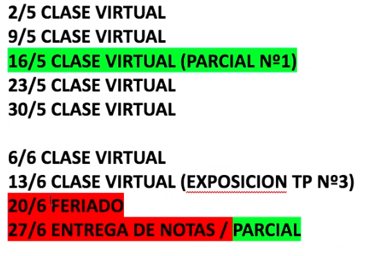

## Clase 09

Repasamos sobre el TP3 de cada grupo. En nuestro caso vemos el avance que quedó documentado en GH --> https://github.com/kaenovsky/enigma-dss

Menciono tema nginx, dominio, dns, docker, landings y grafana. Vemos grafana por dentro con los gráficos actuales. Nos comenta el profe que está muy bien y que veamos de qué forma lo podemos mejorar hasta la semana que viene. De mi parte lo que me imagino es:

- Firmar certificados TLS con certbot
- Agregar integración continua con Github

---

Después vemos cronograma de las próximas clases: 

