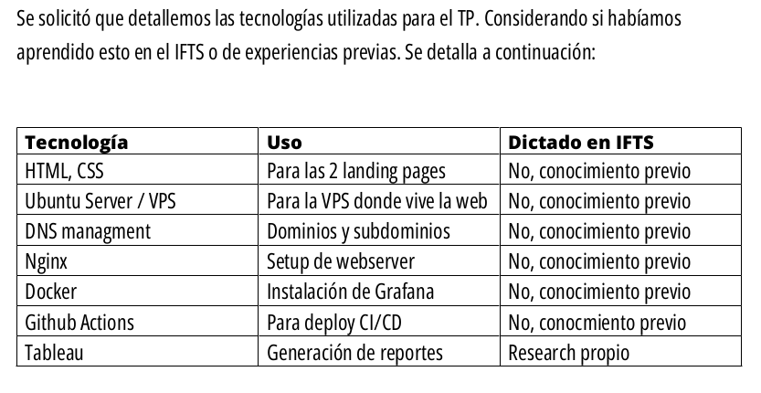

## Clase 10

Hacemos presentación de proyectos grupales.

En nuestro caso mostramos https://altadata.ar lo que fuimos laburando en el repositorio https://github.com/kaenovsky/enigma-dss

Parte del PDF donde mencionamos algunas tecnologías que usamos y si habían sido dictadas en el instituto:

Subo el PDF completo en ./215-assets/TP-final-grupo1-doc.pdf

Mostramos:

- PDF completo
- Landing COVID
- Landing principal
- Cambios en landing
- Conexión a VPS por SSH
- Docker container
- Github Actions
- Nginx server block

Cerramos la presenta 👏 

(...)

Luego presentan los demás grupos.
