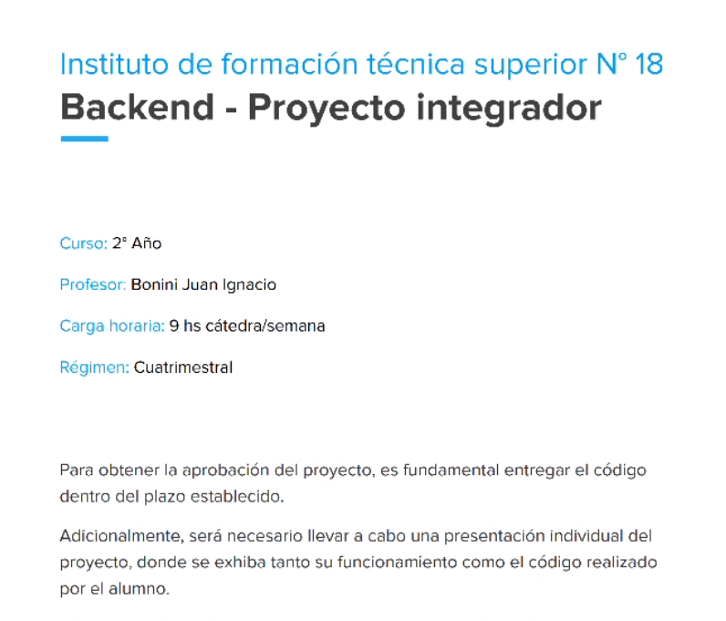
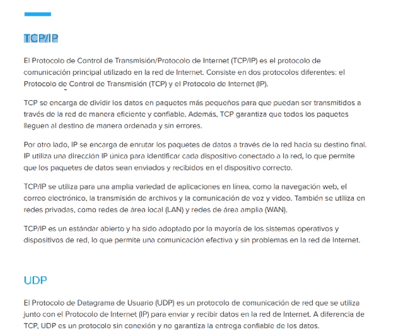
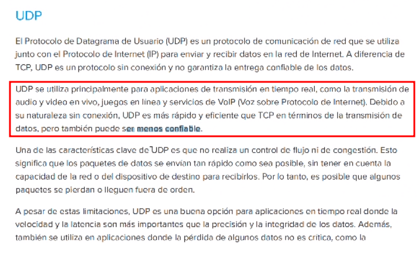

Presentacion de la materia, cada unx se va presentando.

Repasa todo el programa de la materia, apuntes y trabajo final (puede ser en grupo o individual). 

(...) ver en el archivo adjunto en ./proyecto-integrador.pdf

---
Empezamos a ver un poco de protocolo TCP/IP y web en general.

Vemos ejemplo en el browser y en la terminal con ping.

TCP necesita controlar el acceso a la conexion.

UDP no genera una conexion. El ejemplo que pone es de un juego en el que se nos envian todos los paquetes al mismo tiempo, haciendo que parezca que nuestro personaje estuvo frenado por unos segudos y luego se movio de golpe. UDP no necesita chequear si el cliente recibe los paquetes.

