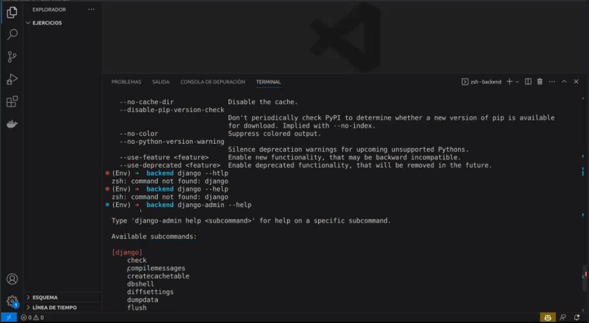
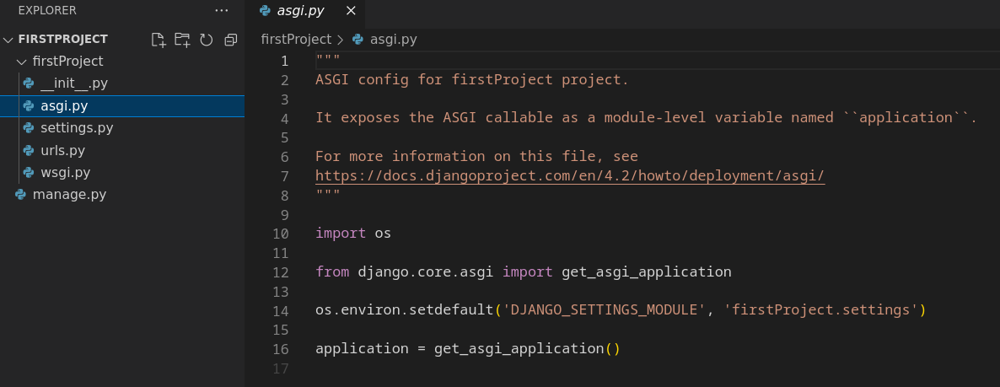
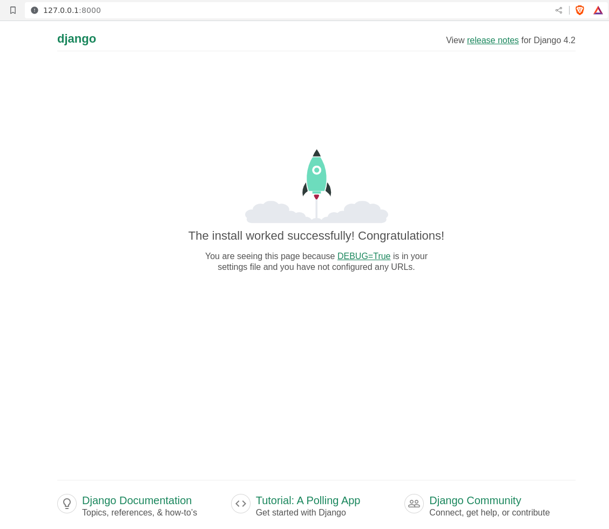
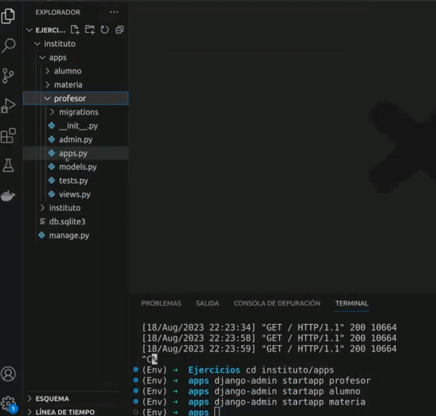
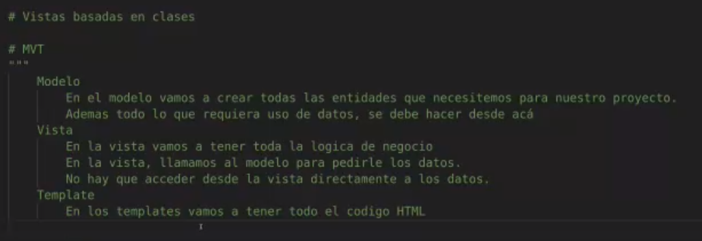

## Clase 02

Empezamos con los primeros pasos en Django

- Instalar python
- Instalar pip
- Crear entorno con venv
- Instalar django
- Crear un proyecto

En mi entorno:

levantamos el server con: `python manage.py runserver`

---
En el entorno del profe:

### MVT (Modelo Vista Template)

