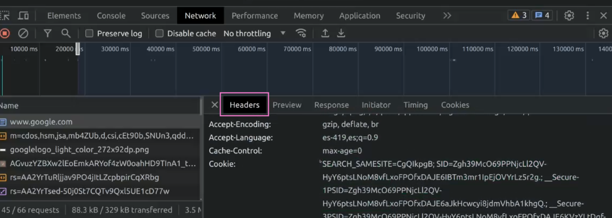
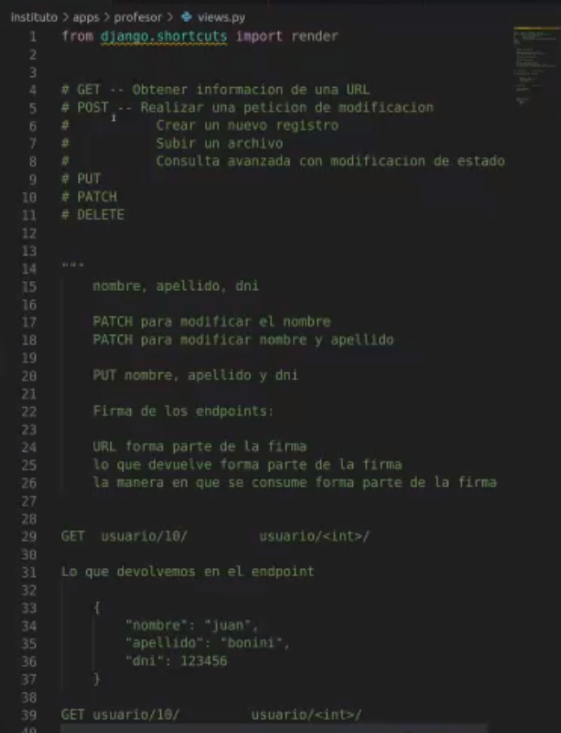
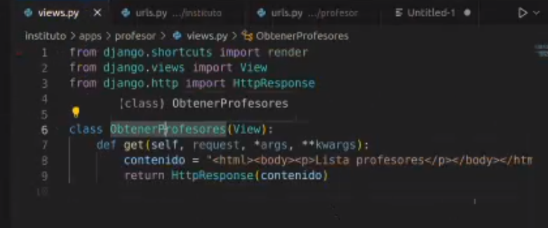
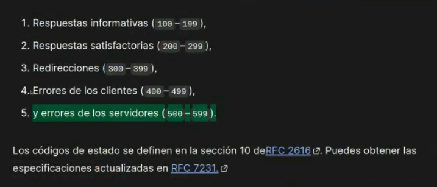

## Clase 03

Empezamos viendo los métodos GET, POST, PUT, PATCH y DELETE

Headers y URL





Después de ver las bases de los métodos volvemos al proyecto que habíamos empezado la clase anterior para crear la primera vista:



```py
class ObtenerProfesores(View):
	def get(self, request, *args, **kwargs):
		contenido = '<html>...etc</html>'
		return HttpResponse(contenido)
```

En el archivo urls.py:

```py

from django.urls import path
from apps.profesor

urlpatterns = [path("", ObtenerProfesores.as_view(), name="profesores")]

```

Revisamos status de respuestas:



