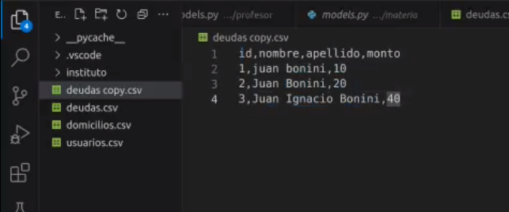
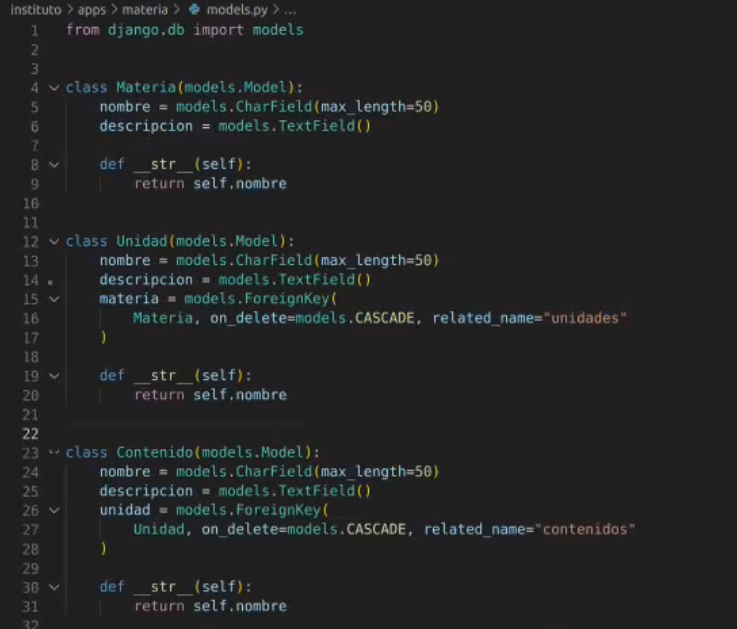
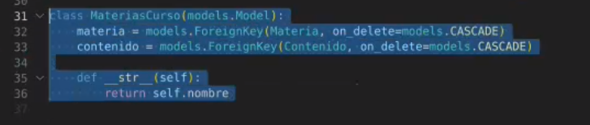

## Clase 06

Empieza la clase comentando un poco sobre normalización de base de datos:

entidades dentro de models.py

Encabezado o tabla intermedia:

Después pasamos a hacer grupos para avanzar con un proyecto.

