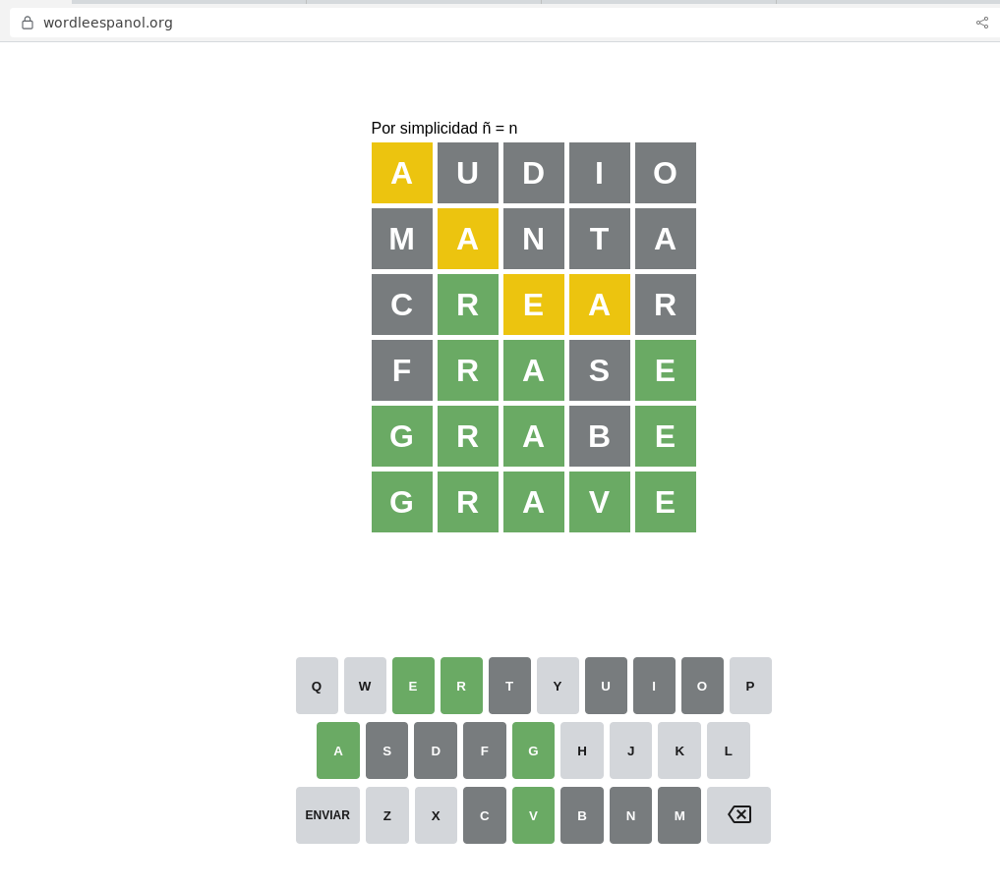

## Clase 07

Empieza hablando sobre historia, conceptos generales de web, frameworks de distintos lenguajes, modelo MVC, MVT..

Nos propone como ejercicio pensar un proyecto y bajar la idea para luego realizarla por el resto de la cursada.

---
### Bajada de Proyecto

#### Chino Básico

La idea es una página web que muestra una palabra en chino por día al estilo Wordle:

No en el sentido de adivinar la palabra, sino en que es una distinta cada día. El usuario no debe adivinar la palabra, simplemente aprenderla, ver el significado y la pronunciación.

Idealmente lo haría con esta api no oficial de duolingo que ya viene como paquete de pip: https://pypi.org/project/duolingo-api/

Aunque si me diera muchos problemas (estuve probando un poco y parece que hay cosas deprecadas y no le dieron mantenimiento), voy a bajar un set de cararceteres chinos que quedará en un BD.

El stack a usar en principio sería:

Backend:

- Django
- ~~SQLite~~ me recomienda PostgreSQL

Frontend:

- HTML, SCSS y JS vanilla
- Mockup con Figma

Operaciones:

- VPS 1gb en Digital Ocean
- Docker
- Github actions CI/CD

Hasta ahora lo único que tengo es el dominio chinobasico.ar que lo saqué hace bastante y todavía nunca me pude poner con este proyecto.

Me voy anotando algunos links:

https://www.digitalocean.com/community/tutorials/how-to-use-postgresql-with-your-django-application-on-ubuntu-20-04

https://learndjango.com/tutorials/django-docker-and-postgresql-tutorial (update: al final lo pude hacer con una app de prueba 👍)