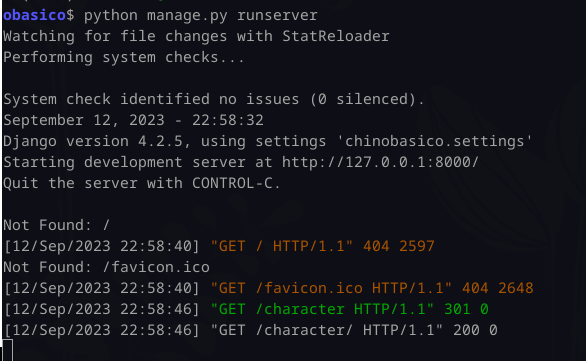

## Clase 08

Empieza creando un nuevo proyecto de 0.

Crea un gitignore

Lamentablemente se ve en re baja calidad, después paso link al repo

setting.json

(...)

Sigo en mi proyecto haciendo code-along. Voy tomando algunos screens:

Dejo corriendo la misma demo en mi local 🙏

