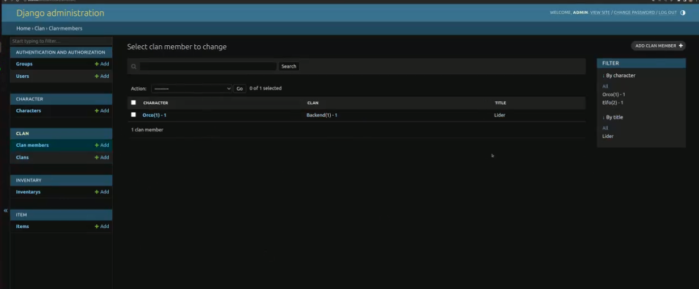
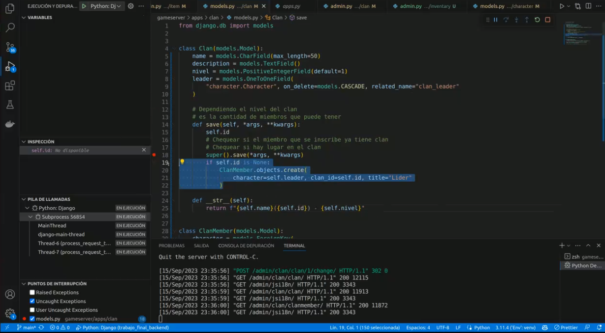
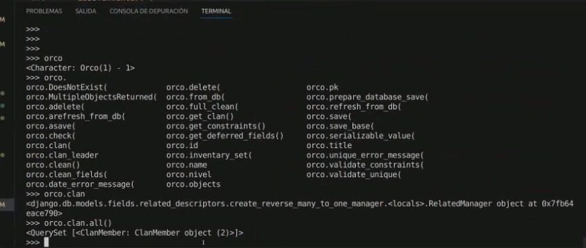
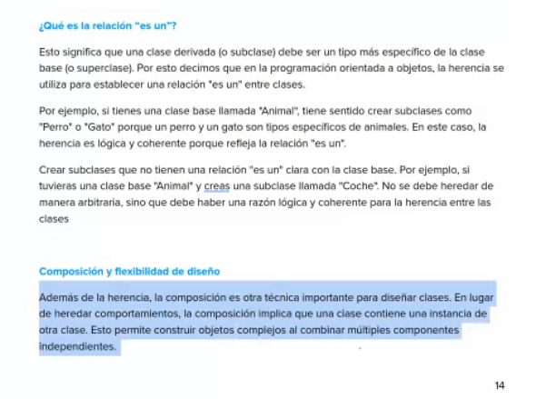
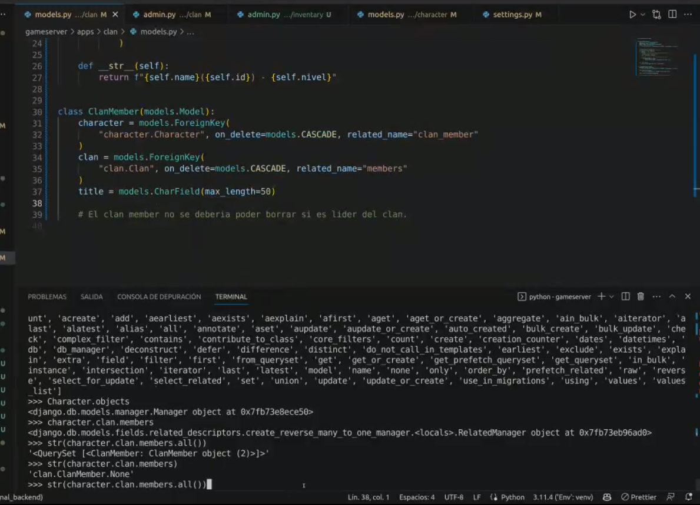
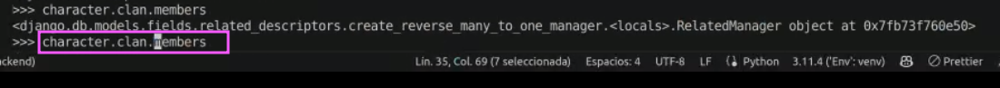
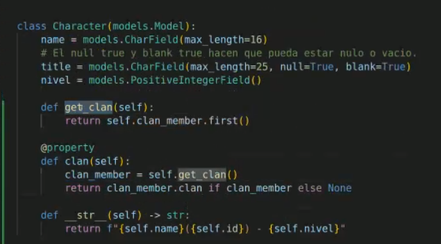
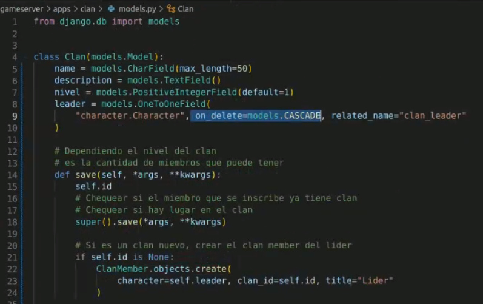

## Clase 09

Llego un poco tarde así que después hago rewatch de la clase. Por ahora mandé un avance de mi proyecto final (bajada en `./proyecto-final-idea`).

Creando entradas en la BD a partir de código:

Manipulando objetos de la BD desde la consola:

Todo es un objeto en python. Clan member está compuesto por tres clases: character, clan y member

members es una propiedad que tiene clan

clan member es clan. si miramos character, clan es un clanmember:

