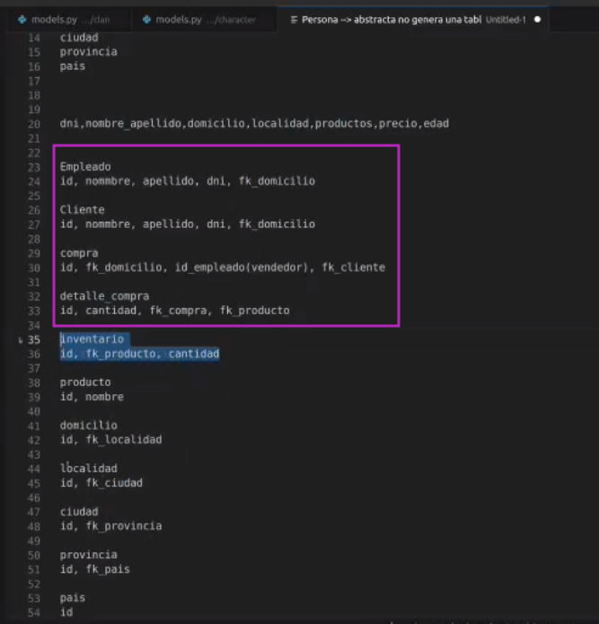
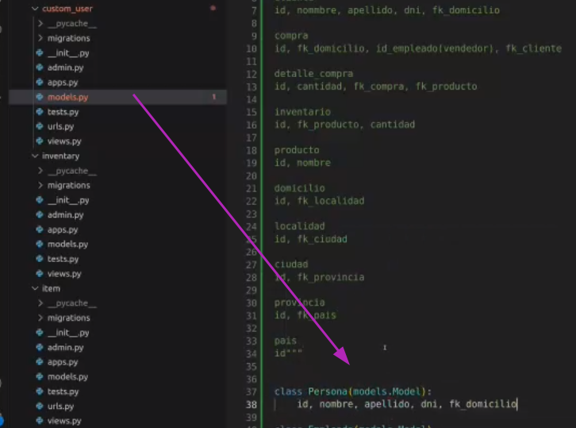
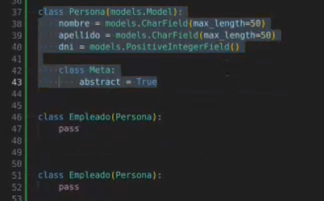
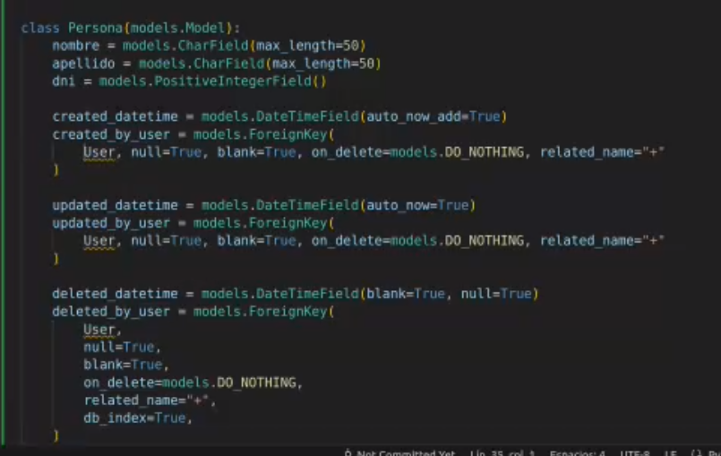
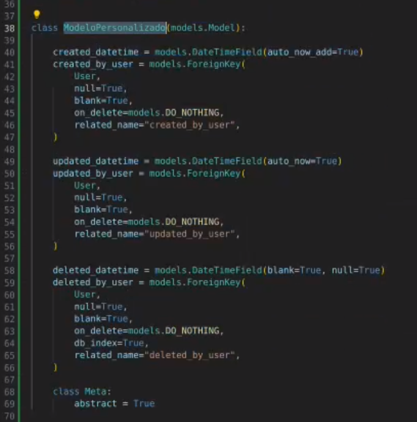
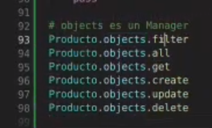
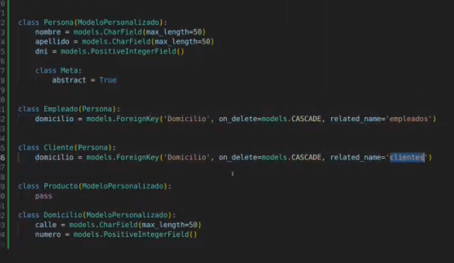
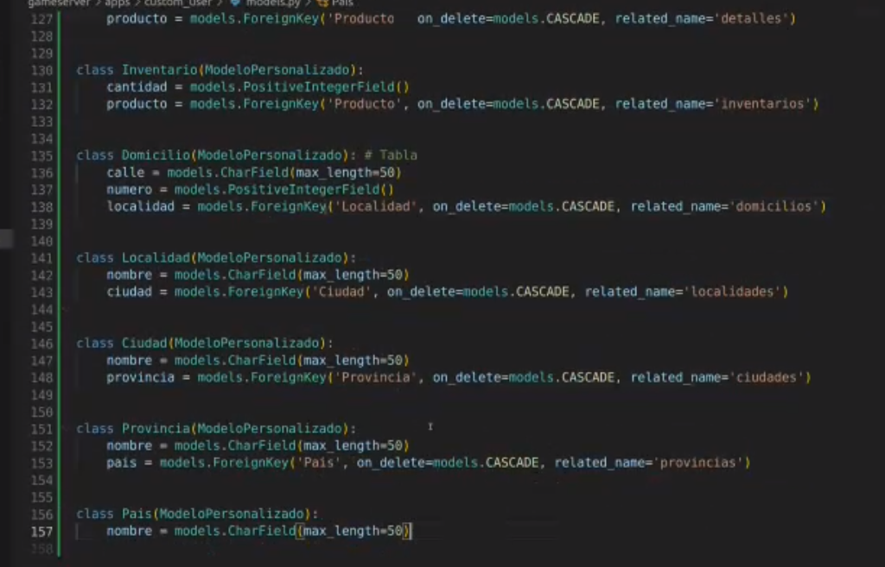

## Clase 10

Empezamos viendo modelos y haciendo una bajada de una posible BD:

Va creando este mismo desde un modelo que no había usado:

Nos menciona que esto se usa mucho para un tipo de búsquedas vía queries.

Busca un ejemplo en una base de datos:

Ahora con el modelo personalizado podemos heredar a Persona.

El manager puede usar toda la lógica:

---

Termina mencionando conceptos generales de POO.

