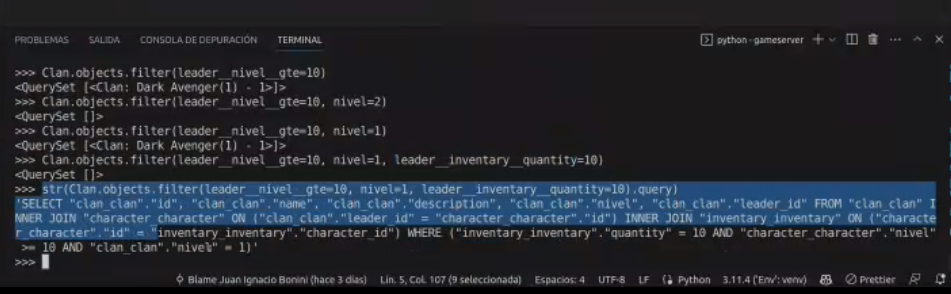
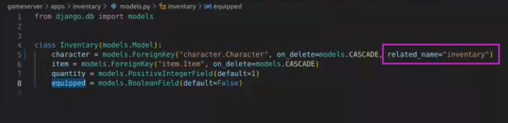
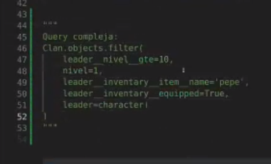
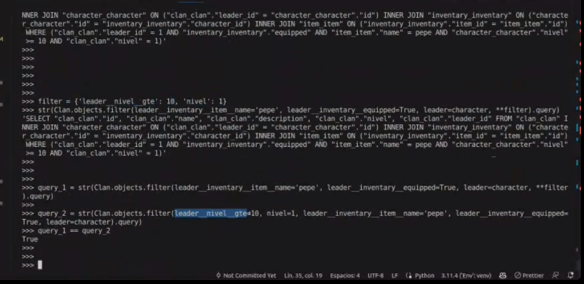
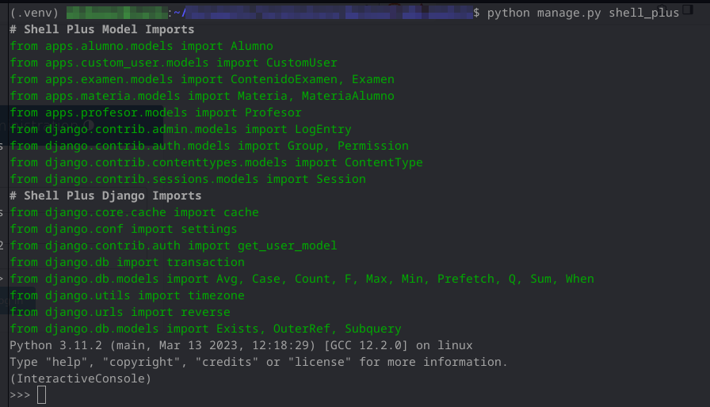
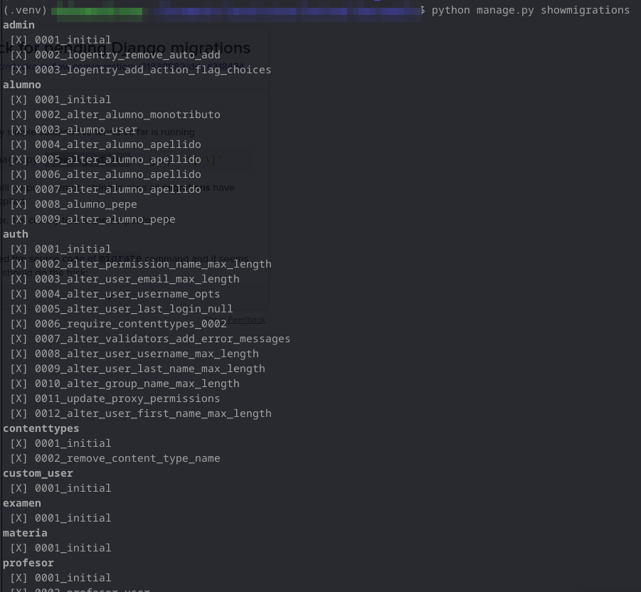

## Clase 11

Sigue avanzando con modelos y relaciones con la BD. En un momento vemos el resultado de la query completa en lugar de la simplificada por django:

Agregando related_name a la clase Inventary.

Queda ejemplo como comentario:

Filtros dinámicos con diccionarios de clave valor.

Va quedando subido acá: https://github.com/ioanne/trabajo_final_backend

---

Nos deja un ejercicio de queries.

Voy clonando el repo e instalando django, django-extensions. Después instalamos shell_plus:

con showmigrations vemos las migrations:

Esto lo voy a seguir en otro momento. [El repo del ejercicio es este.](https://github.com/ioanne/abm_models/ "https://github.com/ioanne/abm_models/")

---

Después en 1:1 le hago unas consultas sobre el TP, lo que venía avanzando del proyecto y estaba medio bloqueado con el docker-compose. Lo pudimos resolver, queda andando el proyecto (sin nada todavía) en su propio repo: https://github.com/kaenovsky/zhongwen