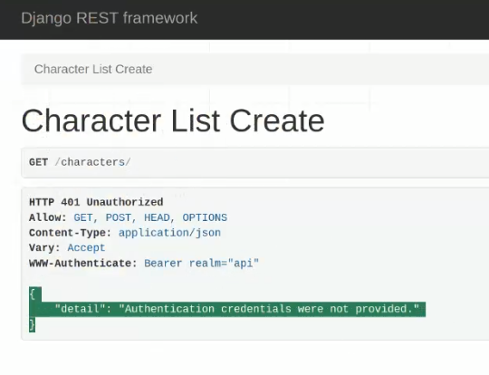
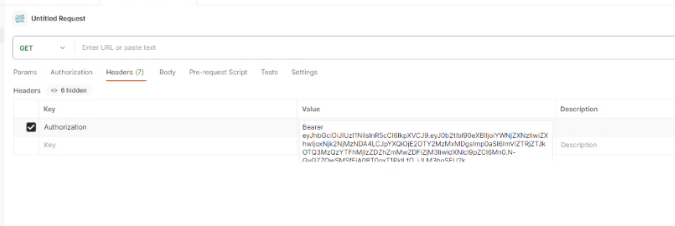
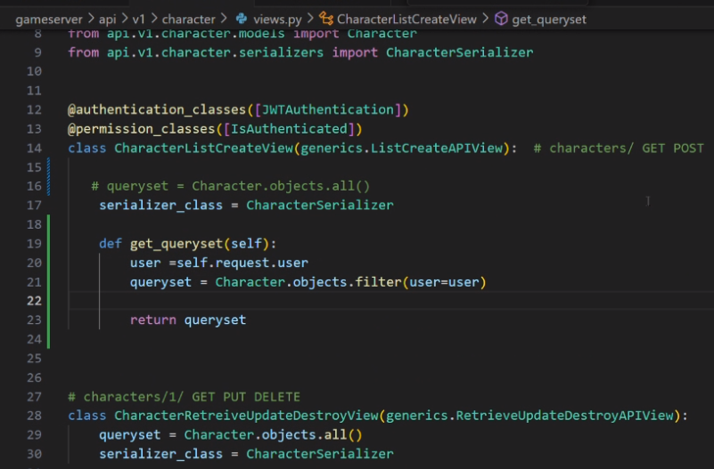
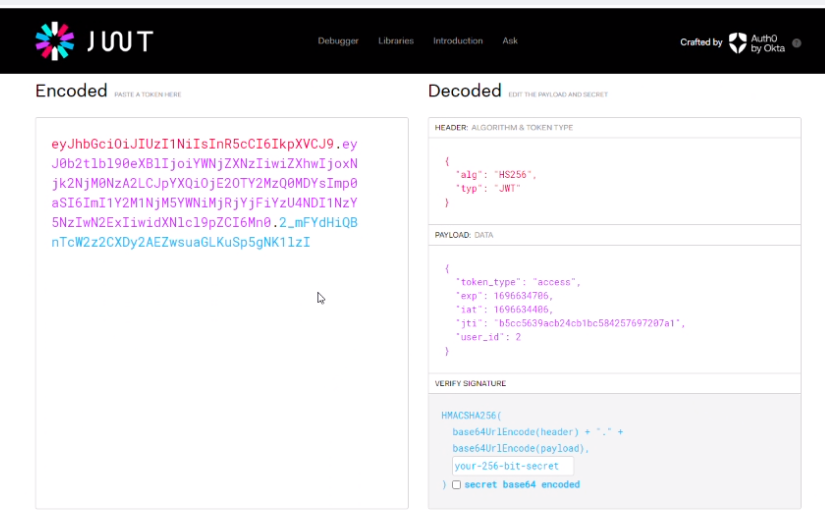
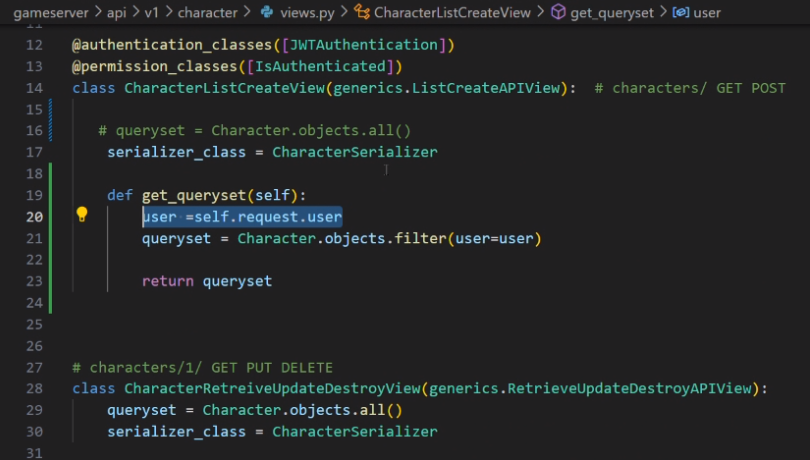
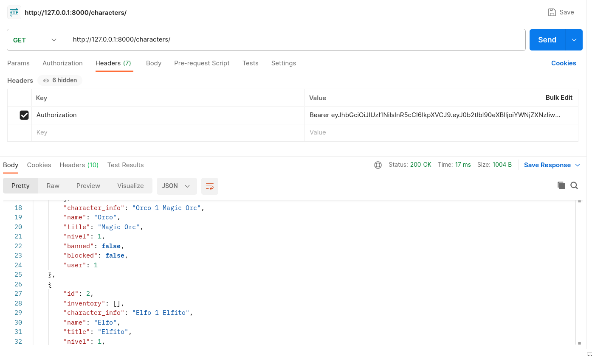

## Clase 14

Continua con JWT:

Crea el token y hace get al character, primero con curl y después con postman.

Nos da un ejercicio para que hagamos y lo seguimos desde la compu de un compañero:

vemos el jwt decoded:

Sigue el ejercicio, un compa va haciendo el código:

yo me quedé un poco seteando el postman en debian que terminó siendo un poco garrón 🙄 pero al final quedó andando

