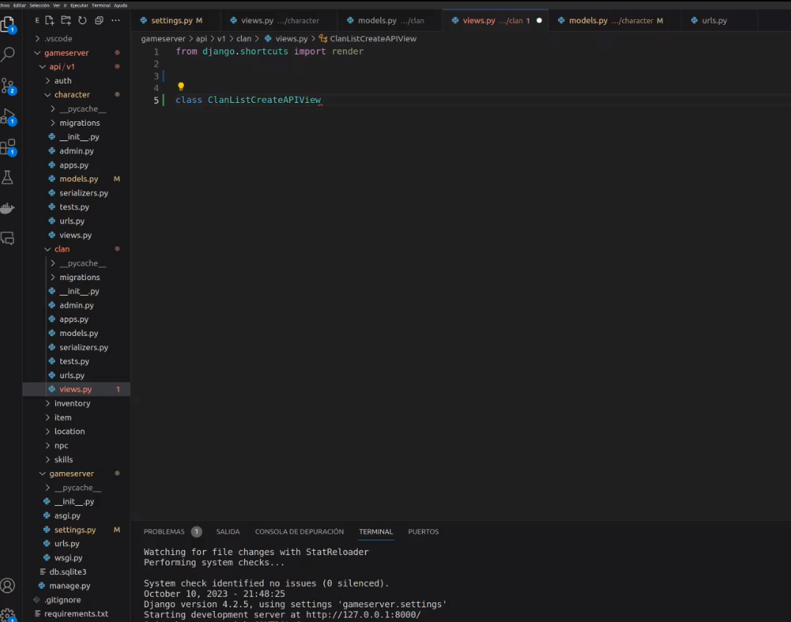
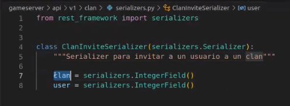
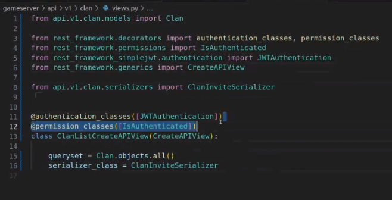
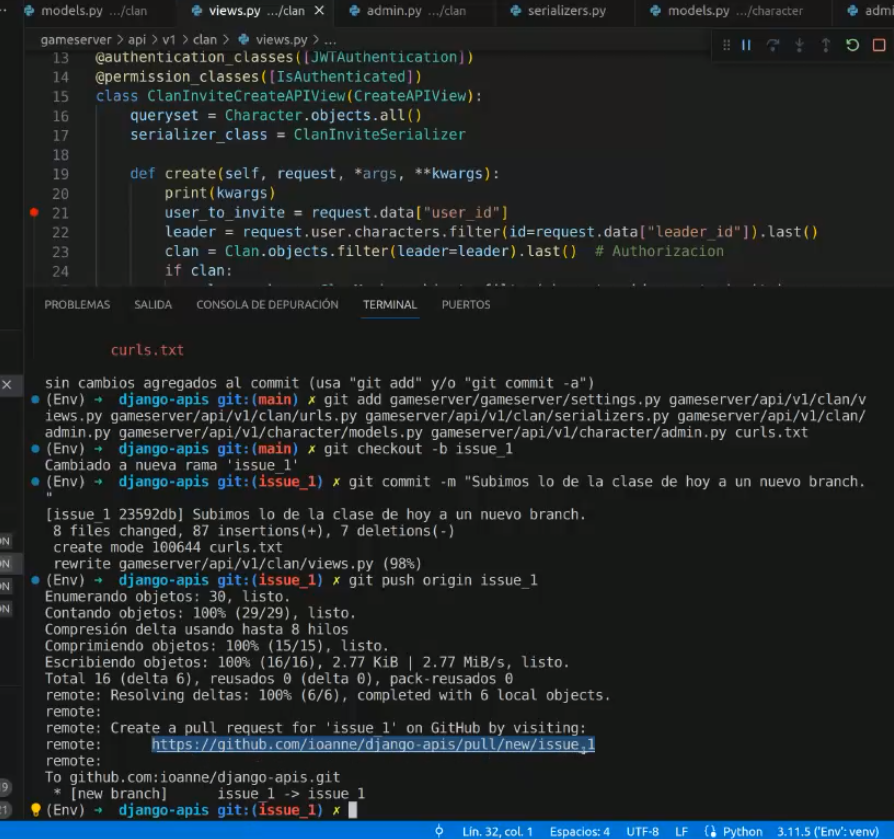
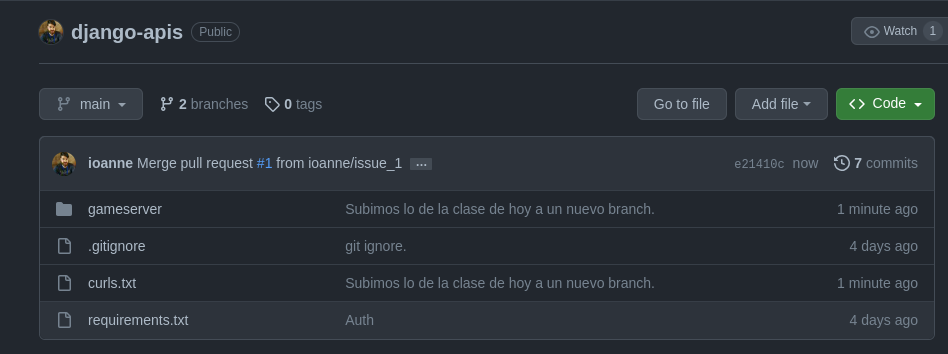

## Clase 15

Retomamos tema visto anteriormente. Hace unos cambios en JWT (después va a retomar eso).

en clan crea un archivo serializer.

commitea cambios y sube a github:

https://github.com/ioanne/django-apis/pull/1

