## Clase 16

Empieza comentando algunas cosas de manejo de contexto. Menciona puertos y procesos, que hay que cerrarlos por la cantidad limitadas de procesos que puede ejecutar la máquina.

Relacionado a eso empieza a mostrar cómo sería la apertura y cierre de un archivo:

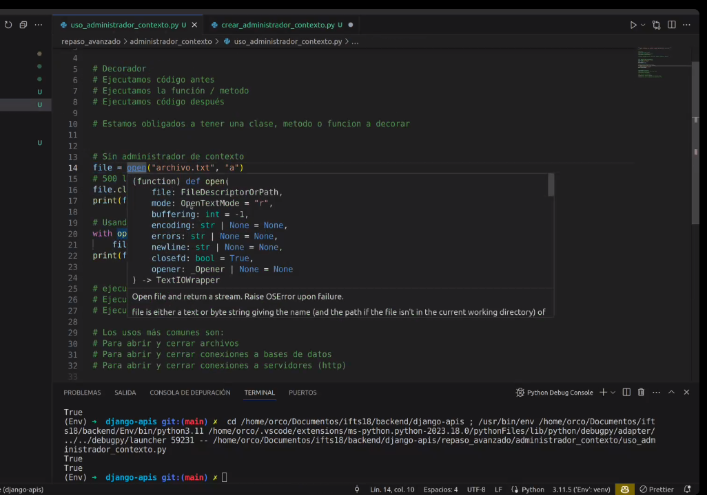

después empieza a definir su propio administrador de contexto.

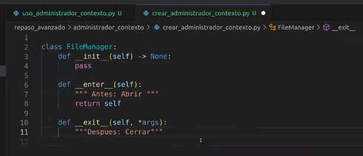

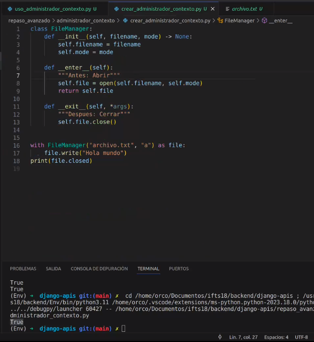

queda andando el FileManager 👏

Después pasa a mostrarnos unos decoradores:

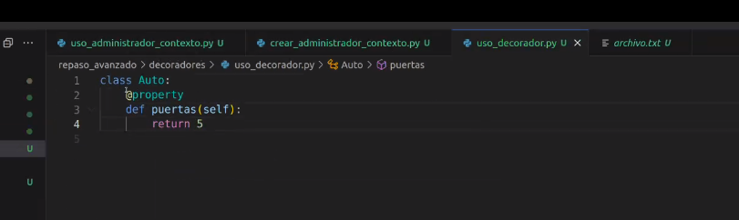

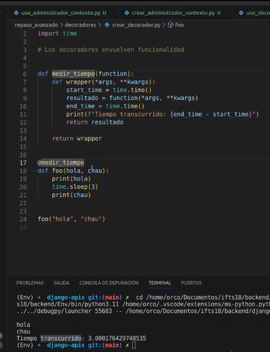

---

Después de ver algo de un compañero empezamos a ver algo de Views:

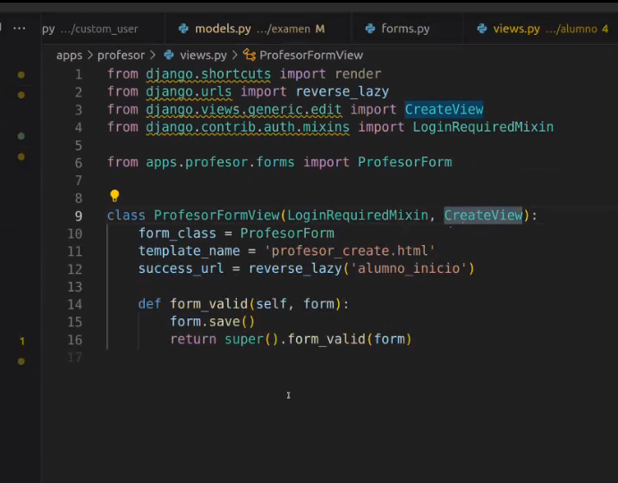
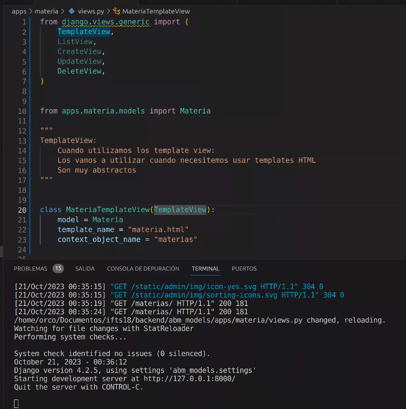

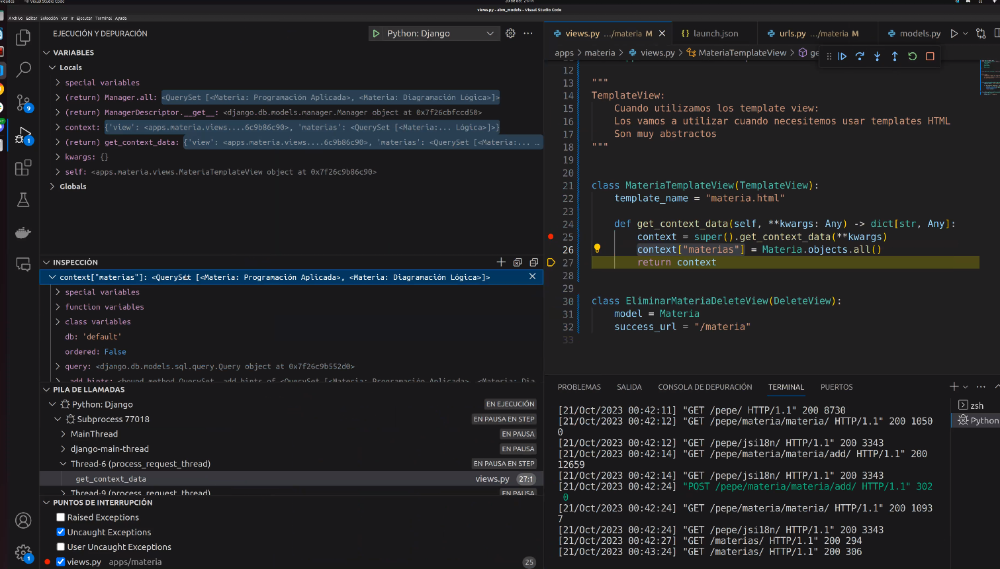

Debuggeando todo el contexto materia:

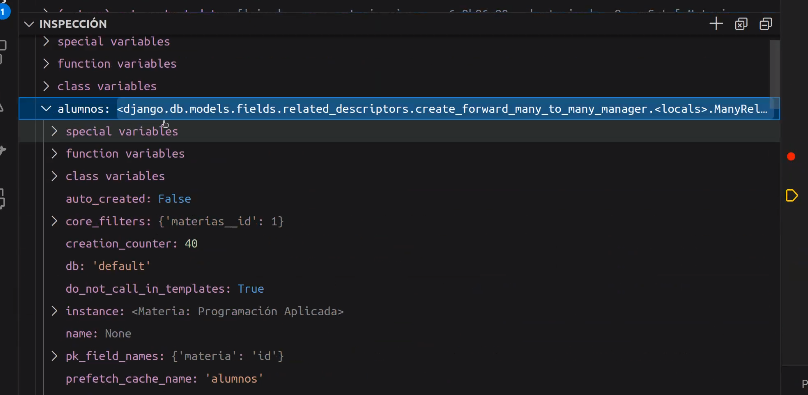

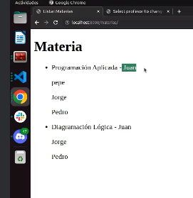

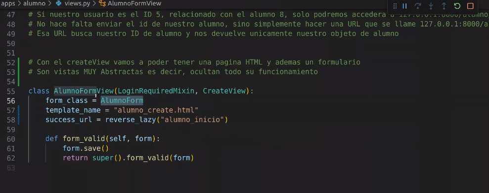

Usando CreateView nos abstraemos del funcionamiento de la creación de los objetos.