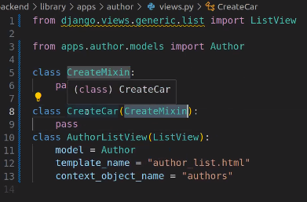
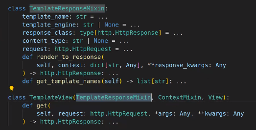

## Clase 17

Hace un repaso por los temas que quedaron pendientes que fuimos viendo para el TP.

Muestra algo de sesiones desde el template para ver parte del sitio sólo desde un usuario logueado.

Hace mención a github. Nos muestra cómo commitea en una rama, menciona temas de mergeo y trabajo en equipo usando github. Se debate un rato sobre eso.

Después sigue con parte de vistas.

Pasa a mencionar clases Mixin:

Le da métodos y propiedas, atributos a la clase que heredes. El patrón indica que no hay que instanciarla.

Muestra las clases desde adentro de django:

