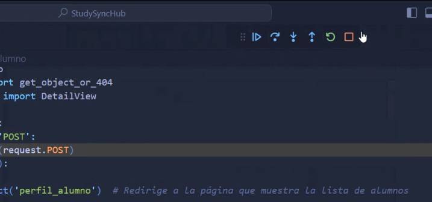

## Clase 18

Este día es para las demos de los proyectos. Empezamos con el de un compa. Aprovecha para mostrar algunas cosas de debugging con vscode:

Sigue un rato largo debuggeando el proyecto de un compa.

Después compartimos los demás TPs.
