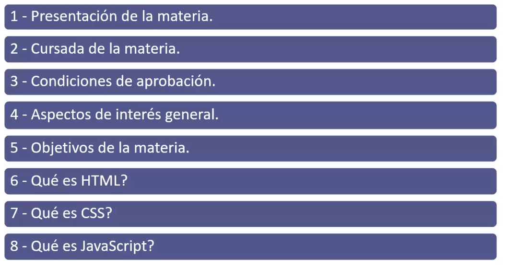
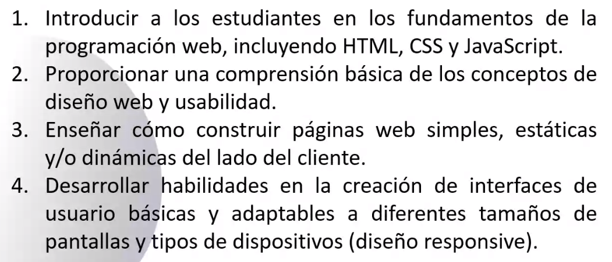
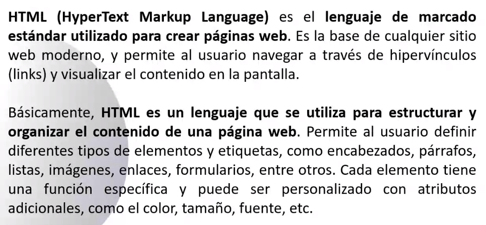
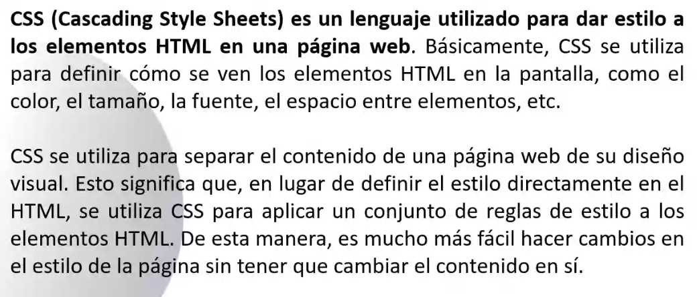
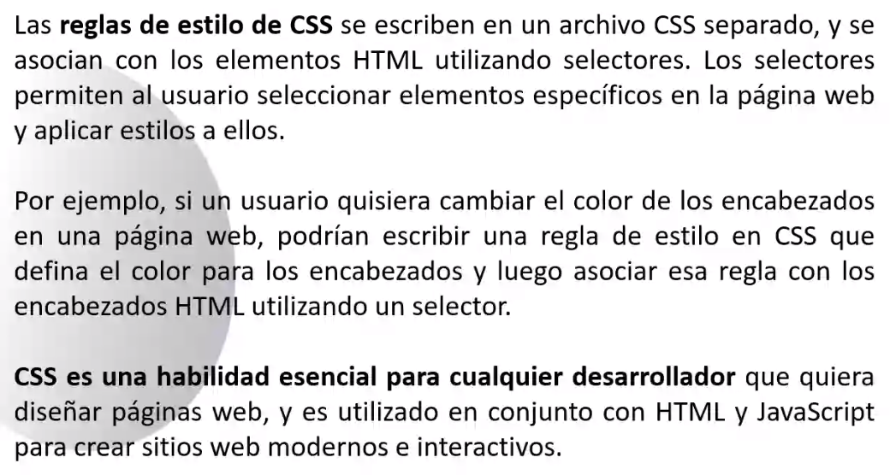
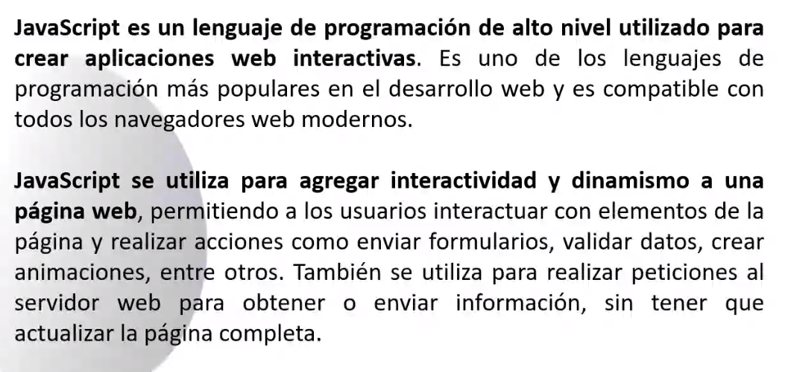

## Clase 01

Presentación del profe (Iberti, que ya lo tuvimos en dos materias). Nos comenta sobre la materia. Agrega a quienes faltan al classroom.



Empieza mencionando las condiciones de aprobación, horarios, etc.

Hay dos fechas presenciales:

- Miércoles 6 de Septiembre
- Miércoles 25 de Octubre

### Objetivos de la materia



### HTML



Se escribe con un editor de texto y se guarda como .html

```html

<body>
	<h1>Titulo de mi web</h1>
	<p>Párrafo en mi web</p>
</body>

```

### CSS





Los selectores nos ayudan a modificar elementos del markup:

```css

body {
	background-color: olive;
	text-align: center;
}

h1 {
	font-size: 12px;
	color: #131313;
}

```

### JavaScript



```js

let num1 = 5;
let num2 = 2;
let result = num1 + num2;

console.log(result);
// muestra en consola: 7

```