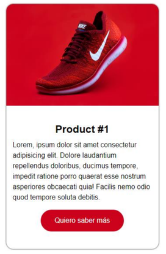

## Materia: Desarrollo de Sistemas web FrontEnd – IFTS 18

**Ejercicio nro 2: Página web Card producto**

**Tema:** uso de etiquetas html, hojas de estilo css con selectores de etiqueta y de clase, unidades de
medida absolutas y relativas.

### Enunciado:

Se debe desarrollar una página web que presente información sobre un producto en una card.
La presentación web del producto debe incluir una imagen, un título y una descripción sobre el producto
y un botón para conocer más información sobre el mismo.

La carpeta solución del ejercicio debe contener los siguientes archivos:

- Un archivo index.html ubicado en la raíz de la solución.
- Una subcarpeta llamada “img” que contenga el archivo “img_producto.jpg” con la imagen del producto. 
- Una subcarpeta llamada “css” que contenga el archivo “style.css” con la hoja de estilos en cascada
de la página. El archivo index.html debe incluir una etiqueta “link” al archivo .css mediante ruta relativa, y dentro de la etiqueta body una etiqueta html “article” con la clase “card” que contenga los siguientes elementos html:
- Una etiqueta “img” con la clase “card-img” que refiera a la imagen del producto mediante ruta relativa, y un “alt” con el valor “Zapatilla deportiva Nike”.
- Una etiqueta “div” con la clase “card-container” que incluya los siguientes elementos: un encabezado
h2 con la clase “card-title” y el texto “Product #1”, un párrafo con la clase “card-paragraph” y un texto
ficticio (Lorem ipsum) de 20 palabras, y una etiqueta “a” con la clase “card-button” y el texto “Quiero
saber más”.

El archivo style.css debe incluir:

- El selector universal * para definir el margen superior e inferior en cero y los márgenes derecho e
izquierdo en “auto”. Y una disposición border-box para los tamaños de caja de todos los elementos
html.
- Tipo de fuente “Arial” para todos los elementos del tag body.
- Tamaño de fuente de 16px para el tag html.
- El selector de clase card debe definir las siguientes propiedades para todos los elementos que lo
implementen: un ancho de 350px, un margen de 30px para top y bottom y automático para right y
left, una sombra para la caja (box-shadow) de 0 en horizontal (offset-x) y 0 en vertical (offset-y) y de
3px de radio de difuminación (blur-radius), y un border-radius de 1em (usar formato abreviado
shorthand).
- La clase “car-img” debe definir un ancho igual al 100% de su contenedor, un display block y un radio
para los bordes de 1em para top-left y top-right y de 0 para bottom-right y bottom-left (usar formato
abreviado shorthand).
- La clase “car-container” debe definir una alineación de texto centrado, un padding de 40px para top
y bottom y de 15px para right y left, y un radio para los bordes de 0 para top-left y top-right y de 1em
para bottom-right y bottom-left (usar formato abreviado shorthand).
- El selector de clase “card-title” debe definir un margen inferior de 10px.
- La clase “car-paragraph” debe definir un alto de línea (line-height) de 1.5 respecto del tamaño de
fuente de la página, y el texto alineado al inicio (start).
- La clase “car-button” debe definir una disposición “inline-block”, un color de fondo “#CC021C”, un
color de fuente “white”, anular la decoración de texto, un padding de 1em arriba y abajo y de 2em a
la derecha y a la izquierda, un margen de 1em arriba, y un border-radius de 2 respecto del tamaño de
fuente de la página.

La renderización de la página web debería verse de la siguiente forma:

Aspectos generales a tener en cuenta:

- El código HTML DEBE VALIDAR según el validador de la W3C:
https://validator.w3.org/#validate_by_input
- El código CSS DEBE VALIDAR según el validador de la W3C: https://jigsaw.w3.org/css-validator/#validate_by_input
- NO está permitido agregar contenido css con el atributo style dentro del html.
- La imagen del producto “zapatilla deportiva Nike” a utilizar en la página debe ser descargada de la
web: https://unsplash.com/es. Link de descarga: https://unsplash.com/es/s/fotos/nike

#### Propiedades

- Webs de referencia acerca de la propiedad box-shadow:
    - https://developer.mozilla.org/en-US/docs/Web/CSS/box-shadow
    - https://www.w3schools.com/css/css3_shadows_box.asp
- Webs de referencia acerca de la propiedad border-radius:
    - https://developer.mozilla.org/en-US/docs/Web/CSS/border-radius
    - https://www.w3schools.com/cssref/css3_pr_border-radius.php
- Webs de referencia acerca de la propiedad line-height:
    - https://developer.mozilla.org/en-US/docs/Web/CSS/line-height
    - https://www.w3schools.com/cssref/pr_dim_line-height.php