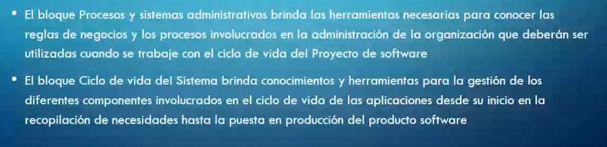
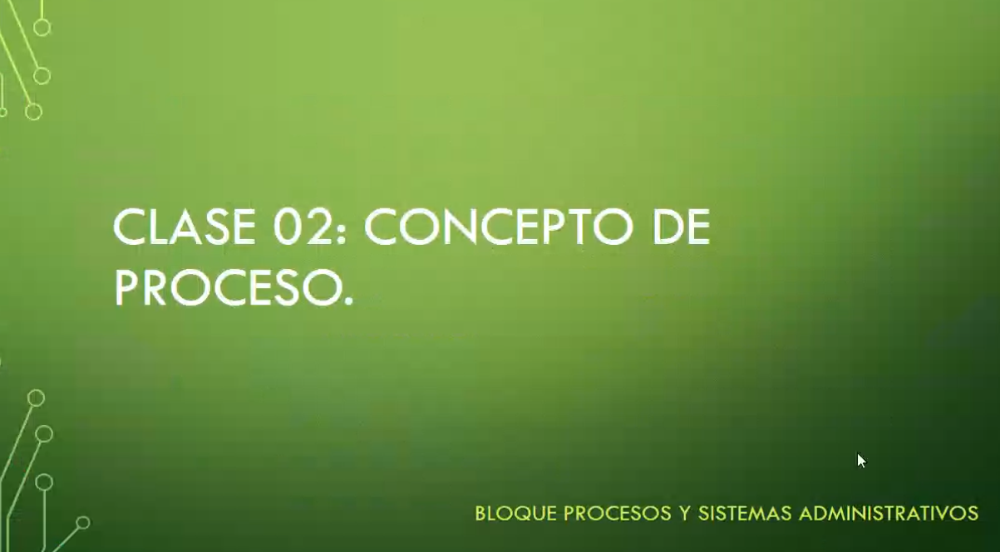
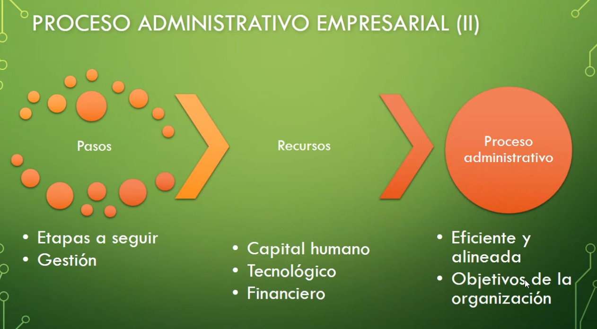
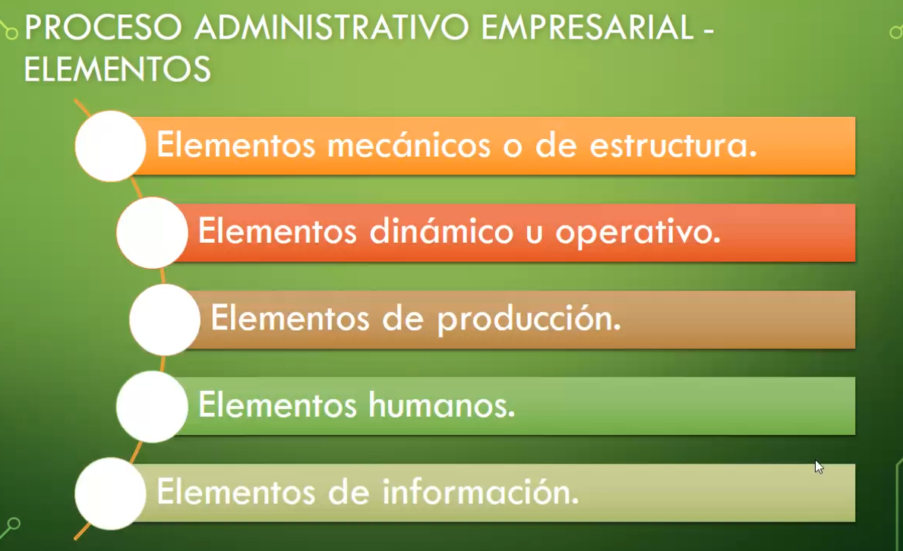
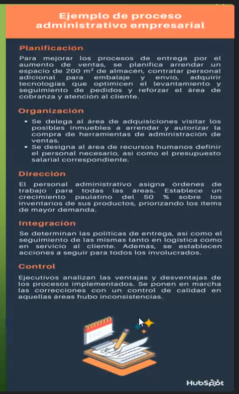

Empieza la clase con presentación de la materia en versión virtual, un poco de lo que hablamos en clase.

Refuerza que va a ser practico y teórico.

Los 2 bloques que mencionó:

- Procesos y Sistemas Administrativos
- Ciclo de vida del Sistema

La finalidad del proceso administrativo es guiar los lineamientos que tienen el fin de magnificar la productividad en términos de rentabilidad.

Estos procesos agilizan todas las etapas administrativas.

Pasos a seguir que gestionan recursos para generar procesos eficientes y alineados a los objetivos de la organización.

5 etapas del proceso administrativo para empresas:

- Planificación
- Organización
- Dirección
- Integración
- Control

