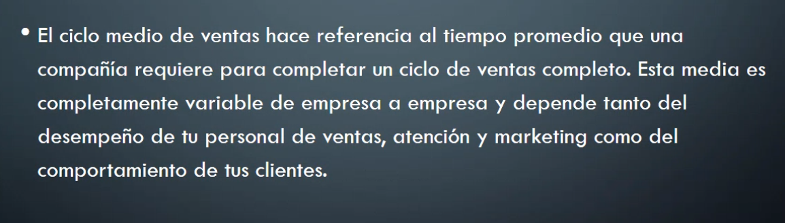

## Clase 03

Repasamos los TP enviados (...)

Luego pasamos a clase 03

Ejercicios de proceso administrativo:

(plantear solución de estos problemas)

### Qué es un ciclo de ventas?

### Importancia del Ciclo de Ventas

### Etapas del Ciclo de Ventas

### Ejemplo

### Ciclo Medio de Ventas

### Actividad grupal o individual

Definir el ciclo de ventas largo y corto con un ejemplo de tu interés.  
No más de un párrafo por ejemplo.

Respuesta:

Un ejemplo podría ser en una compañía que vende infraestructura para servidores (hardware). Un ciclo corto sería el repuesto para un equipo con fallas (se reemplaza por ejemplo el disco duro de un equipo), mientras que un ciclo largo podría ser la infraestructura completa para un cliente corporativo que incluiría múltiples equipos.