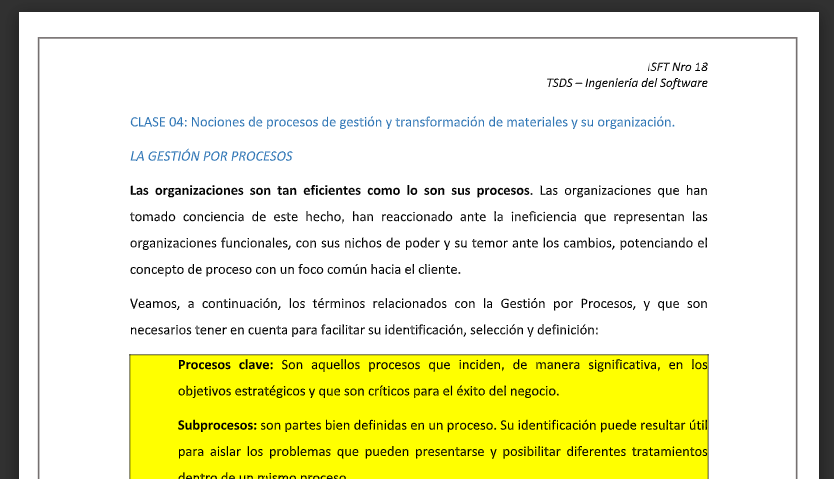

## Clase 04

### Gestión de procesos

Procesos clave: Son aquellos procesos que inciden, de manera significativa, en los objetivos estratégicos y que son críticos para el éxito del negocio.

Subprocesos: son partes bien definidas en un proceso. Su identificación puede resultar útil para aislar los problemas que pueden presentarse y posibilitar diferentes tratamientos dentro de un mismo proceso. 

Sistema: Estructura organizativa, procedimientos, procesos y recursos necesarios para implantar una gestión determinada, como por ejemplo, la gestión de la calidad, la gestión del medio ambiente o la gestión de la prevención de riesgos laborales. Normalmente están basados en una norma de reconocimiento internacional (ISO), que tiene como
finalidad servir de herramienta de gestión en el aseguramiento de los procesos.

Procedimiento: forma específica de llevar a cabo una actividad o un proceso. Los procedimientos se expresan en documentos que contienen el objeto y el campo de aplicación de una actividad; qué debe hacerse y quién debe hacerlo; cuándo, dónde y cómo se debe llevar a cabo; qué materiales, equipos y documentos deben utilizarse; y
cómo debe controlarse y registrarse. 

Actividad: es la suma de un conjunto de tareas que normalmente se agrupan en un procedimiento para facilitar su gestión. La secuencia ordenada de actividades da como resultado un subproceso o un proceso. Normalmente se desarrolla en un departamento o
en una función.

Proyecto: Un comportamiento temporal llevado a cabo para crear un producto o un servicio único (Project Management Institute)

Indicador: es un dato, o conjunto de datos, que ayudan a medir objetivamente la evolución de un proceso o de una actividad.

(Ver documento completo en classroom)

