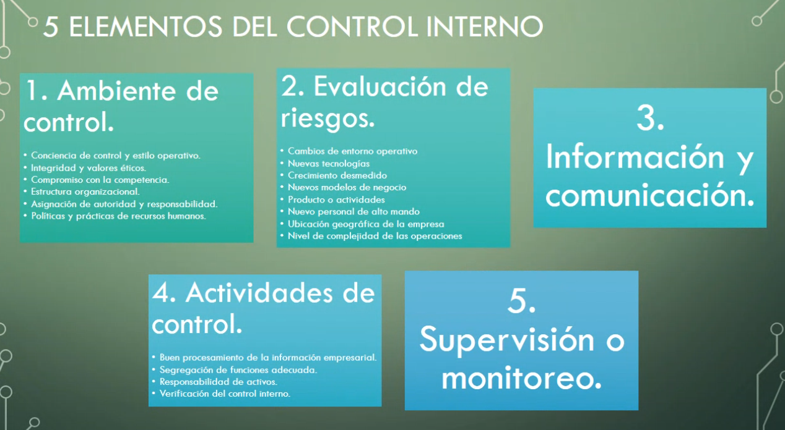
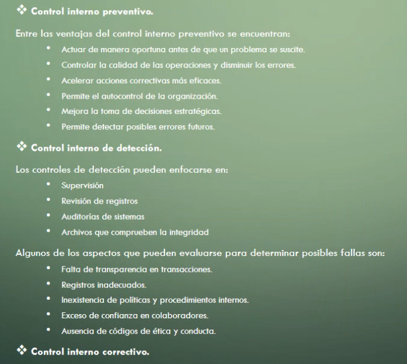
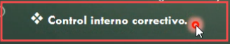
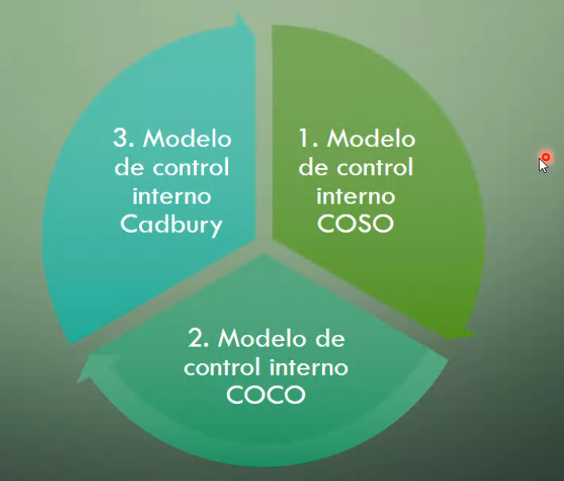

## Clase 05

Control interno. Pensando en auditorias internas y externas.

### 3 tipos de Control Interno

Los advierto con herramientas de la filmina anterior, pero estos son los fallos posibles:

### 3 Modelos de Control Interno

Releer los pasos para llegar a estos modelos de control.

Avanza sobre la idea de control como necesidad de corregir fallos internos y externos. Los planes de contingencia son el resultado de las auditorías y controles internos.

Hay formas de documentar a través de herramientas y estrategias, para dejar plasmado el control de gestión.

Cuáles fueron las medidas o pasos que se hicieron para solucionar ese evento (documentación).

