## Clase 06

Empieza hablando de la modalidad del parcial. Queda en votación la fecha. Explica la modalidad.

Empieza la clase:

En realidad van a ser la 5 y 6 juntas (lunes y martes):

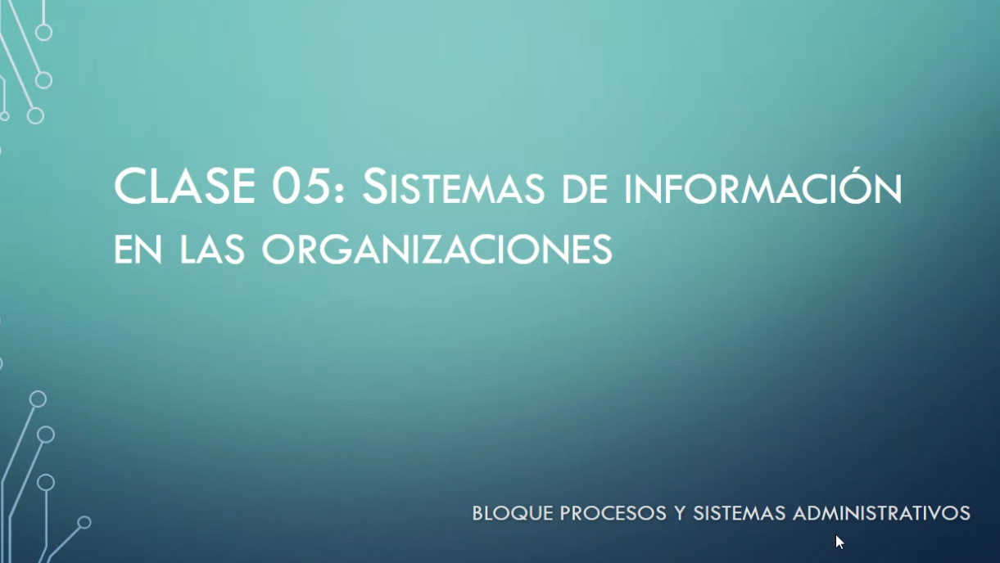

### SI (Sistemas de Información)

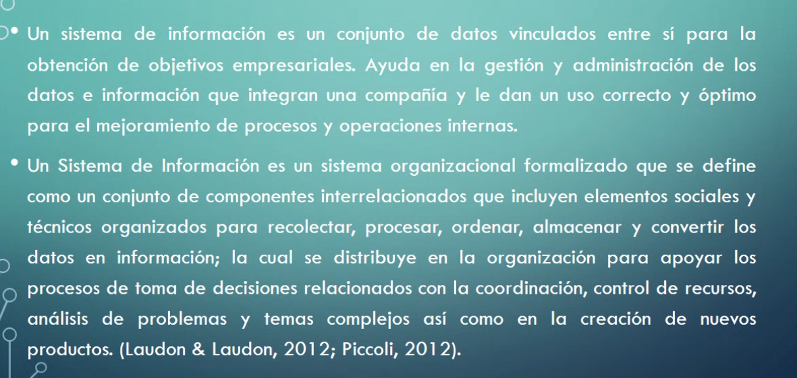

### Funcionamiento

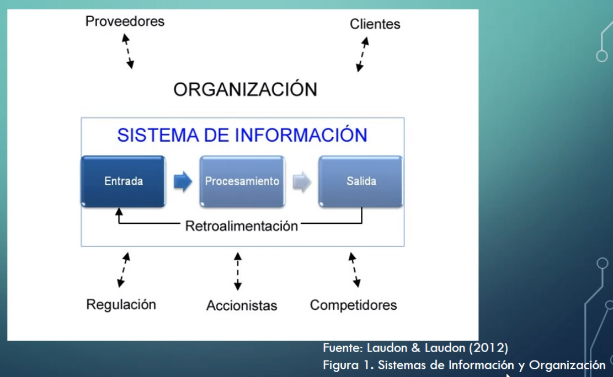

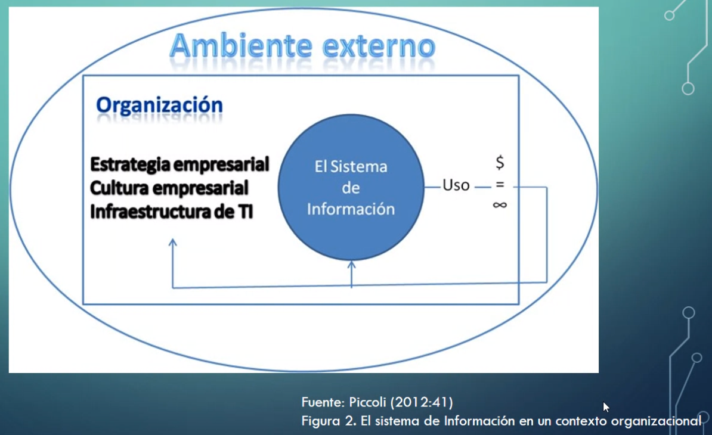

Componentes que forman parte de la TI. Son herramientas que trabajan de manera relacionada para conformar el Sistema de Información.

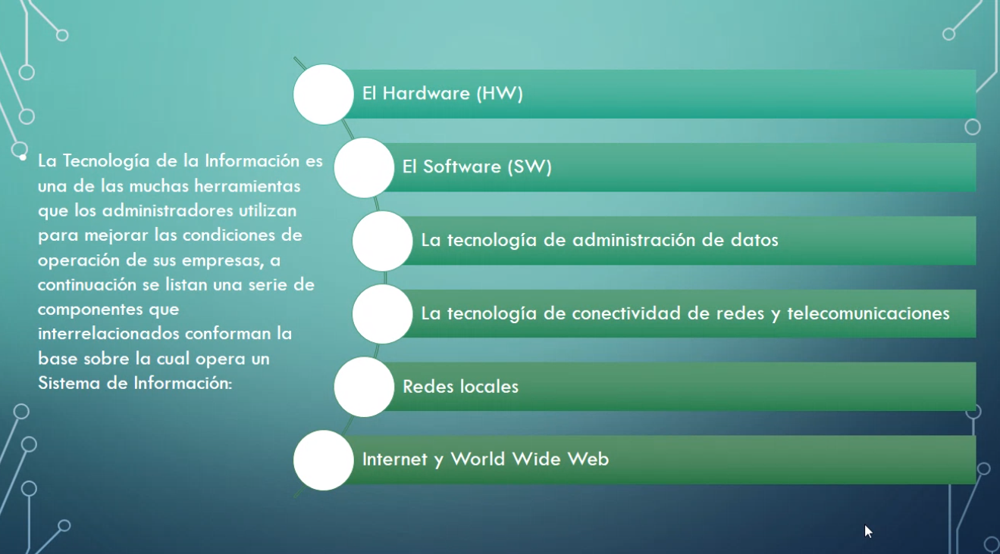

### Usos de Sistemas de Información

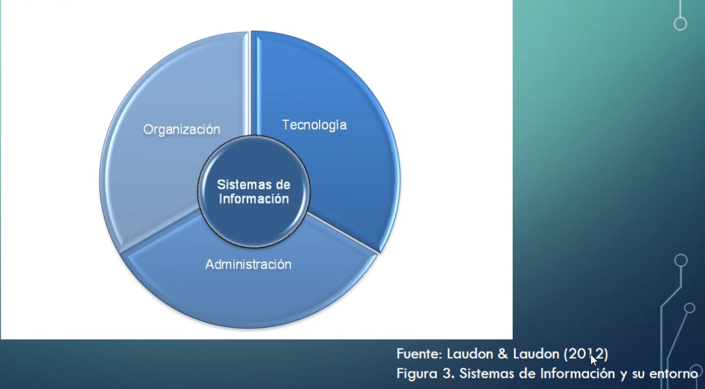

Se apoyan a sí mismos para conseguir los objetivos de la organización

### Cadena de valor de la Información de una Empresa u Organización

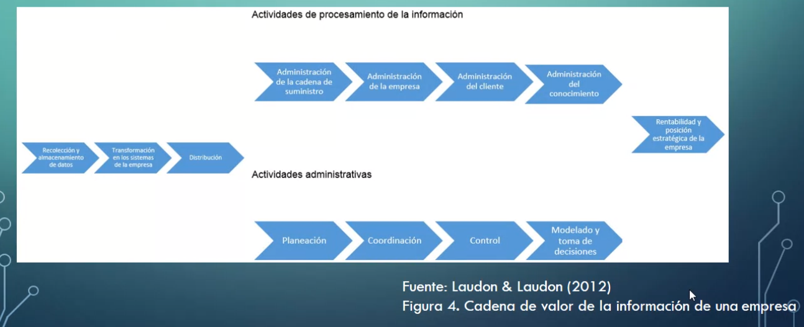

un poquito más de zoom:

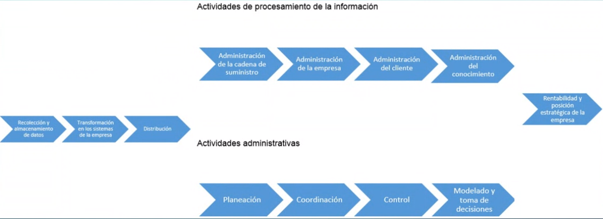

Estos sistemas actuan de forma conjunta, existe una interdependencia. No están aislados. Se relaciona también con la empresa en sí misma.

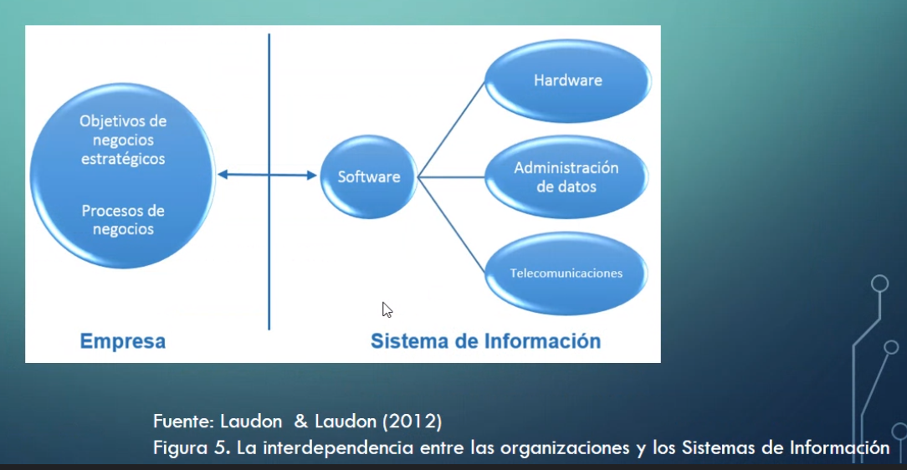

En este caso, las tres partes forman el triángulo de la Estrategía de Sistemas de Información:

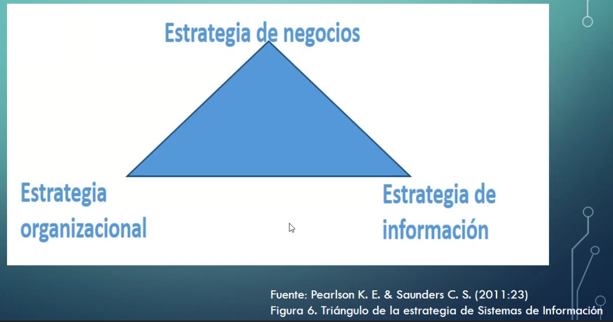

Actividad de la clase 5:

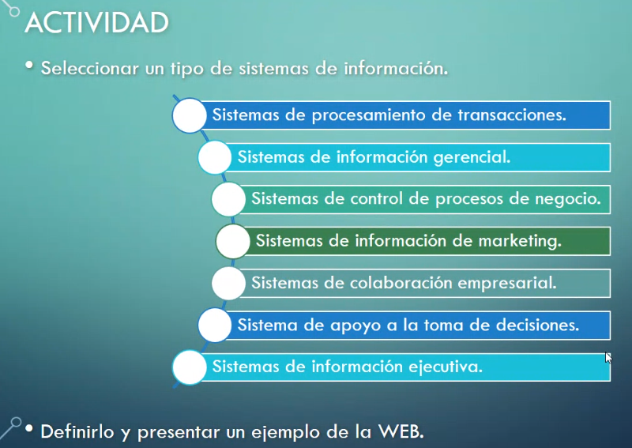

En nuestro caso hacemos grupo con Emi y César, elegimos Sistemas de colaboración empresarial, y ponemos como ejemplo Notion.

Hacemos la presentación en 3 pasos:

1. Qué son los Sistemas de Colaboración Empresarial
2. Demostración de un sistema con Notion
3. Desventajas de estos sistemas en la nube

Sale todo ok 👍

(...)

Siguen los demás grupos

---

Un poco más random...nos comenta sobre cómo aprendemos en la era de la Información (sociedad del conocimiento):

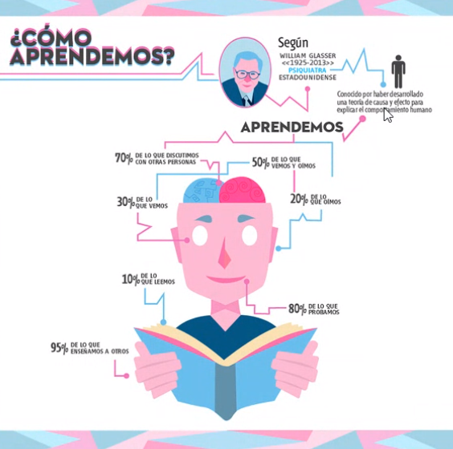

Menciona esto para hablar de que es importante mostrar la información de forma atractiva, comprensible y gráfica. De ahí el éxito de herramientas como PowerBI.

