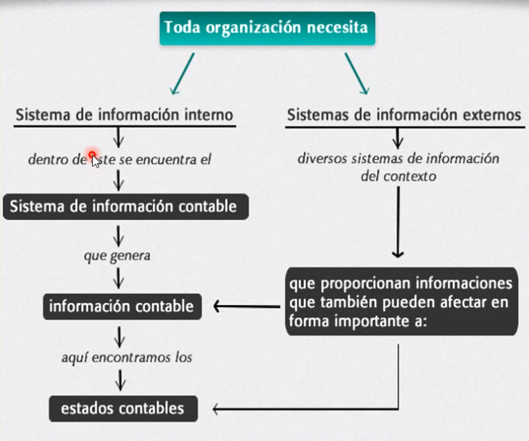

## Clase 08

### Sistema Contable

La contabilidad como sistema de información

Por qué aparecen también nueves formas de organización del trabajo?

### Qué sistemas de información necesitan?

Termina de compartir la presentación (ver en Classroom) y pasa a comentar la actividad.

(...)

Completo la actividad ✔️

Cada grupo va llenando el doc y después hacemos puesta en común en la sala.

Cierre de la clase. Comenta la actividad de la próxima clase.