## Clase 09

Empezamos viendo un poco de Teoría general de Sistemas.

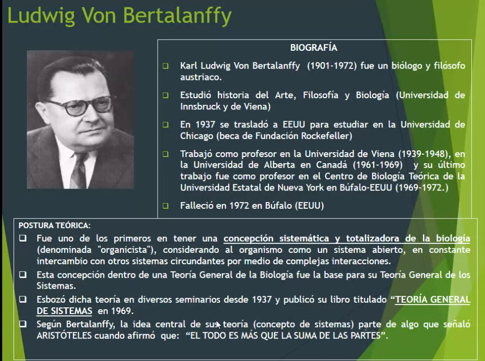

Diferencias entre la concepción clásica y la moderna:

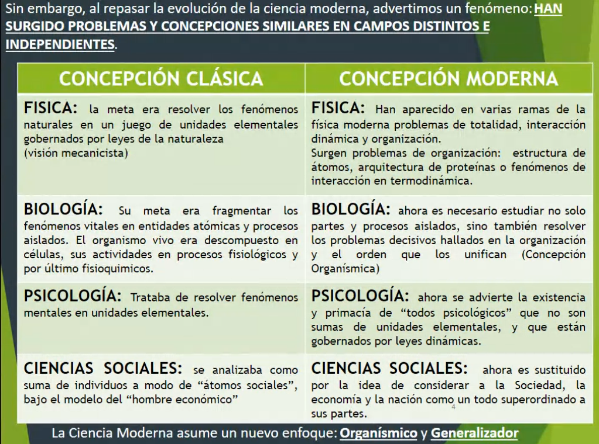

Evolución en las ciencias modernas

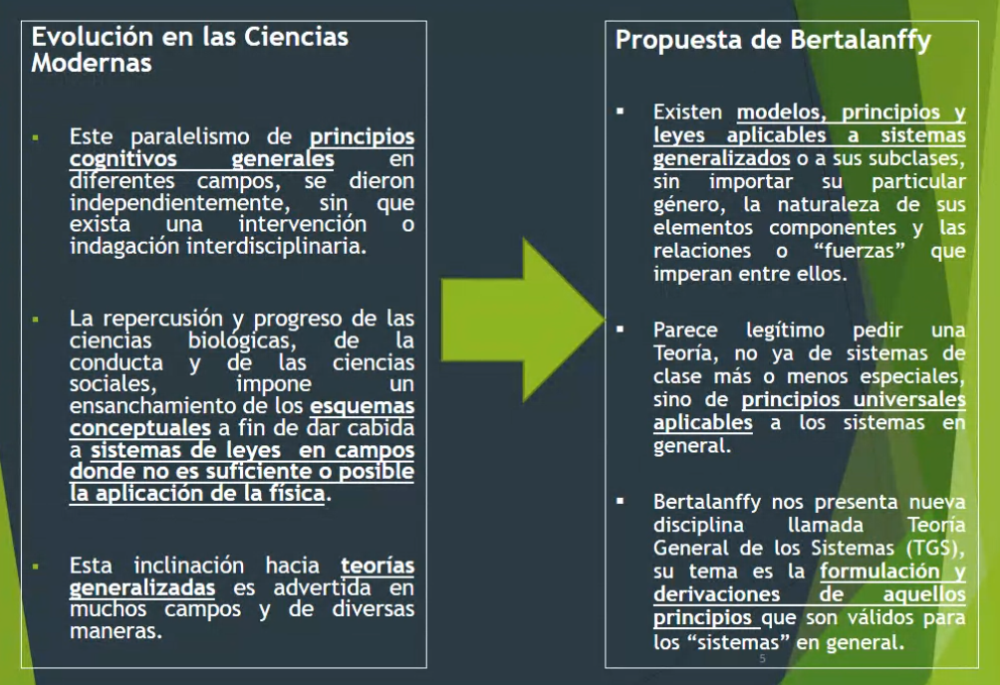

Esta teoría se aplica a todas las ciencias, no necesariamente las CS.

### Qué es la Teoría General de Sistemas?

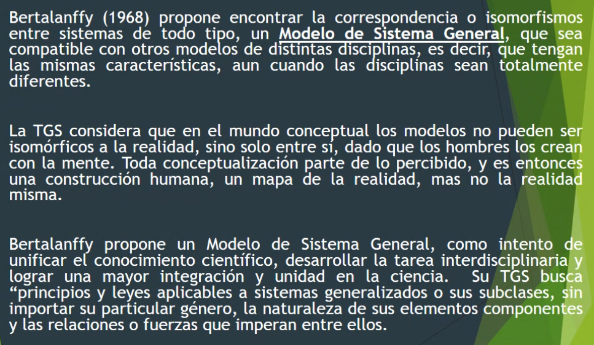

> Concepto clave, isomorfismo: En [matemáticas](https://es.wikipedia.org/wiki/Matem%C3%A1ticas "Matemáticas"), un **isomorfismo** (del [griego](https://es.wikipedia.org/wiki/Griego_antiguo "Griego antiguo") _iso-morfos_: Igual forma) es un [homomorfismo](https://es.wikipedia.org/wiki/Homomorfismo "Homomorfismo") (o más generalmente un [morfismo](https://es.wikipedia.org/wiki/Morfismo "Morfismo")) que admite un inverso.[1](https://es.wikipedia.org/wiki/Isomorfismo#cite_note-1)​

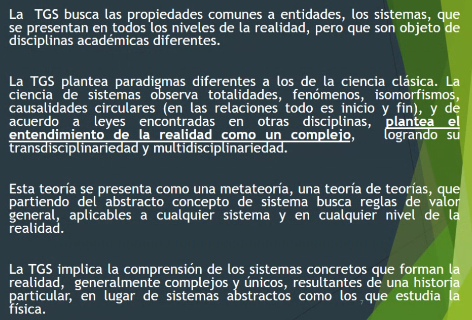

Busca propiedades comunes a los sistemas.

### Sistemas y Niveles de Complejidad

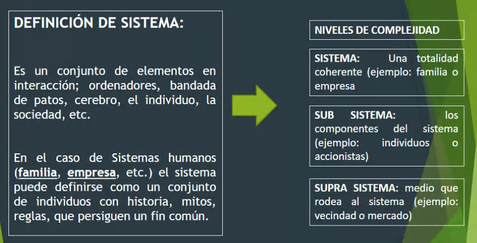

### Características

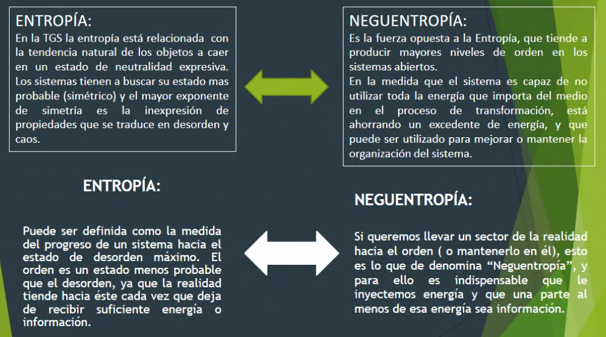

> ver material complementario de clase 01.

### Tipos de Sistemas

- Abiertos: los sistemas vivientes son abiertos al intercambio de energía y la relación con el entorno.
- Cerrados: Poco intercambio de energía, son herméticos a la influencia externa.

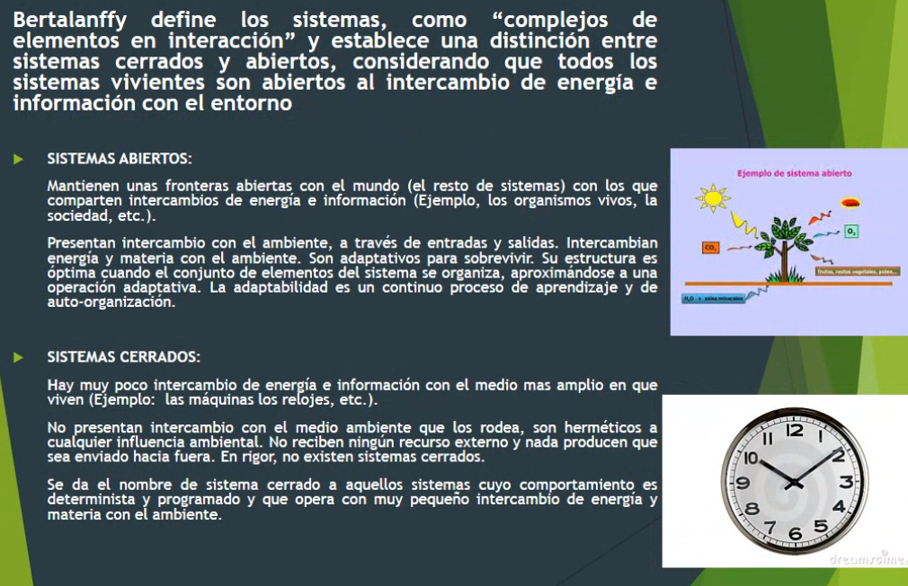

### Aplicaciones de la TGS

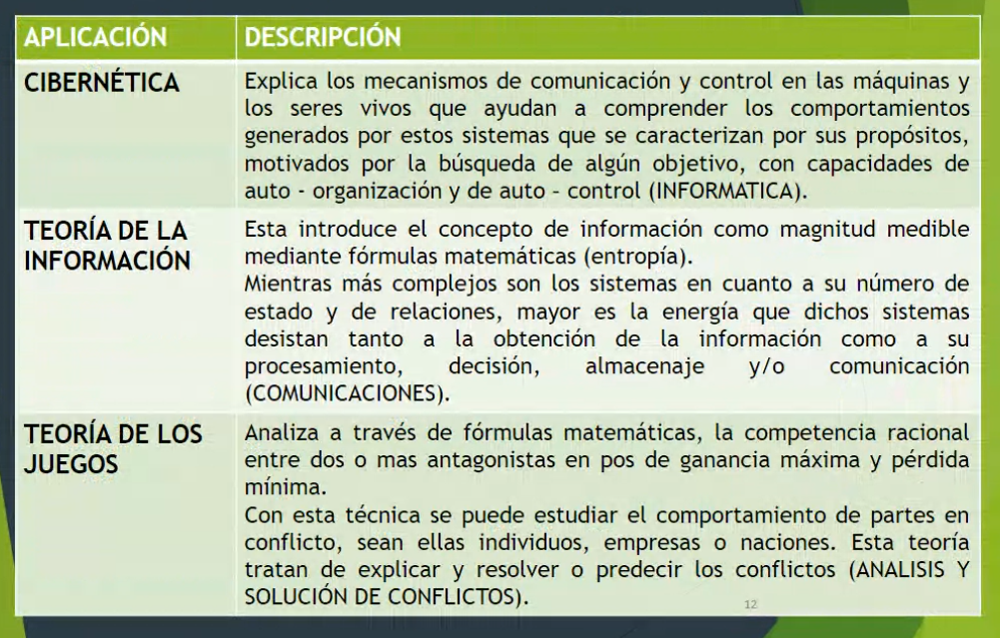

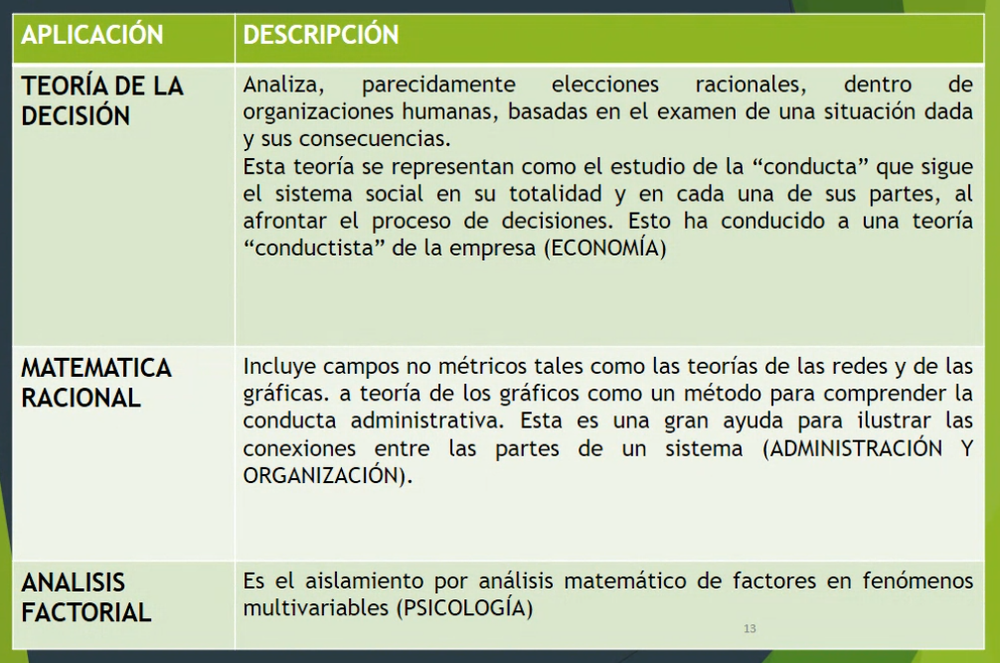

### Dónde más se puede aplicar la TGS?

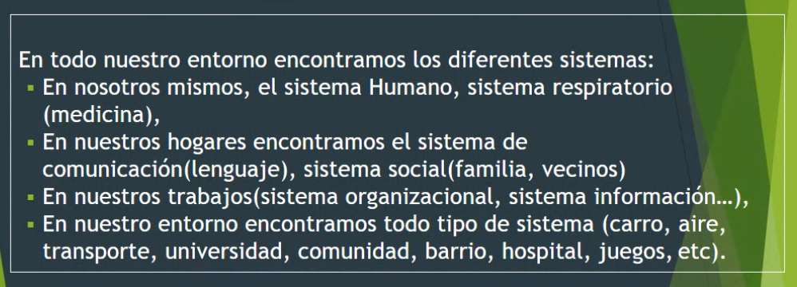
