Clase 10

## Paradigmas de desarollo

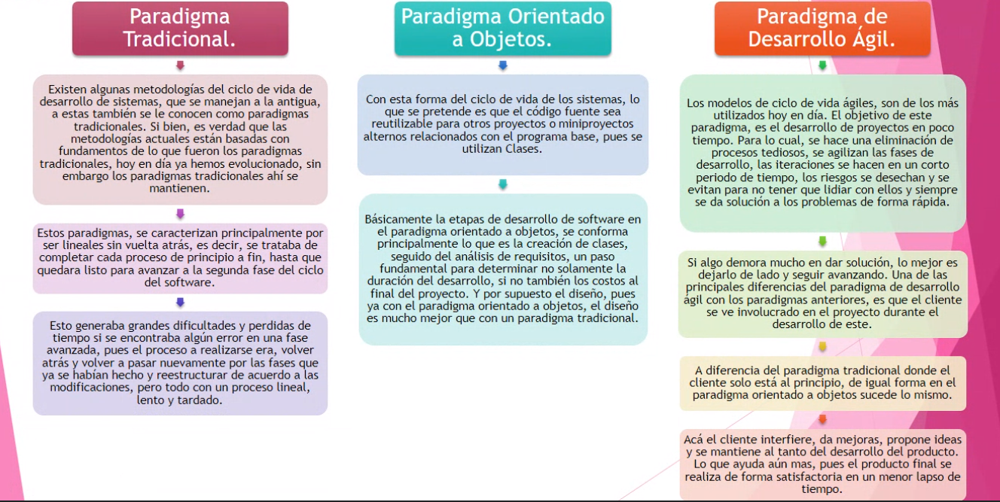

### Modelos del Ciclo de vida de un Software

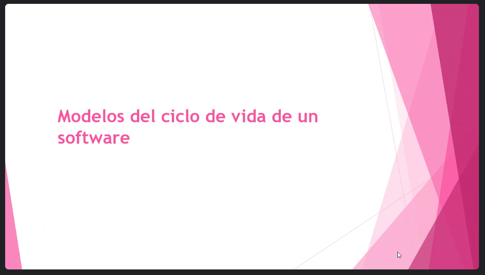

### Waterfall Model

Modelo en cascada

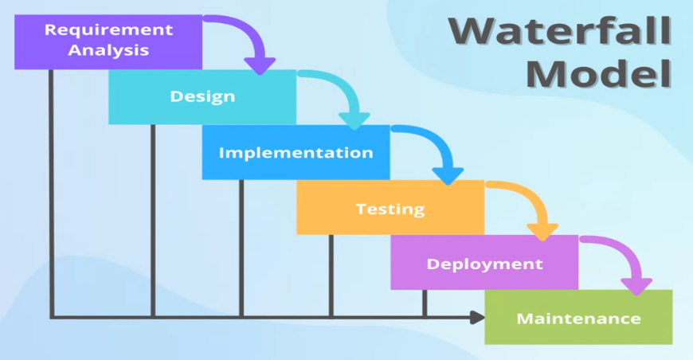

Hay objetivos claros.
Podemos utilizarlo también desde Agile. Se relacionan.

### Modelo V

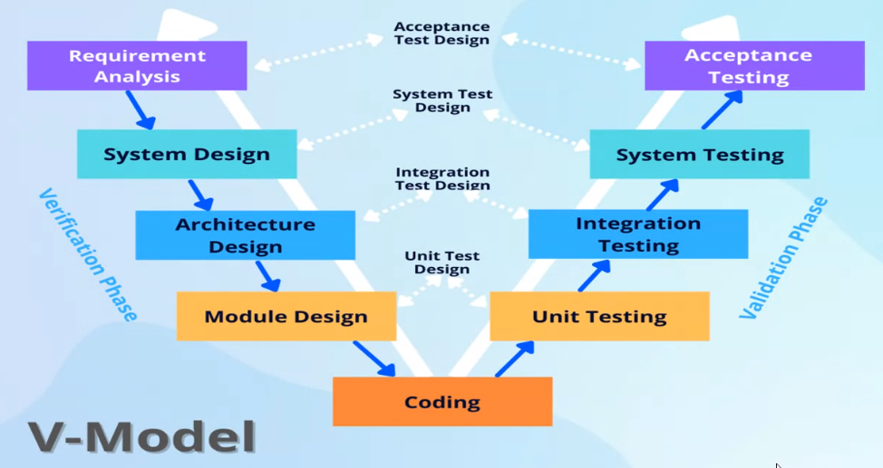

### Modelo iterativo e incremental

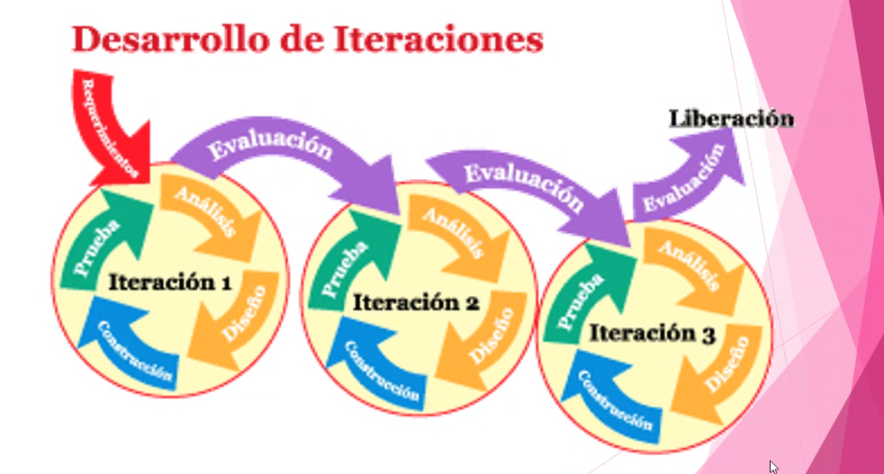

Pasa por etapas.

### Modelo en espiral

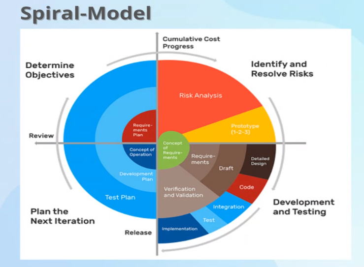

Cuando los requisitos y los objetivos no son claros.

### Modelo de prototipos

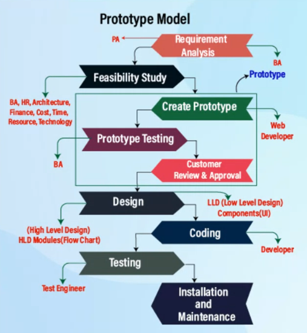

### El proceso unificado racional (RUP)

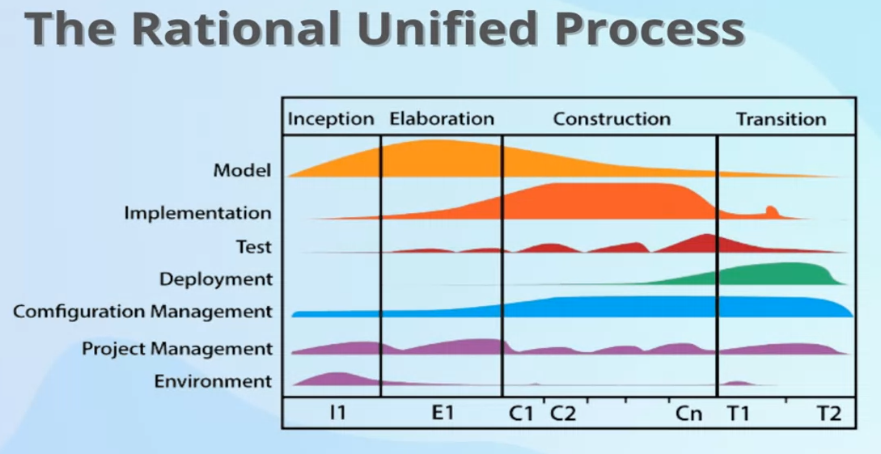

Se usan cuando hay cambios constantes en los requisitos. También cuando son desarrollos largos. Los requisitos van cambiando. Afectan procesos externos.

### El grupo ágil

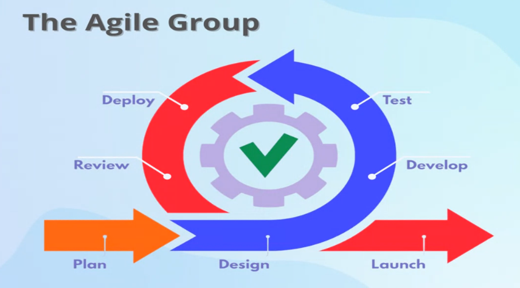

Es dinámico.

Dentro de esto hay varias herramientas.

### Kanban

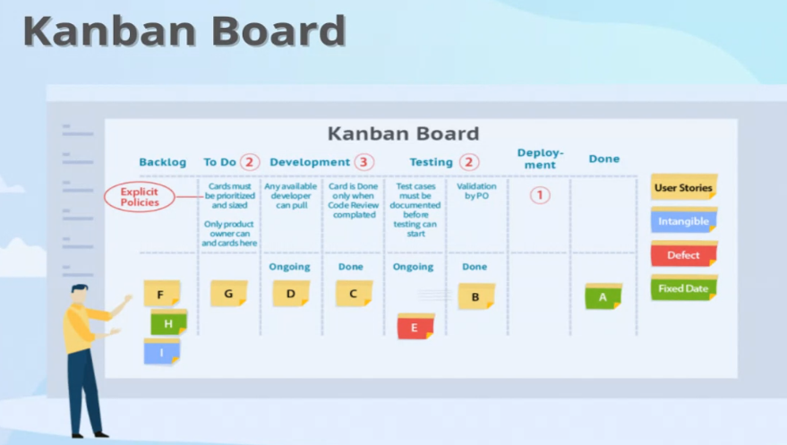

### Extreme Programming (XP)

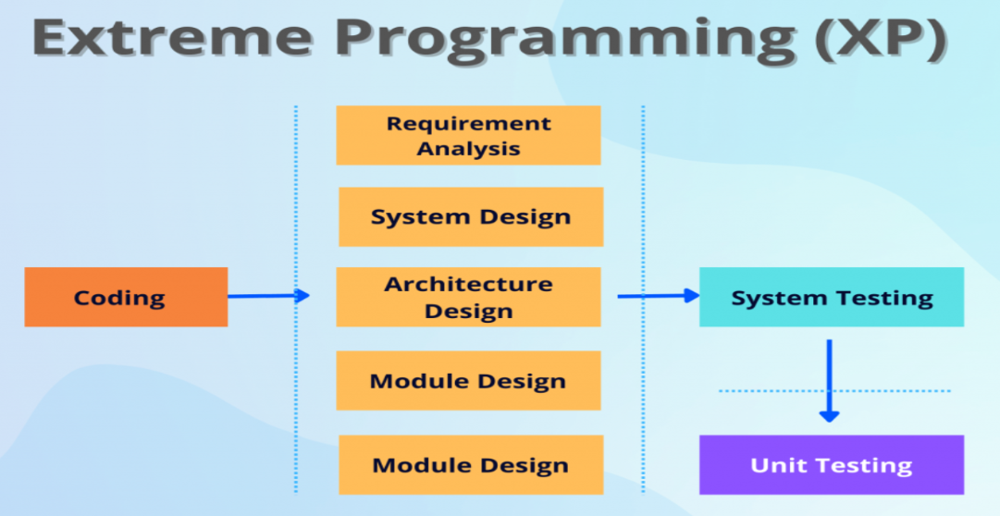

### Scrum

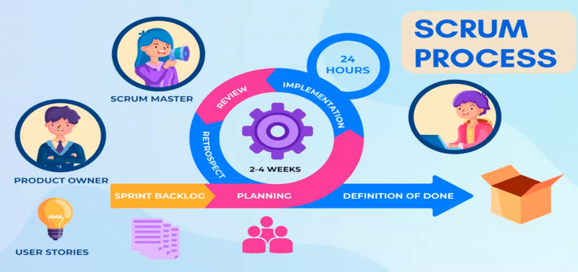

Podemos corregir errores en corto plaza.

### Preguntas frecuentes

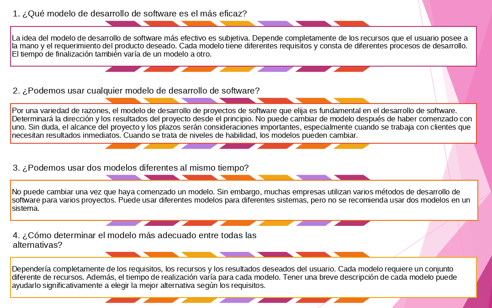

### Conclusión

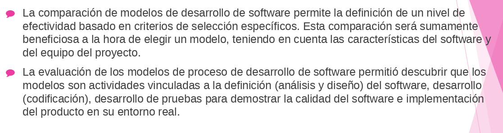

