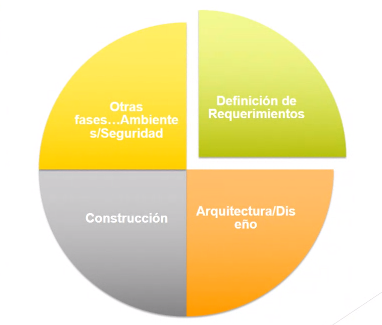
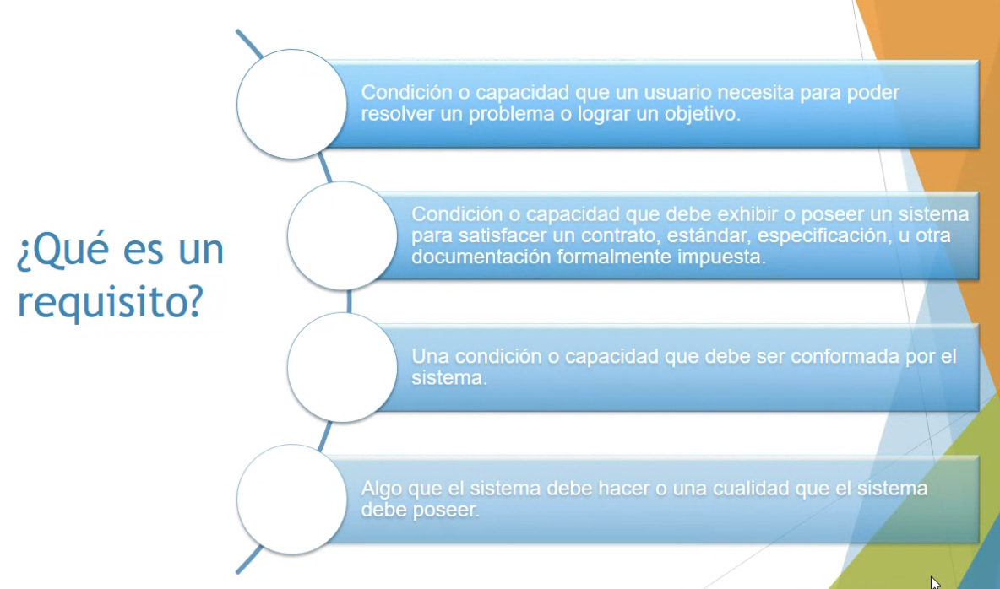
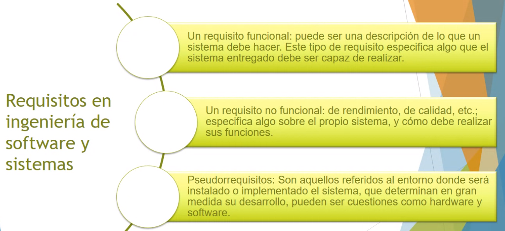
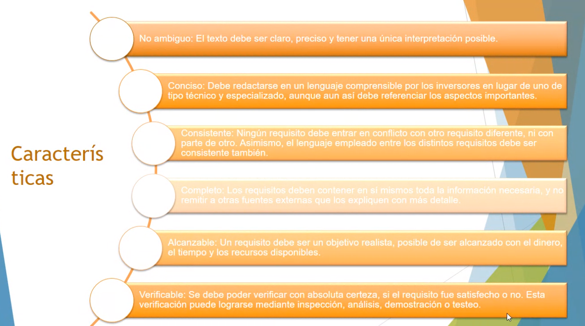
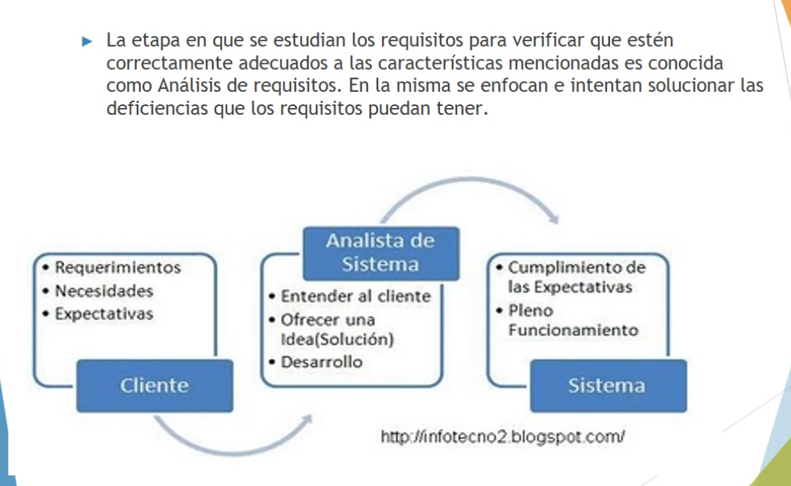
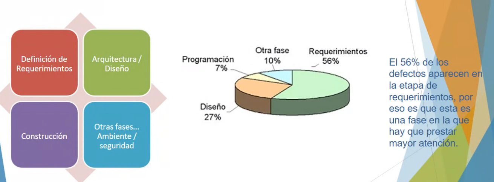
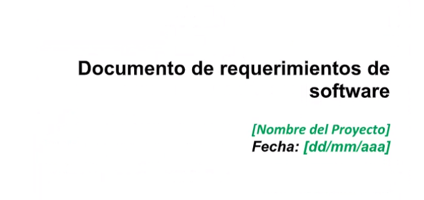
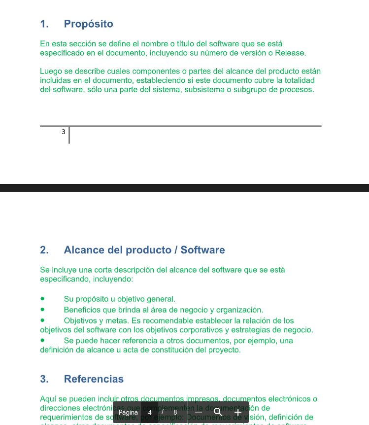

## Clase 13

Empezamos viendo un video para ilustrar la diferencia entre los requisitos que plantea un cliente y la forma en la que lo interpreta un analista funcional.

https://youtu.be/BKorP55Aqvg?si=7_bihxMWPQfrIBfc ("The Expert", corto)

Fases de requerimientos

Distintos tipos de requisitos:

- Qué debe hacer el sistema
- Cómo debe lograrlo

### Análisis de requisitos

Pensamos en qué fases del proceso de desarrollo y planificación empiezan a aparecer los problemas más frecuentes:

Se arrastran errores desde el diseño hasta la ejecución.

Pasa a mostrar ejemplos de requisitos funcionales y no funcionales.

Después vemos un DRS:

Ver completo en Classroom