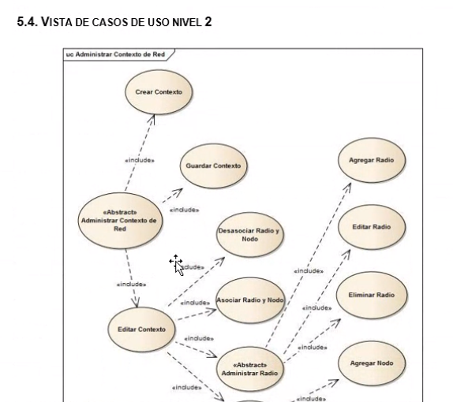
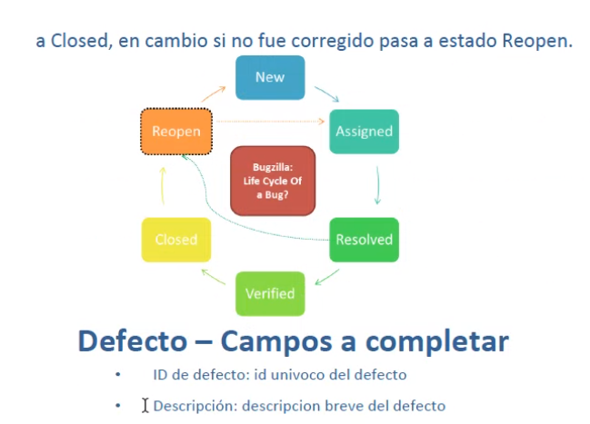

## Clase 15

Vemos temas como:

- Casos de uso
- Casos de prueba

Cómo a partir de los casos de uso se crean casos de prueba. Muestra un ejemplo en distintos niveles. Ejemplo nivel 2:

### Casos de Prueba - Criterios

Fallas a considerar:

---

Comenta que vamos a armar casos de prueba. Diseño de casos de uso.

Esto comprende parte del ciclo de vida de desarrollo.

Amplia un poco sobre defecto / falla:

error / defecto / fallo

- Error: en el código
- Defecto: en el software
- Fallo: al momento de ejecutar las pruebas

### Un buen reporte de defectos

KISS (Keep it Simple, Stupid)

Ser específico, técnico, pero sin criticar. No generar problemas en el equipo:

Usar estándares, que quede escrito. Que esté numerado.

Ejemplo de ciclo de bug por bugzilla:

