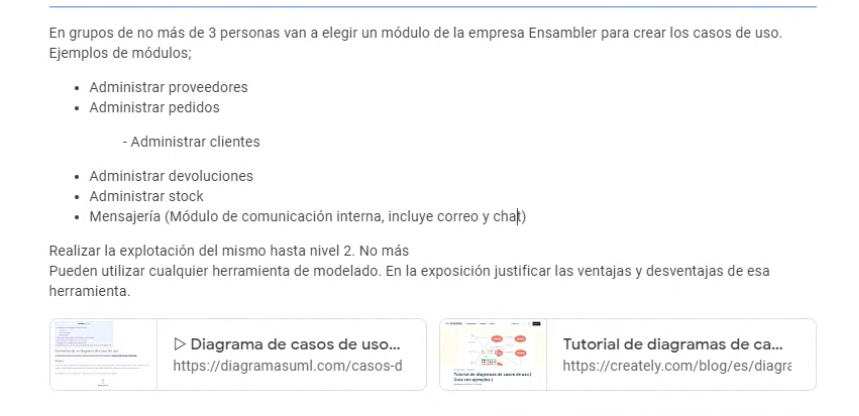
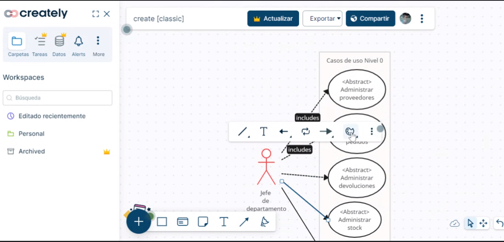
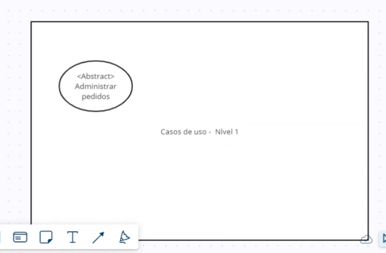
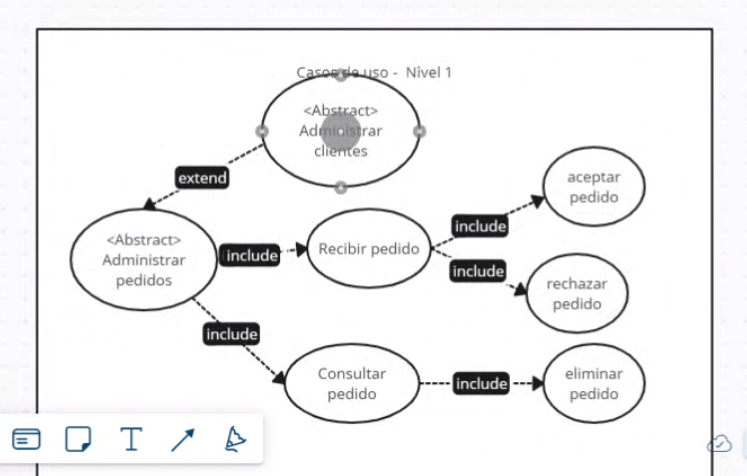

## Clase 16

Primero da las notas del parcial. Menciona tema TP final.

En clase hacemos una actividad sobre casos de uso:

Hacemos uno de prueba:

De nivel 0 a nivel 1

Casos de uso del ejemplo:

Queda subido el ejemplo completo en Classroom