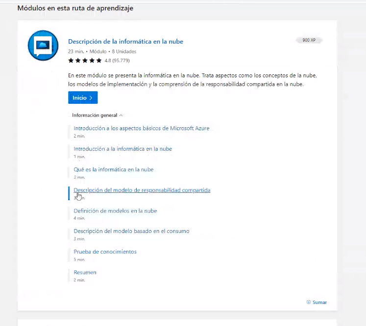

## Clase 01

Comenta las modalidades de la materia.

En vez de Discord usamos meet y vez de Classroom usamos un Moodle. 

Temas que vamos a ver en principio:

- Git
- Shell
- Scripting
- Automation
- Networking
- Balanceadores
- Proxy
- DNS
- TCP/IP
- Subnetting
- Analítica de costos
- Data
- IoT
- Diagramas de infraestructura

Proyecto integrador: trabajo grupal. Pensar una necesidad para una organización. Configurar una solución en la nube. 

Path de ceritificación AZ-900 (Microsoft Azure). Vamos a ir siguiendo el learning path de Azure, las preguntas del parcial son las mismas que la certificación.

