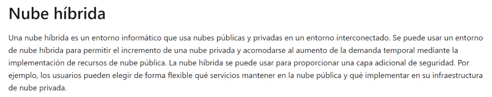
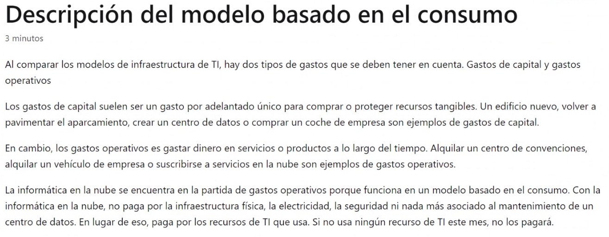

## Clase 02

Empieza la clase haciendo un repaso por la historia de las terminales, mainframes, etc.

Revisamos algunos conceptos del apunte:

Después volvemos al learning path de Azure:

### Intro a Azure

### Responsabilidad compartida en Cloud

### Modelos en la nube

### Comparación de modelos de nube

Cuando trabajamos en múltiples nubes (por ejemplo algunos servicios en AWS, otros en Azure) hablamos de nubes múltiples:

### Modelo basado en el consumo

