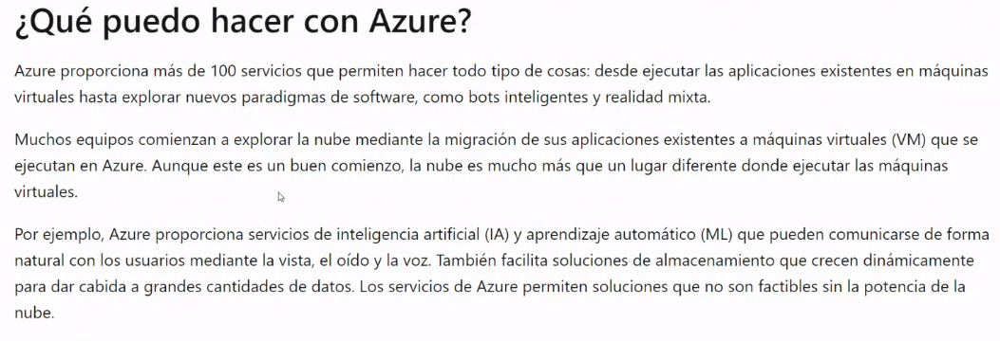
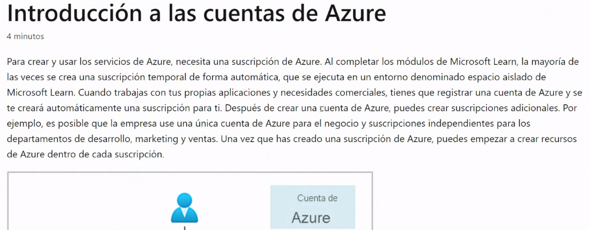
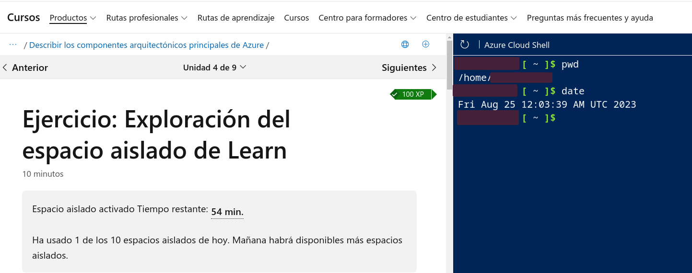
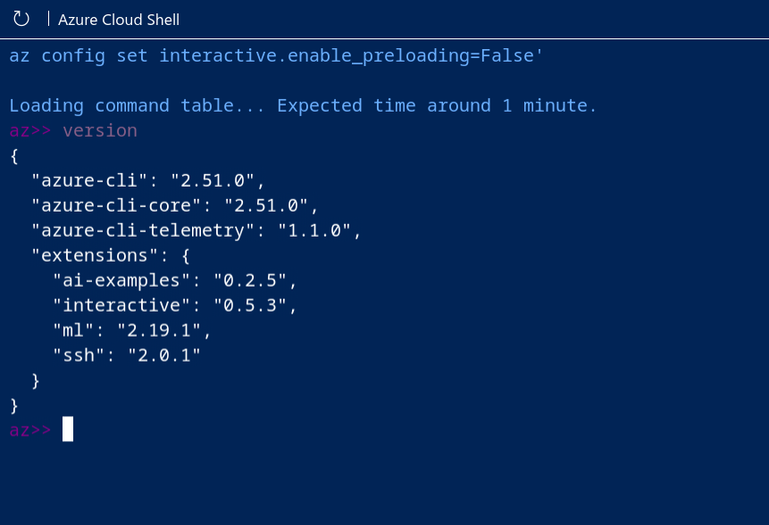
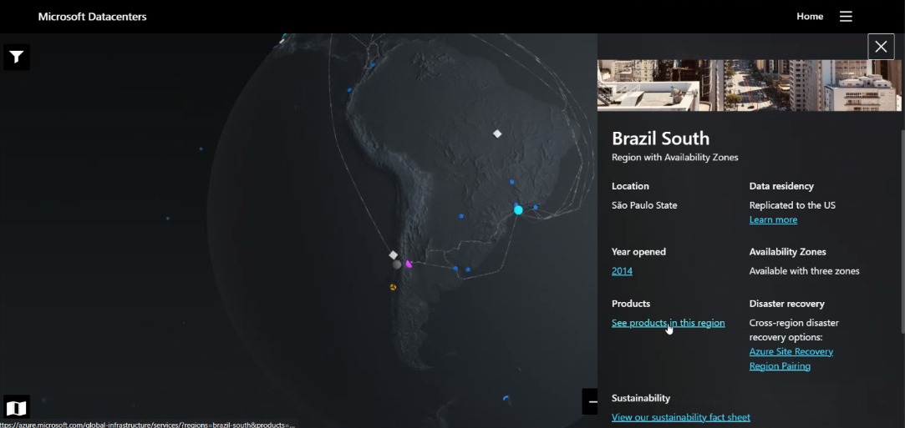
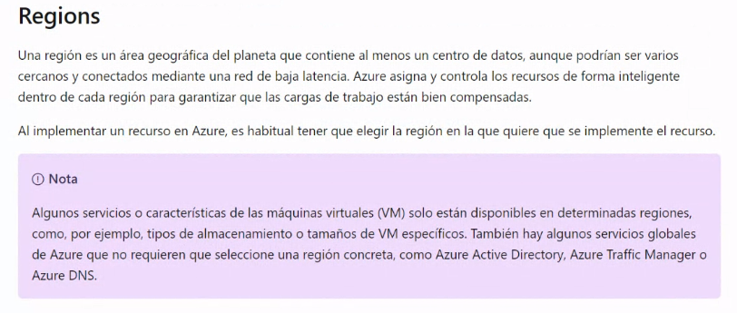
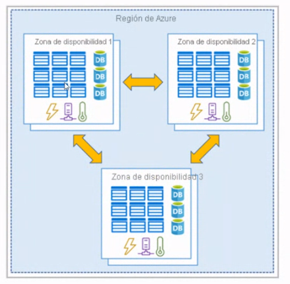
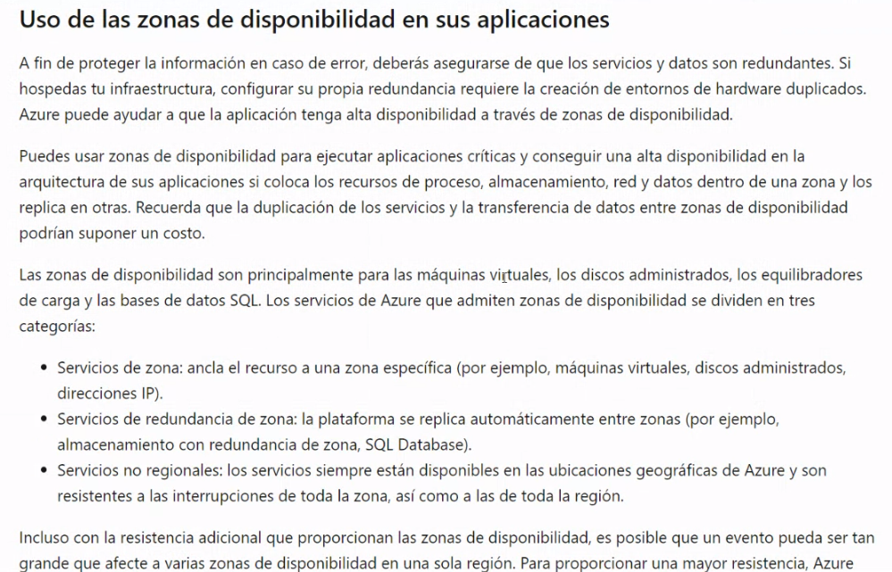
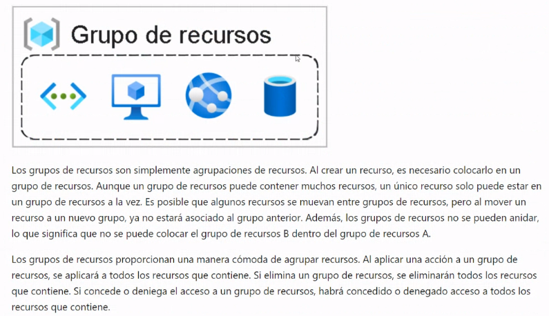
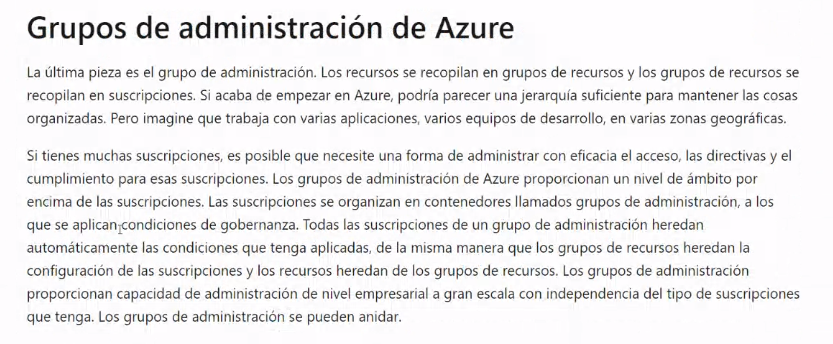

## Clase 03

Comienza la clase invitándonos al nuevo moodle (aunque no llegó la invitación 🤕).

Retomamos el tema de la clase anterior, pero rápidamente se desvía hablando de otras cosas (experiencias autoreferenciales, encuestas de sueldos, lenguajes más usados, etc.)

Después de muchas vueltas retomamos con el Learning Path de Azure:

### Introducción a las cuentas de Azure

Empezamos a ver la shell de Azure:

Con el shell probamos la versión interactiva:

---

### Regions

Data centers dentro de la misma región:

### Grupo de Recursos

### Grupos de administración de Azure

