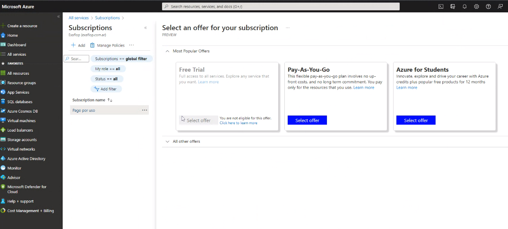
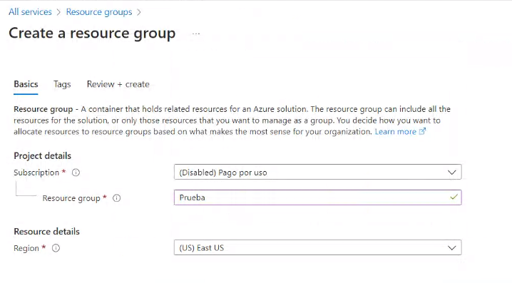
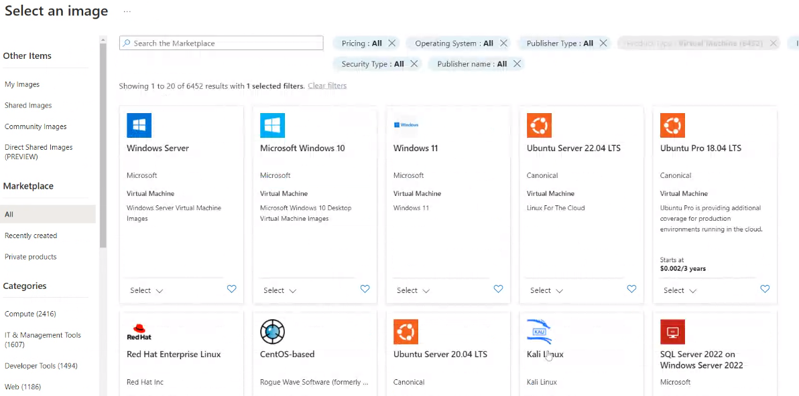
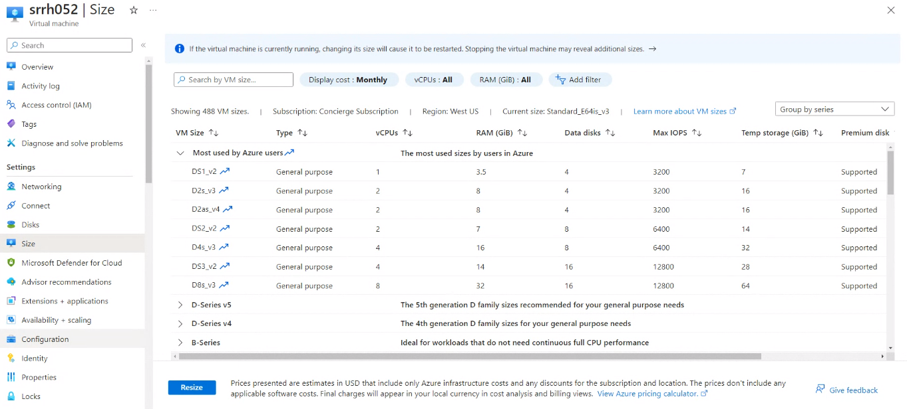

## Clase 04

Empezamos viendo el moodle (ya tenemos acceso).

Después retomamos el Learning Path de Azure. Empezamos viendo el portal. Nos muestra el área de suscripciones:

Resource groups por región:

### marketplace azure

Hacemos todo el proceso de crear una VPS con recursos asignados.

Queda creada para ingresar por SSH.

