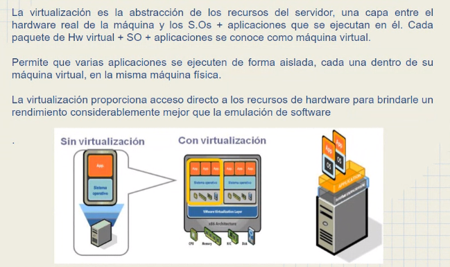
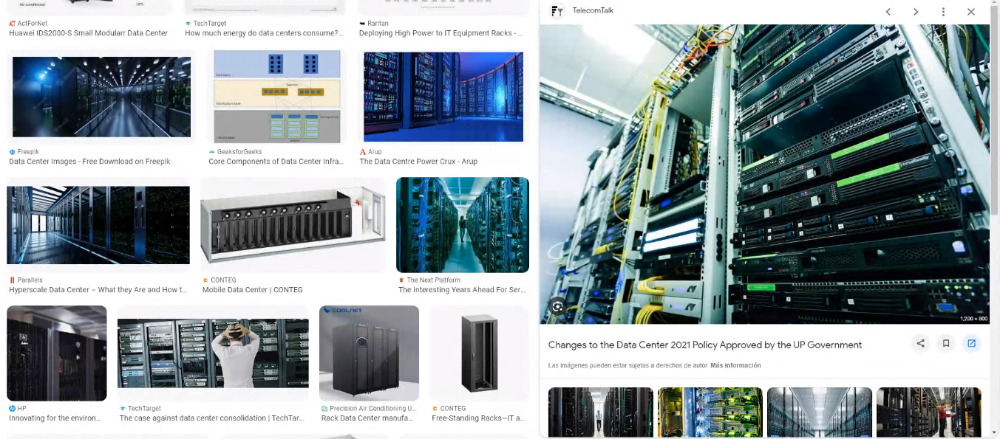
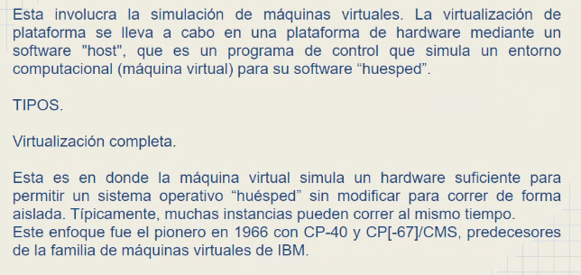
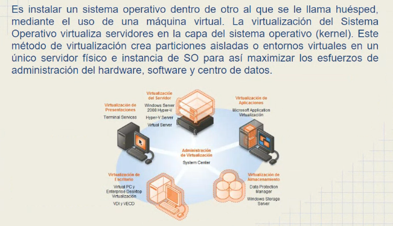
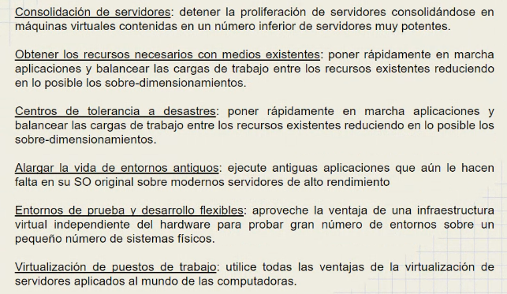
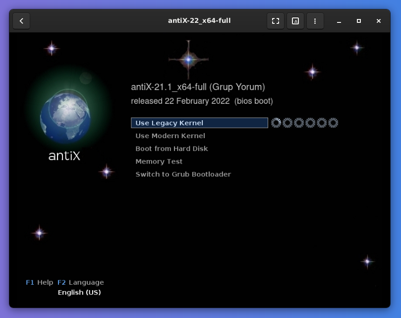
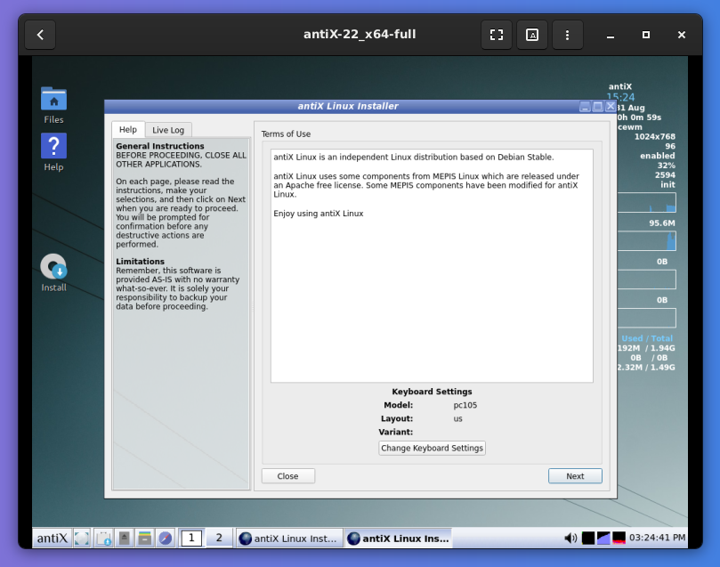
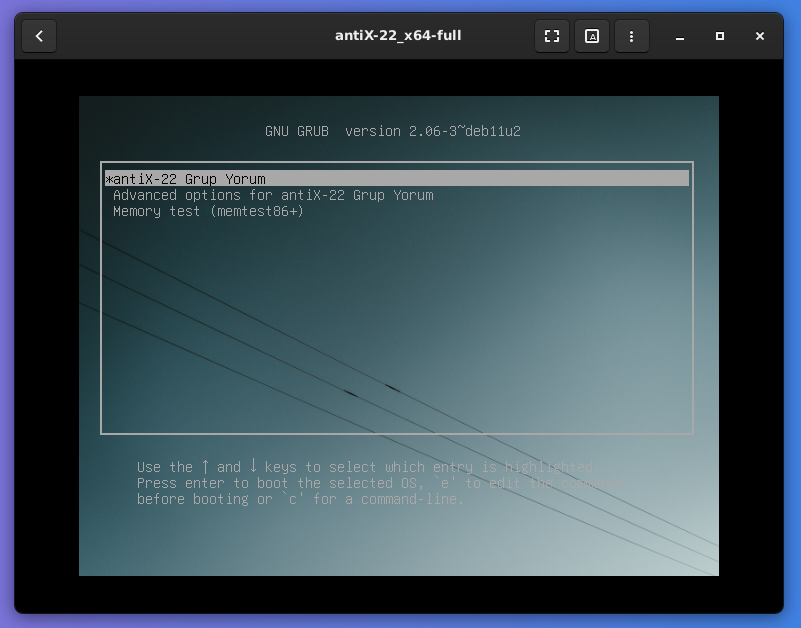
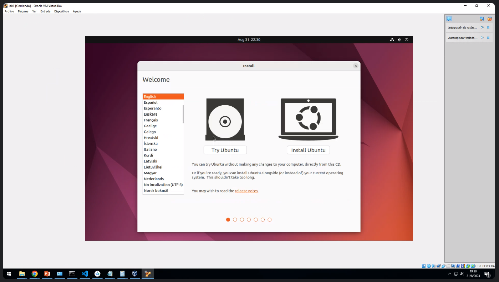
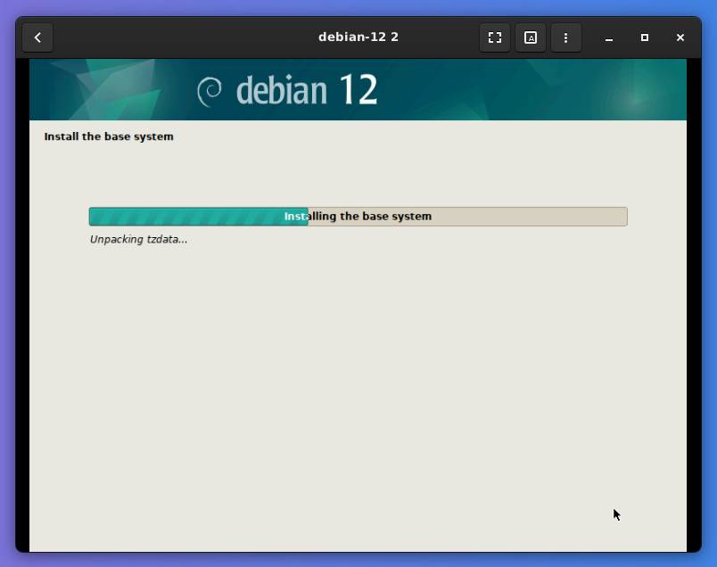

## Clase 05

Empezamos hablando de virtualización

Volvemos sobre el concepto de racks y servers físicos

Repaso sobre cómo fue evolucionando la infraestructura.

### Tipos de virtualización de plataforma

Ejemplos de Virtualización completa:

- VMware
- Virtual Box
- OpenVZ Oracle VM
- XenServer

### Virtualización por SO

### Ventajas de virtualizar

- Consolidación de servidores
- Obtener los recursos necesarios con medios existentes
- Centros de tolerancia a desastres
- Alargar la vida de entornos antiguos
- Entornos de prueba y desarrollo flexibles
- Virtualización de puestos de trabajo

Próximo TP: Diferencia entre emular y virtualizar

---

Pasamos a hacer una parte práctica:

### Taller virtualización

En mi caso usando gnome-boxes voy a instalar antiX-22

El profe lo va haciendo con virtual box e instala 2 VM distintas cada una con Ubuntu 22

Para hacer 2 VM, creo una segunda máquina con Debian:

Mi setup final:

- VM1: antiX
- VM2: debian12

Próxima tarea: conectar ambas VM por tunel SSH