## Clase 08

Vemos algo de diagramas de arquitectura.

Ejemplo Arquitectura de la información: [https://arquitecturahipermedia.wordpress.com/arquitectura-de-la-informacion/](https://arquitecturahipermedia.wordpress.com/arquitectura-de-la-informacion/ "https://arquitecturahipermedia.wordpress.com/arquitectura-de-la-informacion/")

Pone otro ejemplo usando Azure:

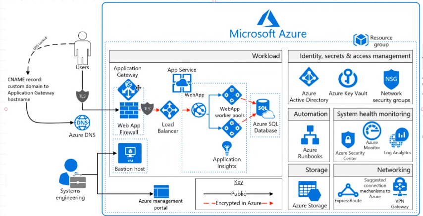

---

Va haciendo un diagrama propio:

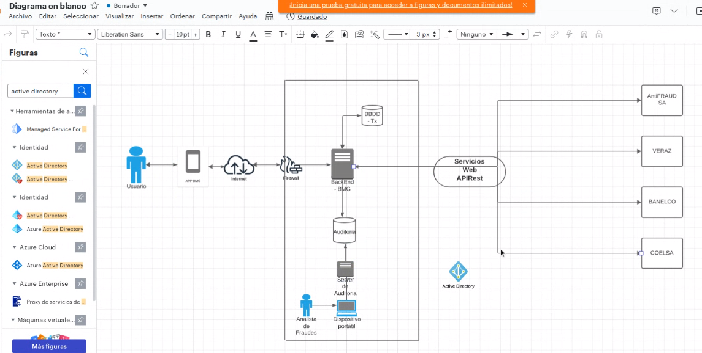

Menciona active directory. Me dejo a mano un link: https://learn.microsoft.com/en-us/azure/active-directory/fundamentals/whatis

Poco después se cayó de la llamada.

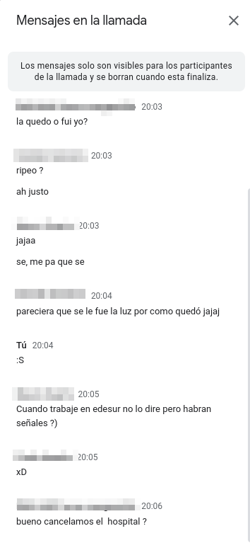

Se había caído Internet. Después retoma:

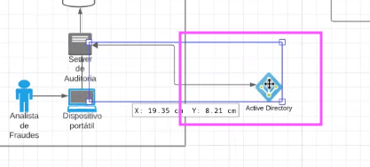

Esta arquitectura hace que sea híbrida.

Vamos a un break y después sigue con shell.

---

### Shell y Linux

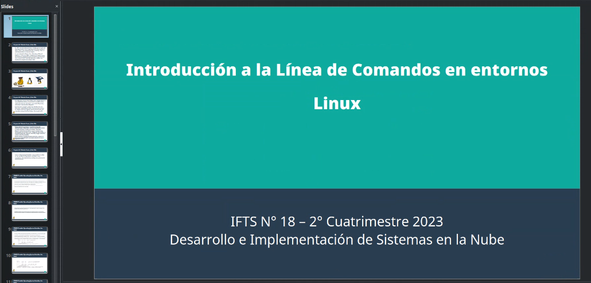

Hace una intro a Linux y Unix.

Comenta sobre GNU/Linux, sobre Richard Stallman. Después comenta una anécdota sobre Oracle leyendo la documentación y viendo el código que es abierto.

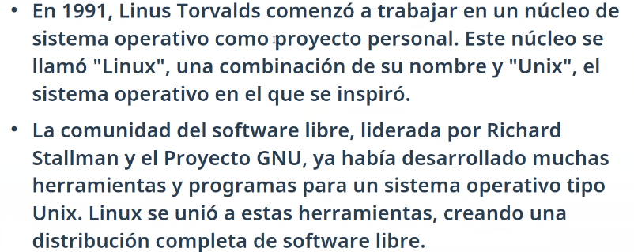

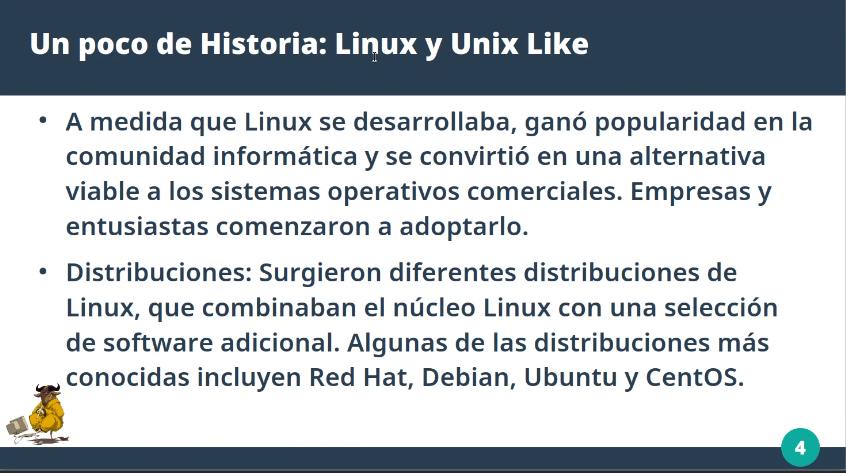

un compa sobre stallman tocando la flauta en pijama 😂

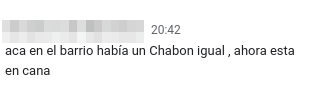

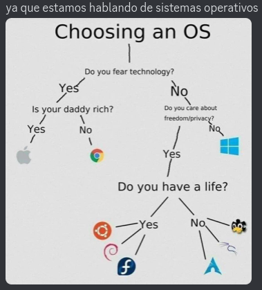

### POSIX

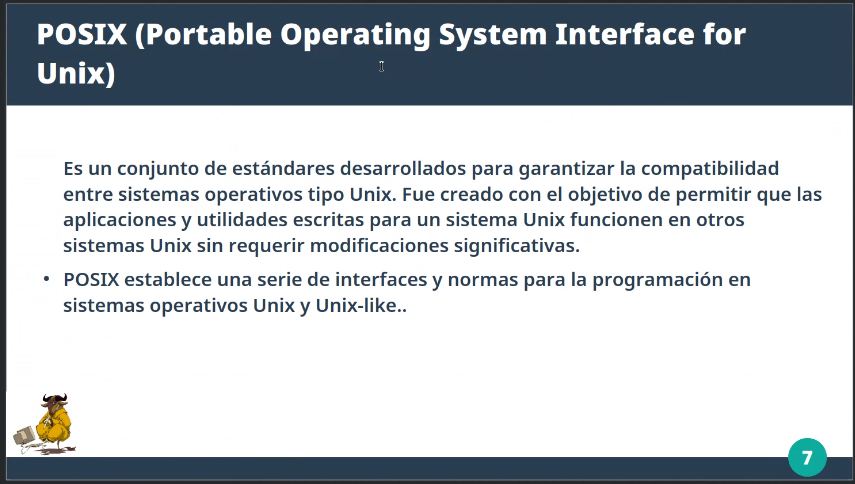

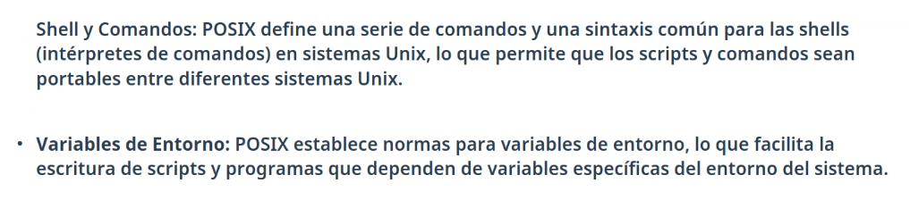

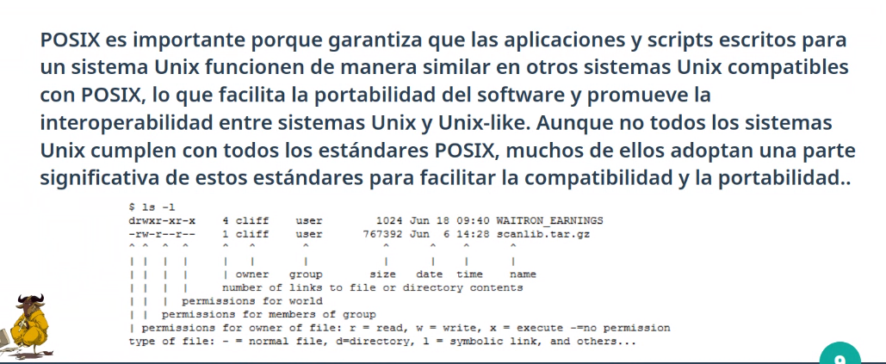

Menciona servidores con soporte para cierto SO (ejemplo Red Hat). Lo que nos da la seguridad que ese equipo va a ser compatible.

Control de procesos:

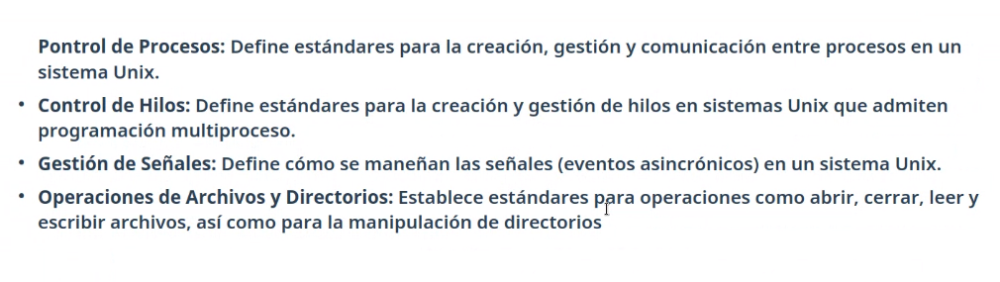

### Consola, terminal, shell, mainframe

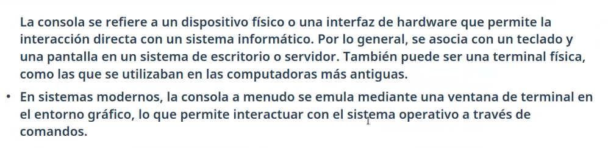

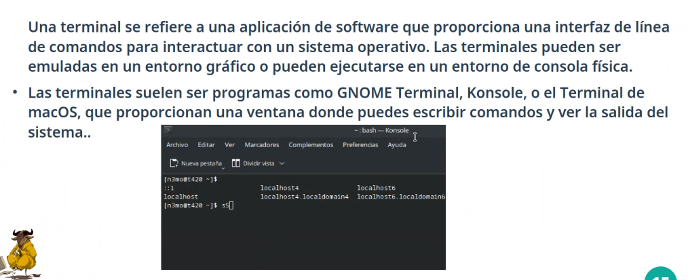

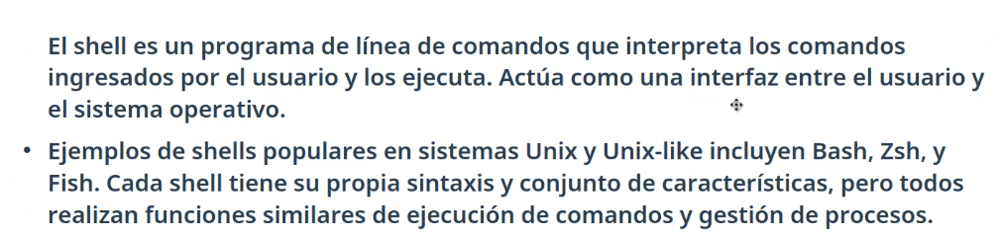
### TTY

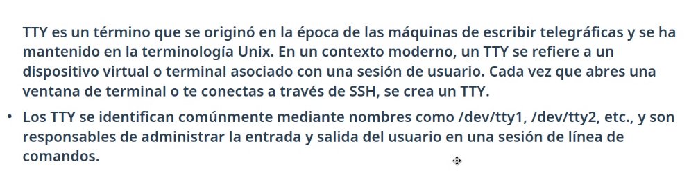

### Konsole en Fedora

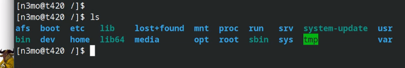

Muestra los básicos:

- ls
- pwd
- cd
- mkdir
- rmdir
- touch
- rm
- cp
- mv
- cat
- tail
- head
- sudo
- man
- chmod
- chown
- kill

Quedamos en seguir con práctica la próxima clase.