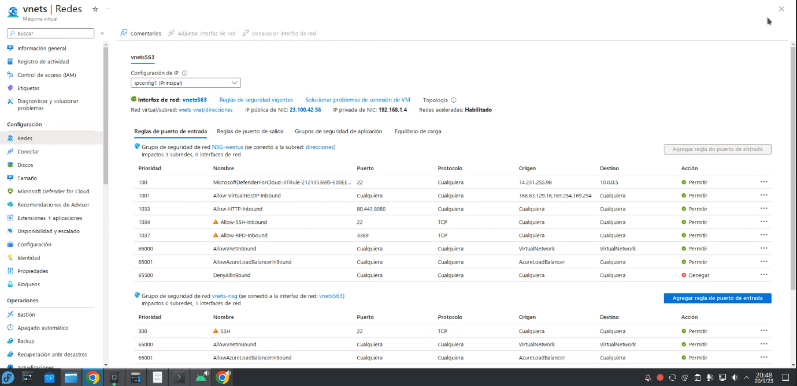
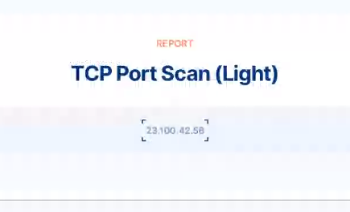
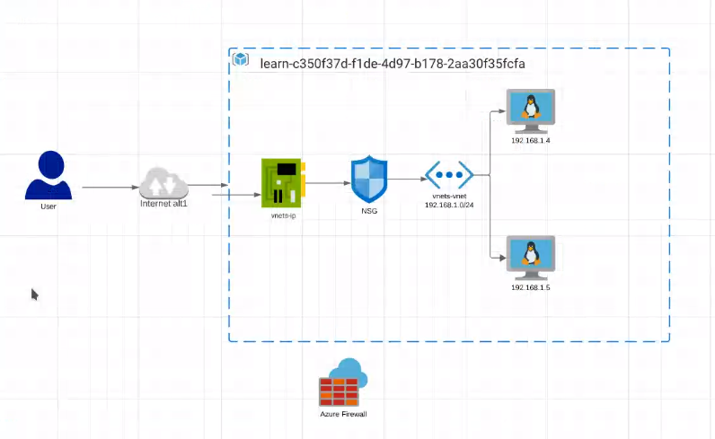
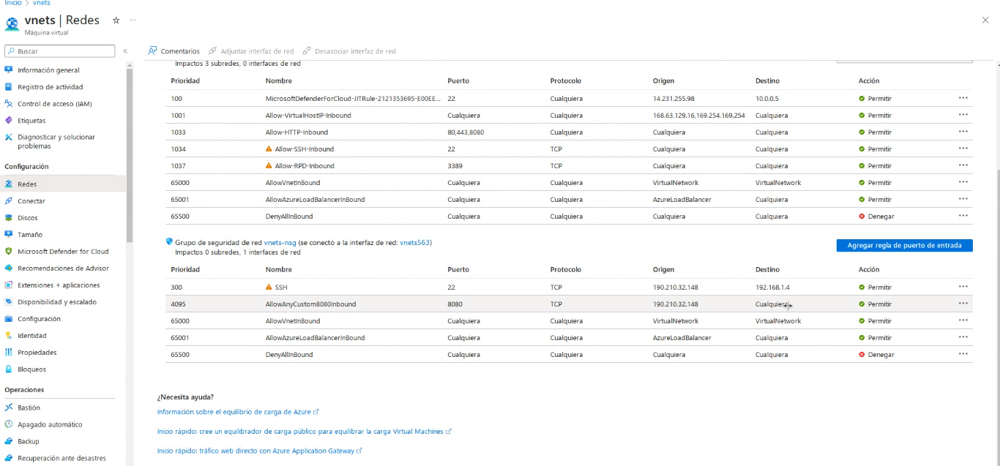
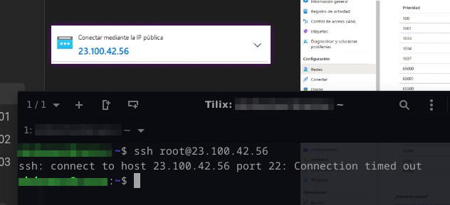
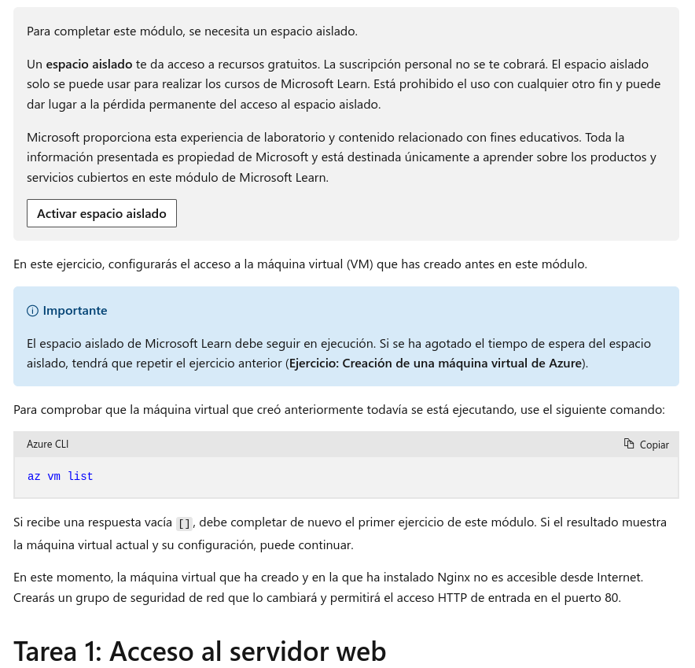

## Clase 09

Reglas de seguridad de la tarjeta de red en Azure

Hace una prueba desde una web:

Esto es lo que estaba planteado en la arquitectura:

Hace pruebas abriendo y cerrando algunos puertos, como el 22 y el 8080.

Pruebo pegarle a esa IP pública y tenía la regla para que no me deje pasar:

---

Como tarea nos deja hacer el ejercicio de Azure:

