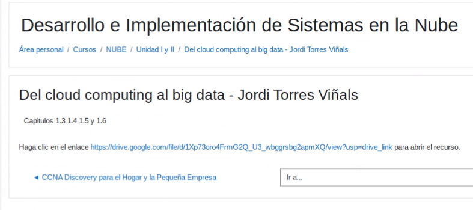
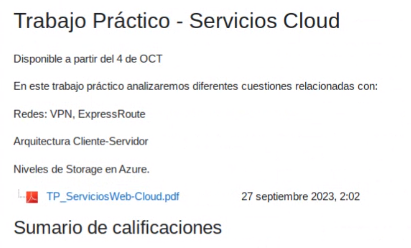
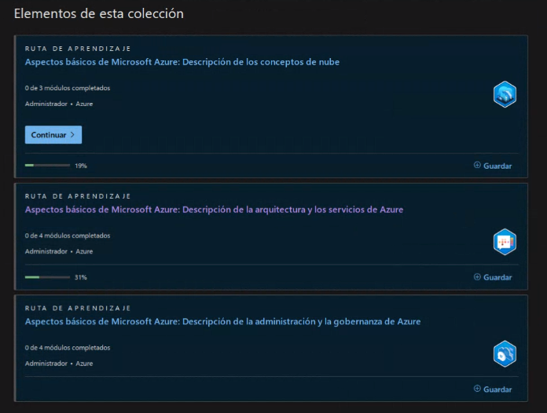
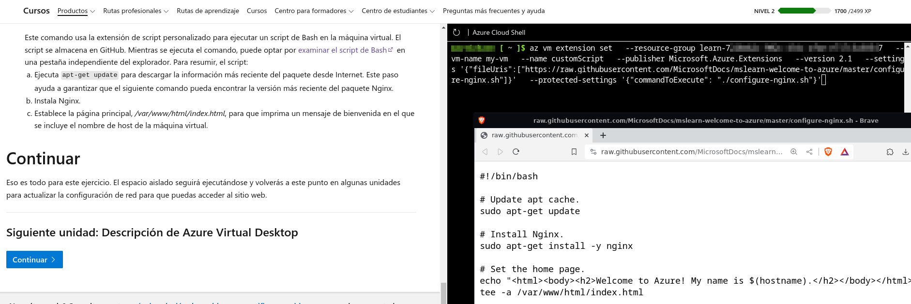
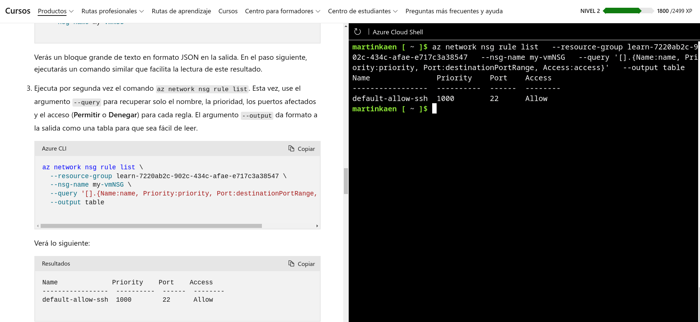
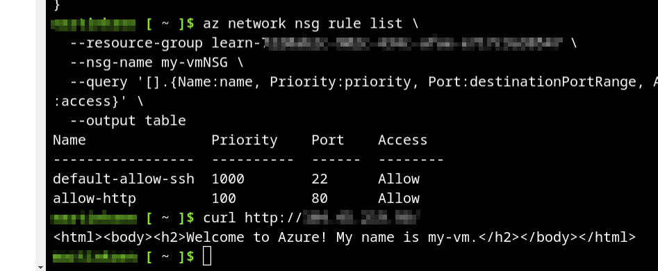
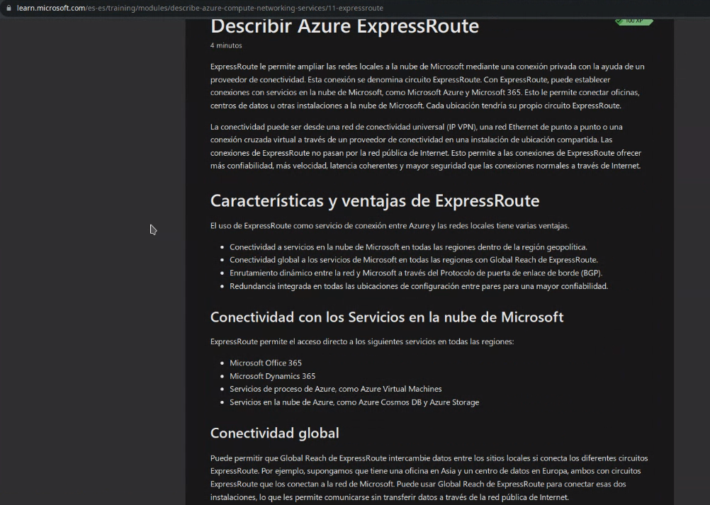
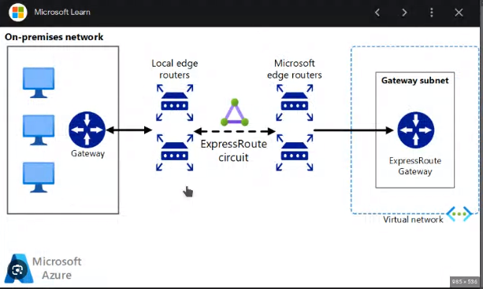
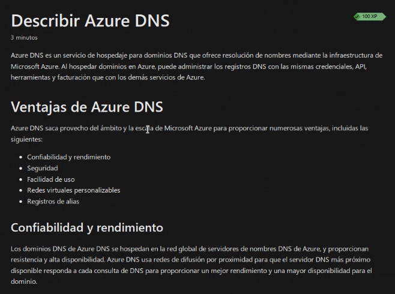

## Clase 10

Nos pasa una bibliografía:

Menciona los inhibidores en el cloud. Ver capítulos 1.3, 1.5 y 1.6

Después muestra los nuevos TPs.

El próximo sería este:

Sigue con el path de Azure:

Hacemos el primer ejercicio de crear la VM y después instalarle ngnix:

en mi entorno de azure queda habilitado el puerto 80:

Después pasamos a ver ExpressRoute:

Cómo sería un diagrama?

Menciona DNS y terminamos:

