## Clase 11

Empezamos viendo PaaS, algunos servicios de Azure:

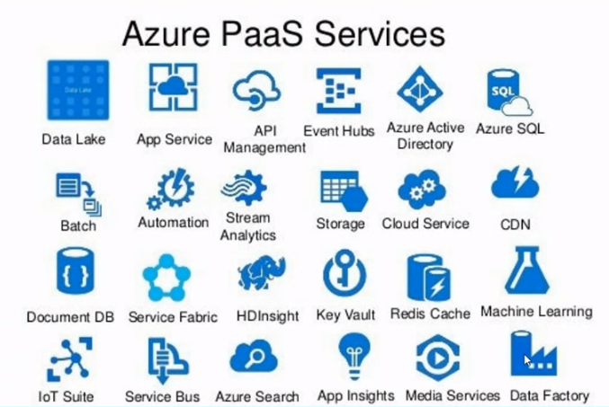

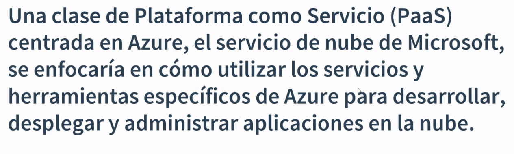

El servicio web más popular de Azure: App Service

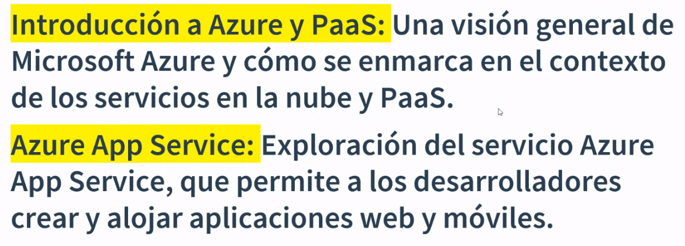

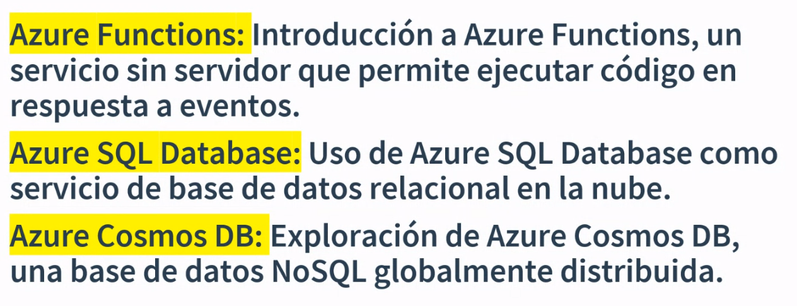

Ahí hace un parate y se debate el avance de la materia frente a algunas incomodidades en la parte didáctica.

Después pasamos a hacer un ejercicio de Azure LP:

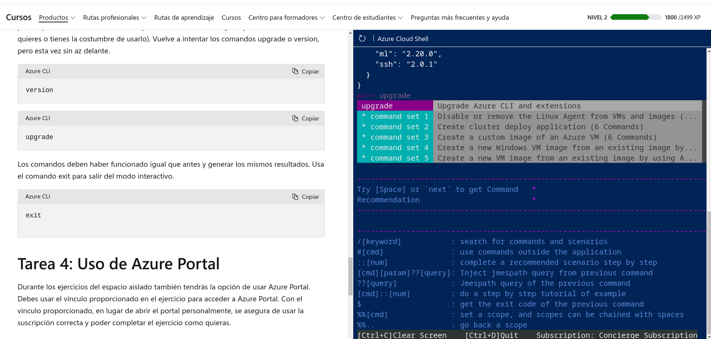

termino ese módulo:

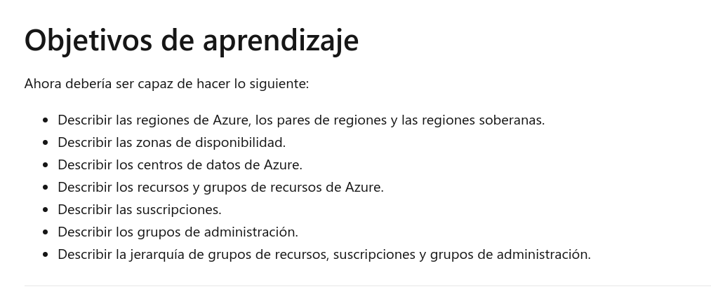

Después un compañero comparte pantalla y muestra cómo instalar nginx. Muchas idas y vueltas después, vuelve al PPT original:

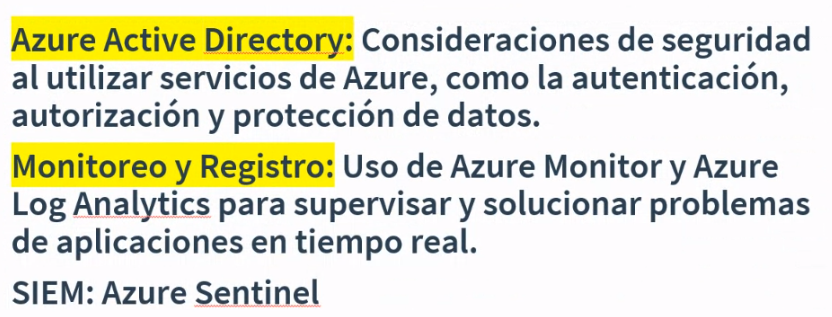

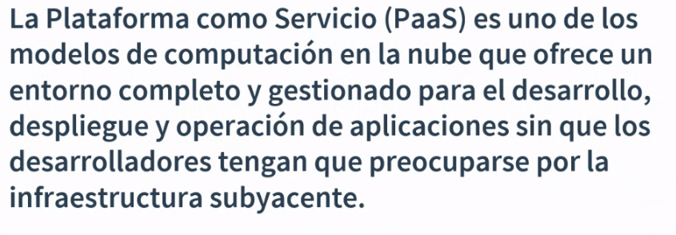

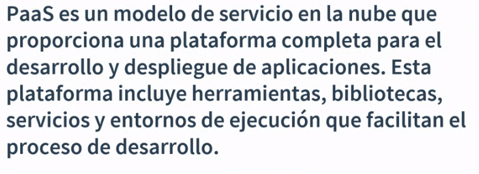

### Características de PaaS

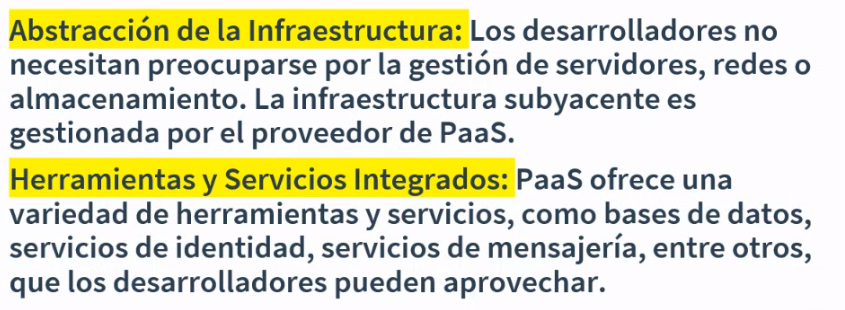

- Mejora el trabajo en equipo

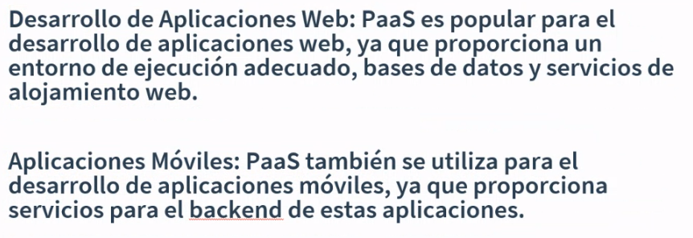

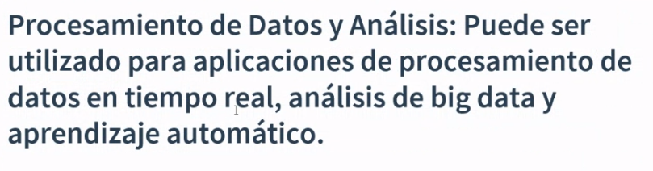

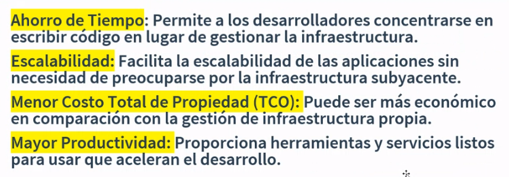

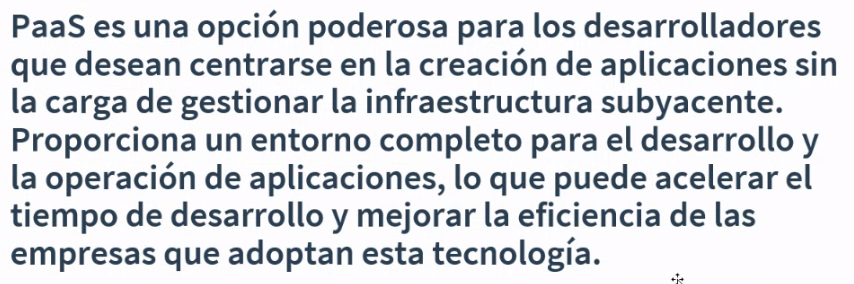

