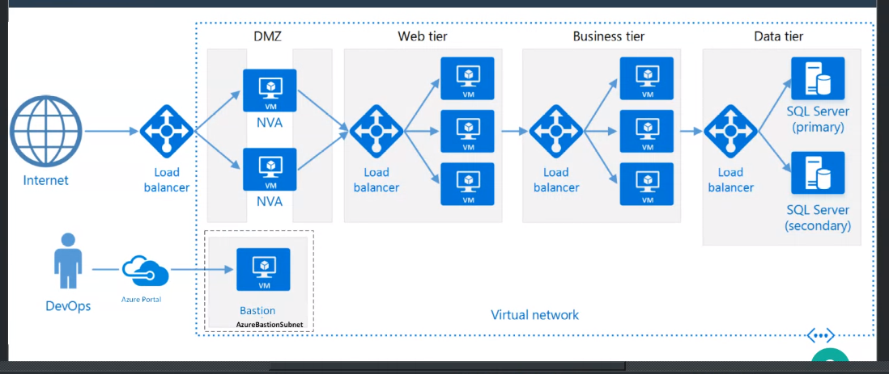
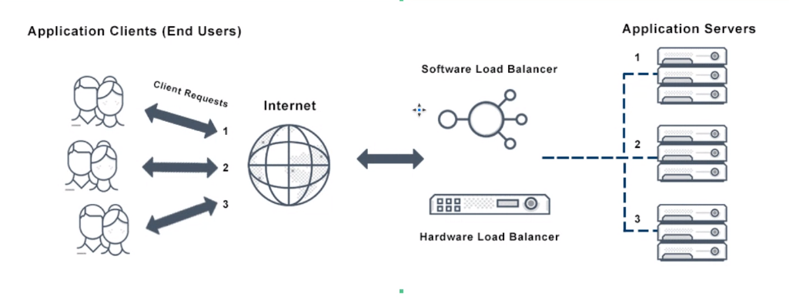
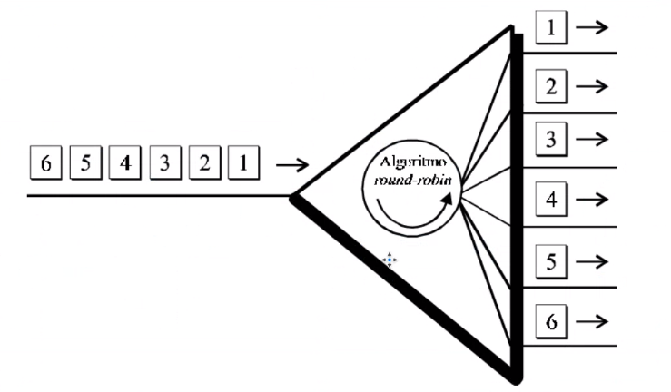
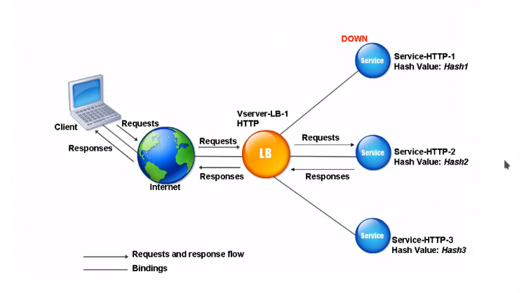

## Clase 12

Empieza hablando de PaaS

Una arquitectura de n capas.

Menciona load balancers en software y hardware

Cuando analizamos el modelo de capas, al último está la base de datos.

esquema round-robin (va acomodando las peticiones una a una por orden de llegada)

(...) TBD

---
### Método hash

(...) TBD