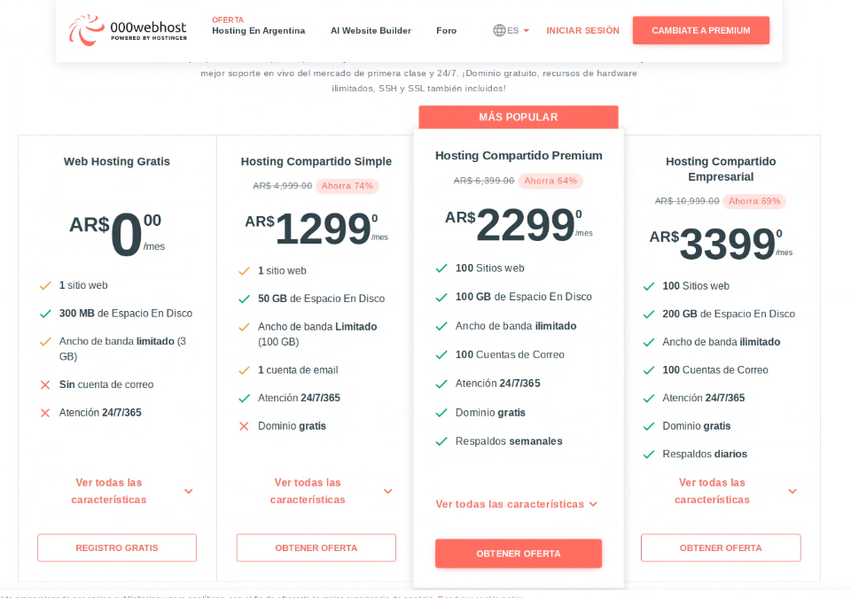
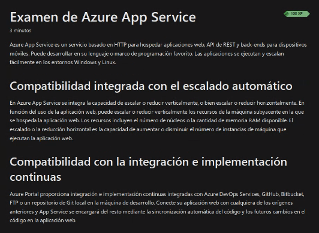

## Clase 13

Empezamos viendo un nuevo learning path de Azure:


Sigue con un ejemplo de un breve setup para wordpress, usando apache/nginx, una base de datos, etc.

Menciona pasar una imagen a base64 para guardarla como texto plano en un BD.

Menciona hosting tradicionales vs cloud.

Ejemplo de proveedor de hosting (un clásico 000webhost)



algunos servicios:


Menciona varios hostings locales:

- Donweb https://donweb.com/es-ar/
- LatinCloud https://latincloud.com/argentina
- Allytech https://www.allytech.com/
- Mesi  https://www.mesi.com.ar/

Hace comparación con la nube en términos de costo beneficio. Usar la nube para levantar un sitio estático

vemos un server gratuito y sube un archivo mostrando el phpinfo:

```php
<?php
	phpinfo()
?>
```


Comenta como ejemplo un cronjob que corre todos los días y chequea las transacciones y correos.


nos comenta los tiempos de una cola de mensajes


Cerrando esto volvemos a nube hablando de App Service:



Link a este modulo de az: https://learn.microsoft.com/en-us/training/modules/introduction-to-azure-app-service/2-azure-app-service


https://learn.microsoft.com/en-us/training/modules/introduction-to-azure-app-service/3-azure-app-service-plans

Activa un espacio aislado y después crea una aplicación php


Tiene su github ya cargado y elige un repo existente


insights para monitoreo de los servicios (no está disponible en esta versión de learning):


Acá se pasa a una cuenta privada (no educativa, o sea que esto te cobra por uso). Vemos muy al paso varias partes del admin: métricas, bd, redes, asesor (IA) y más.


La parte de logs está bastante buena:


Por último, crea una app que tiene una barrera de autenticación de distintos proveedores: Microsoft, Google, Github y más. El contenido del sitio se ve solamente después de autenticarse.

Pone fecha de primer parcial: 25/10