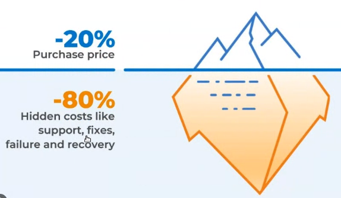

## Clase 14

Empieza hablando de costos en la nube:

Nos menciona algunas calculadoras de distintos providers, muestra la de azure:

[https://calculator.aws/#/](https://calculator.aws/#/ "https://calculator.aws/#/")
[https://azure.microsoft.com/en-us/pricing/calculator/](https://azure.microsoft.com/en-us/pricing/calculator/ "https://azure.microsoft.com/en-us/pricing/calculator/")
[https://cloud.google.com/products/calculator](https://cloud.google.com/products/calculator "https://cloud.google.com/products/calculator")

Sigue replicando los specs de un ejercicio.

Estábamos buscando ssd:

exporta el presupuesto:

### app service

costos asociados al TCO

"cuánto me sale a mí tener un activo".

Software Assurance

momento random terminamos en el tarifario de edesur

Hasta acá el análisis de costo del ejemplo.

---
Después nos muestra otras partes de azure, la parte de costo.

La App Service que creamos el otro día es literalmente todo x 2 pesos:

---

De tarea deja leer esto:

[https://learn.microsoft.com/es-mx/azure/azure-sql/database/serverless-tier-overview?view=azuresql&tabs=general-purpose](https://learn.microsoft.com/es-mx/azure/azure-sql/database/serverless-tier-overview?view=azuresql&tabs=general-purpose)

